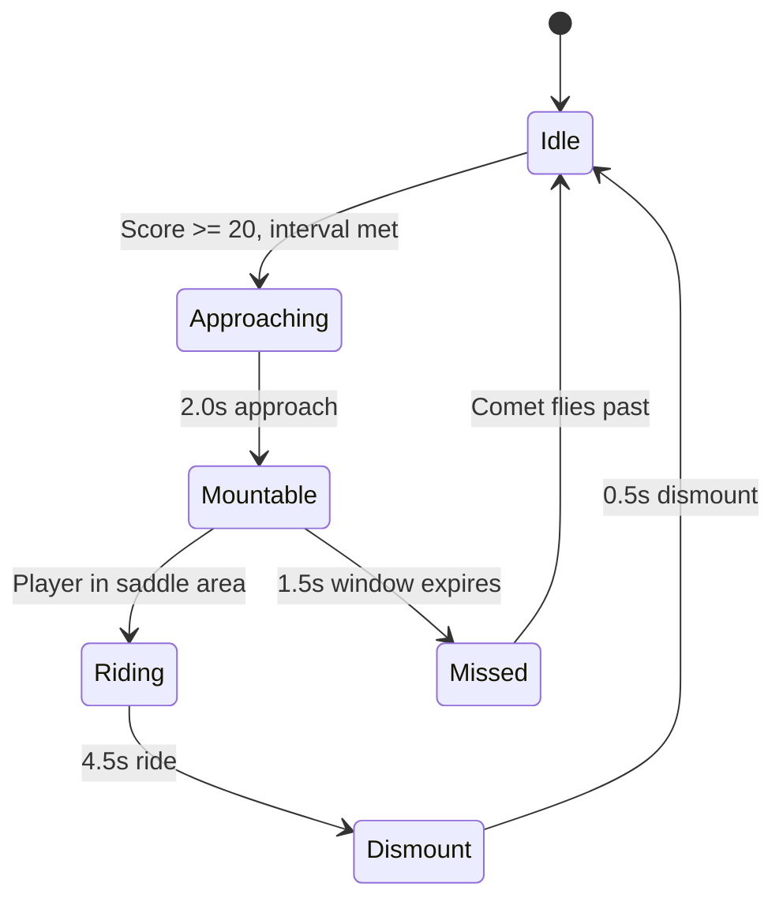
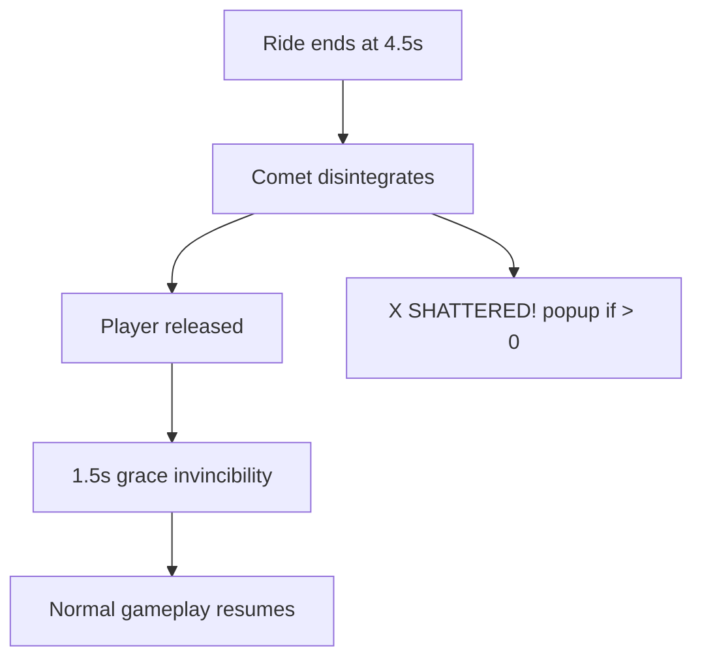

## Overview

Comet Rides are a dramatic event where a comet streaks across the screen. If you position your astronaut in the comet's saddle area, you mount it for an invincible ride that shatters any obstacles in your path.

## Trigger conditions

| Parameter | Value |
|-----------|-------|
| Minimum score | 20 |
| Trigger interval | 45-60 seconds (random) |
| Mutual exclusion | Cannot start during other events |

## Event phases

| Phase | Duration | Description |
|-------|----------|-------------|
| Approaching | 2.0s | Light streak on right edge, gradually brightening |
| Mountable | 1.5s | Comet crosses screen, player can mount |
| Riding | 4.5s | Player attached, invincible, shatters obstacles |
| Dismount | 0.5s | Comet disintegrates, player released |

## Comet properties

| Parameter | Value |
|-----------|-------|
| Core size | 20 x 20 points |
| Saddle area | 30 x 15 points (above core) |
| Speed | 3x current obstacle speed |
| Trail particles | 60 particles/s, blue-white |

### Mounting

To mount the comet, your astronaut must overlap with the **saddle area** -- a 30x15 point zone positioned on top of the comet core. The check runs every frame during the mountable phase.

<Callout kind="tip">
  The comet moves at 3x obstacle speed, so you need to be positioned to intercept it. Watch for the approach indicator on the right edge during the 2-second warning phase and position yourself at the comet's projected Y position.
</Callout>

## Riding mechanics

During the ride:
- **Full invincibility** -- you cannot take damage
- The comet continues moving at 3x speed
- When the comet reaches the left edge, it wraps back to the right
- Any obstacle the comet contacts is **shattered** with particle effects

### Obstacle shattering

When the comet collides with an obstacle:
- The obstacle is destroyed
- +1 point per shattered obstacle
- 6 blue-white burst particles at the obstacle's position
- The `onObstacleShatter` callback fires

## Missed comet

If you fail to mount the comet within the 1.5-second window:
- The comet disintegrates with burst particles
- "MISSED IT!" text appears near the player
- No penalty -- you simply miss the opportunity

## Dismount

When the ride ends after 4.5 seconds:
- The comet disintegrates with burst particles
- The "X SHATTERED!" text displays your shatter count
- Brief **1.5-second invincibility grace** period after dismount
- "COMET RIDE!" text appeared at ride start

<Callout kind="info">
  The 1.5-second post-dismount invincibility prevents unfair deaths from being released directly into an obstacle's path.
</Callout>

## Visual design

### Comet appearance
- Bright white-gold core with an elliptical shape
- Blue-white pulsing glow ring (radius 14pt)
- Particle trail emitting behind (left) with blue tint

### Approach indicator
- Vertical light streak on the right edge of screen
- Gradually brightens from 0% to 60% alpha over 2 seconds
- Subtle vertical shimmer animation

### Disintegration effect
- 12 blue-white burst particles expanding outward
- Core fades out and scales to 0.3x over 0.2 seconds

## Related pages

<Columns cols="2">
  <Card title="Event overview" href="/events/overview" icon="zap" horizontal="false">
    All dynamic events and mutual exclusion rules.
  </Card>

  <Card title="Speed Surges" href="/events/speed-surges" icon="fast-forward" horizontal="false">
    Another obstacle-speed-modifying event.
  </Card>
</Columns>
