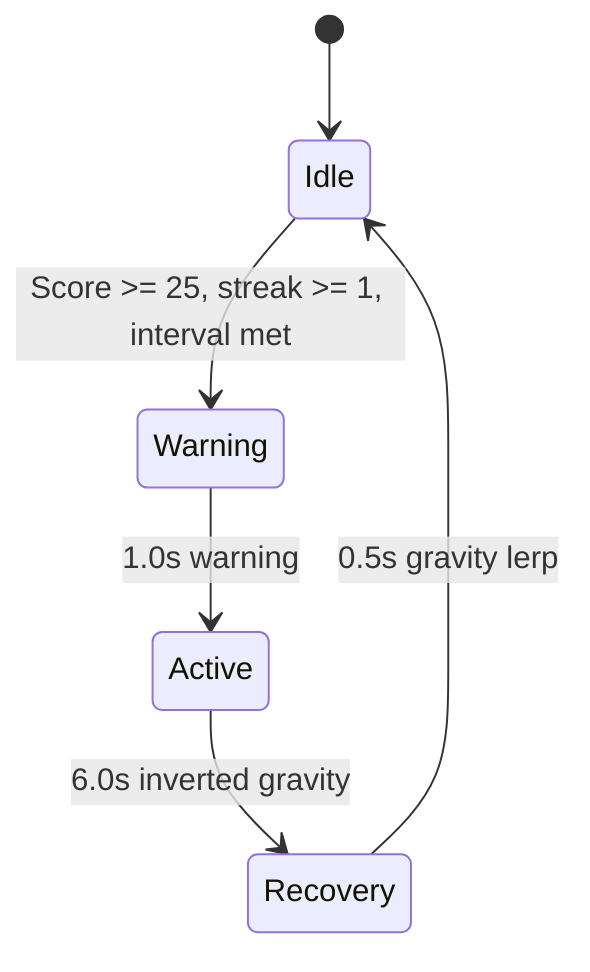

## Overview

Gravity Flips are a skill-challenge event that completely inverts gravity and thrust direction for 6 seconds. During the flip, all scoring is doubled. Surviving the full duration awards a bonus and displays the "GRAVITY MASTER!" achievement banner.

## Trigger conditions

| Parameter | Value |
|-----------|-------|
| Minimum score | 25 |
| Minimum streak level | Level 1 (3 consecutive passes) |
| Trigger interval | 35-50 seconds (random) |
| Mutual exclusion | Cannot start during other events |

<Callout kind="info">
  Gravity Flips require both a score gate AND a streak gate. You need at least 25 points and an active streak of 3+ passes before they can trigger.
</Callout>

## Event phases



| Phase | Duration | Gravity | Scoring |
|-------|----------|---------|---------|
| Warning | 1.0s | Normal (-5.0) | 1x |
| Active | 6.0s | Inverted (+5.0) | 2x |
| Recovery | 0.5s | Lerped back to normal | 1x |

## Gravity mechanics

### Normal vs. inverted

| State | Gravity Y | Thrust direction | Effect |
|-------|-----------|-----------------|--------|
| Normal | -5.0 | Upward | Tap pushes up, player falls down |
| Inverted | +5.0 | Downward | Tap pushes down, player rises up |

### Recovery lerp

When the flip ends, gravity does not snap back instantly. It smoothly interpolates from +5.0 back to -5.0 over 0.5 seconds:

```
lerpedY = invertedGravity + (normalGravity - invertedGravity) * (timer / 0.5)
```

This prevents a jarring transition that could cause immediate death.

## Scoring during flip

| Scoring change | Value |
|---------------|-------|
| Score multiplier | 2x |
| Multiplier indicator | "2x" label displayed on screen |

The 2x multiplier applies to all obstacle passes during the active phase. It resets to 1x when the recovery phase begins.

## Survival bonus

If you survive the full 6-second flip without dying:

| Reward | Value |
|--------|-------|
| Bonus points | +5 |
| Achievement banner | "GRAVITY MASTER! +5" |
| Visual effect | Purple burst particles (10 particles) |

<Callout kind="tip">
  When gravity flips, resist the instinct to tap rapidly. The inverted controls mean your tap now pushes downward. Maintain a steady rhythm, tapping less frequently since the inverted gravity pulls you upward.
</Callout>

## Warning visuals

During the 1-second warning:
- **Warning text**: "GRAVITY FLIP!" pulses between 30% and 100% alpha
- Text color: Purple (R:0.7, G:0.3, B:1.0), font size 24
- **Purple vignette**: Gradually intensifies from 0% to 15% opacity

## Active visuals

During the 6-second flip:
- **Purple vignette**: Pulses between 15% and 25% opacity
- **Timer label**: "FLIP: X.Xs" countdown
- **Multiplier label**: "2x" in purple
- Timer and multiplier positioned at screen top

## Recovery behavior

At the start of recovery:
- Thrust direction is immediately restored to normal
- Score multiplier resets to 1x
- Timer and multiplier labels are removed
- Gravity smoothly lerps over 0.5 seconds
- Purple vignette fades out over 0.3 seconds

## Related pages

<Columns cols="2">
  <Card title="Streak and combo system" href="/mechanics/streak-combo" icon="flame" horizontal="false">
    The streak level requirement for triggering gravity flips.
  </Card>

  <Card title="Flight controls" href="/mechanics/flight-controls" icon="gamepad-2" horizontal="false">
    How thrust and gravity physics work during flips.
  </Card>
</Columns>
