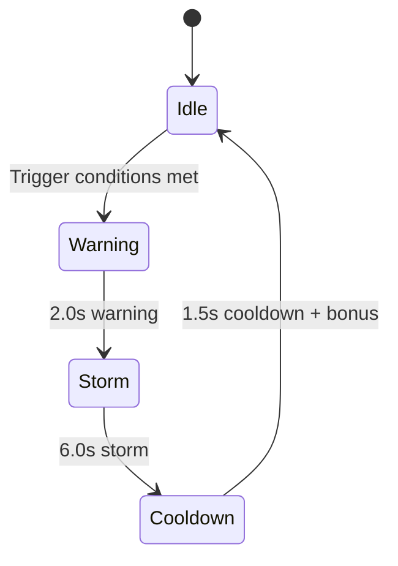

## Overview

Meteor Storms are the flagship dramatic event in SpaceFlapper. A barrage of meteors rains from the upper-right of the screen while regular obstacle spawning pauses. Surviving the storm earns bonus points, with a perfect survival bonus for taking no hits.

## Trigger conditions

| Parameter | Value |
|-----------|-------|
| Minimum score | 15 |
| Minimum game time | 30 seconds |
| Trigger interval | 45-60 seconds (random) |
| Additional check | No active power-up |
| Mutual exclusion | Cannot start during other events |

## Event phases

| Phase | Duration | Description |
|-------|----------|-------------|
| Warning | 2.0s | Screen shake, flashing "METEOR STORM INCOMING" text, orange vignette |
| Storm | 6.0s | Meteors spawn from upper-right, bell curve spawn rate |
| Cooldown | 1.5s | Remaining meteors clear, storm effects fade |

<Callout kind="info">
  Obstacle spawning pauses 1 second into the warning phase (halfway through). It resumes 1.5 seconds after the storm ends, giving you a grace period.
</Callout>

## Meteor spawn rate curve

The storm uses a bell curve for spawn intensity, ramping up and back down:

| Time (s) | Meteors/second |
|----------|---------------|
| 0.0 | 3 |
| 1.0 | 5 |
| 2.0 | 8 (peak) |
| 3.0 | 8 (peak) |
| 4.0 | 6 |
| 5.0 | 4 |
| 6.0 | 2 |

The system interpolates linearly between these keyframes for smooth spawning.

## Meteor properties

### Size distribution

| Size | Chance | Dimension range | Hitbox shrink |
|------|--------|----------------|--------------|
| Small | 60% | 15-25 points | 0.65 |
| Medium | 30% | 30-45 points | 0.60 |
| Large | 10% | 50-70 points | 0.55 |

### Movement

| Parameter | Value |
|-----------|-------|
| Speed multiplier | 1.5x - 2.5x current obstacle speed |
| Movement angle | 210-250 degrees (diagonal from upper-right) |
| Tumble rate | 1-4 rad/s (random direction) |
| Spawn area | Right edge of screen, Y: 30%-100%+ screen height |

### Visual design

Each meteor features:
- Procedurally generated irregular polygon (5-8 vertices)
- Rock gradient fill (brown/orange/dark brown)
- Fire trail particle effect with orange-yellow color sequence
- Continuous tumbling rotation

## Survival bonuses

| Outcome | Bonus |
|---------|-------|
| Survived without shield hit | +10 points + "STORM MASTER!" banner |
| Survived with shield absorbing hit | +5 points |

The "STORM MASTER!" banner appears as a golden text popup that scales from 0.5x to 1.3x, settles to 1.0x, then fades after 1.5 seconds.

<Callout kind="tip">
  The safest strategy is to stay in the center-left of the screen during a storm. Meteors come from the upper-right, so the lower-left has the most reaction time. Save your shield for late in the storm when meteor density peaks.
</Callout>

## Warning visuals

During the 2-second warning:
- **Screen shake**: Micro-vibration (0.5pt horizontal oscillation)
- **Warning text**: "METEOR STORM INCOMING" pulses between 30% and 100% alpha
- **Orange vignette**: Gradually intensifies from 0% to 5% opacity
- Text color: Red (R:1.0, G:0.3, B:0.2)

## Storm visuals

During the 6-second storm:
- Orange vignette at 6% opacity
- Progress bar at screen top (60% screen width, orange fill)
- Screen shake continues at lower intensity

## Related pages

<Columns cols="2">
  <Card title="Event overview" href="/events/overview" icon="zap" horizontal="false">
    All dynamic events and their trigger conditions.
  </Card>

  <Card title="Star Shield" href="/power-ups/star-shield" icon="shield" horizontal="false">
    Shield interaction with meteor storms.
  </Card>
</Columns>
