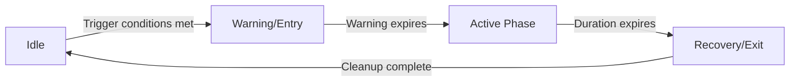
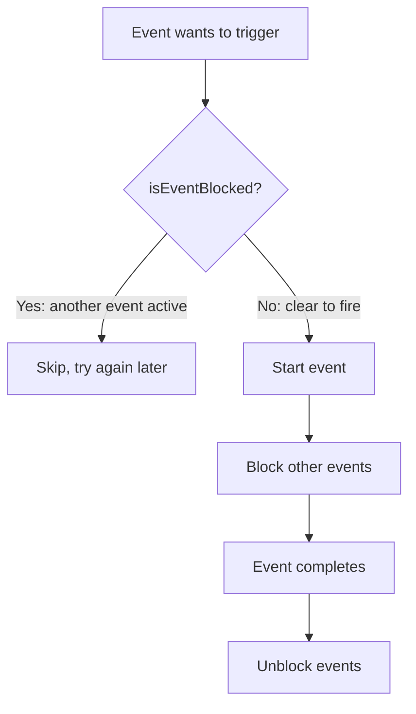

## Overview

SpaceFlapper features seven dynamic events that activate during gameplay to create varied and dramatic moments. Events range from environmental hazards (Meteor Storms, Speed Surges) to skill-reward opportunities (Gravity Flips, Comet Rides, Warp Zones) and progression boosters (Stardust Fever).

## Event catalog

| Event | Trigger interval | Min score | Special requirement | Duration |
|-------|-----------------|-----------|-------------------|----------|
| Meteor Storm | 45-60s | 15 | Not during power-ups, 30s+ game time | 9.5s total |
| Gravity Flip | 35-50s | 25 | Streak level 1+ | 7.5s total |
| Comet Ride | 45-60s | 20 | None | 8.5s total |
| Speed Surge | 15-25s | 10 | 10s cooldown | 5.0s total |
| Stardust Fever | On-demand | -- | Streak level 4 (12 passes) | 6.6s total |
| Warp Zone | On score | 25 (multiple of 25) | Streak level 2+, 5% chance | 4.0s total |

## Event lifecycle

All events follow a phased lifecycle with distinct visual and gameplay changes per phase.

### Common phases

| Phase | Purpose | Typical duration |
|-------|---------|-----------------|
| Warning / Entry | Visual telegraph, prepare player | 0.3-2.0s |
| Active | Core event gameplay effect | 3.0-6.0s |
| Recovery / Exit | Smooth transition back to normal | 0.3-1.5s |

## Mutual exclusion

Events respect mutual exclusion rules. When one event is active, other events cannot trigger. Each event manager checks an `isEventBlocked` callback before starting.

<Callout kind="info">
  Stardust Fever is an exception -- it triggers directly from reaching streak level 4 and does not check mutual exclusion. However, it still blocks other events from triggering during its active phase.
</Callout>

## Trigger conditions

Events combine multiple conditions before activating:

### Score gates

| Event | Minimum score |
|-------|--------------|
| Speed Surge | 10 |
| Meteor Storm | 15 |
| Comet Ride | 20 |
| Gravity Flip | 25 |
| Warp Zone | Score divisible by 25 |

### Streak gates

| Event | Required streak level |
|-------|-----------------------|
| Gravity Flip | Level 1+ (3 passes) |
| Warp Zone | Level 2+ (5 passes) |
| Stardust Fever | Level 4 (12 passes, exact trigger) |

### Timing gates

| Event | Additional timing requirement |
|-------|-------------------------------|
| Meteor Storm | 30+ seconds of game time, not during active power-up |
| Speed Surge | 10-second minimum cooldown between surges |

## Event interactions with power-ups

| Power-up | Event interaction |
|----------|-------------------|
| Star Shield | Absorbs meteor hit during storms (reduced bonus) |
| Rocket Boost | Invincibility persists through events |
| Time Warp | Slows obstacles but not event timers |
| Cosmic Magnet | Continues attracting during events |

## Event detail pages

<Columns cols="2">
  <Card title="Meteor Storms" href="/events/meteor-storms" icon="cloud-lightning" horizontal="false">
    Survive waves of meteors from the upper-right.
  </Card>

  <Card title="Gravity Flips" href="/events/gravity-flips" icon="flip-vertical" horizontal="false">
    Inverted gravity with 2x scoring challenge.
  </Card>

  <Card title="Comet Rides" href="/events/comet-rides" icon="sparkles" horizontal="false">
    Mount a comet for an invincible ride.
  </Card>

  <Card title="Speed Surges" href="/events/speed-surges" icon="fast-forward" horizontal="false">
    Random 2x speed bursts with warning phase.
  </Card>
</Columns>

<Columns cols="2">
  <Card title="Stardust Fever" href="/events/stardust-fever" icon="flame" horizontal="false">
    3x scoring triggered by maximum streak.
  </Card>

  <Card title="Warp Zones" href="/events/warp-zones" icon="orbit" horizontal="false">
    Rare bonus zones with auto-scoring.
  </Card>
</Columns>
