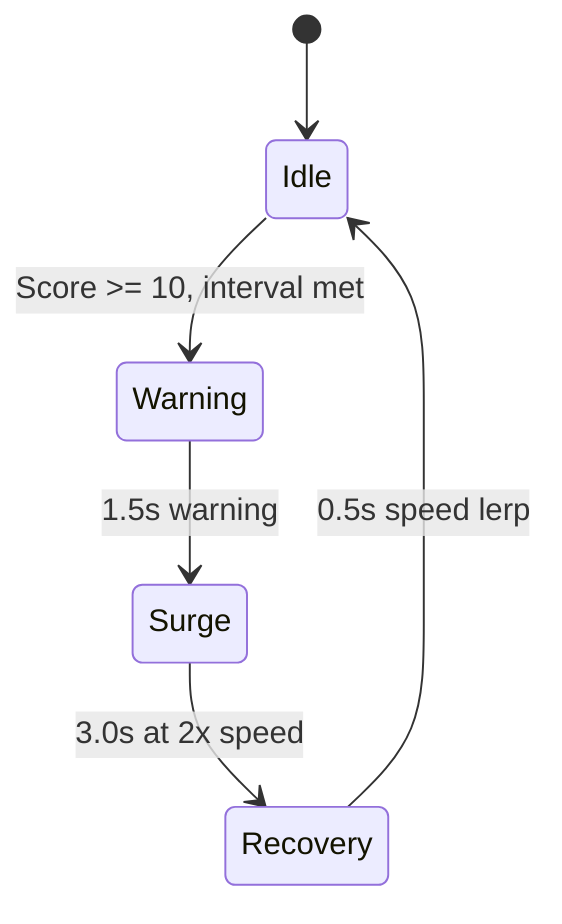

## Overview

Speed Surges are the most frequent dynamic event in SpaceFlapper. They temporarily double obstacle scroll speed for 3 seconds, creating intense bursts of action. A 1.5-second warning phase gives you time to prepare.

## Trigger conditions

| Parameter | Value |
|-----------|-------|
| Minimum score | 10 |
| Trigger interval | 15-25 seconds (random) |
| Minimum cooldown | 10 seconds between surges |
| Mutual exclusion | Cannot start during other events |

<Callout kind="info">
  Speed Surges have the lowest score requirement (10) and shortest interval (15-25s) of any event, making them the first and most frequent event you encounter in a typical run.
</Callout>

## Event phases



| Phase | Duration | Speed multiplier |
|-------|----------|-----------------|
| Warning | 1.5s | 1.0x (normal) |
| Surge | 3.0s | 2.0x (doubled) |
| Recovery | 0.5s | Lerp from 2.0x back to 1.0x |

## Speed change

### During surge

All obstacle scroll speed is multiplied by 2.0x. This affects:
- Static obstacle pair movement
- Moving obstacle drift
- Collectible and power-up movement
- Scene-specific obstacle movement

### Recovery lerp

Speed smoothly transitions back to normal over 0.5 seconds:

```
currentSpeed = 2.0 - (1.0 * (timer / 0.5))
```

| Recovery time | Speed multiplier |
|--------------|-----------------|
| 0.0s | 2.0x |
| 0.25s | 1.5x |
| 0.5s | 1.0x |

## Warning visuals

During the 1.5-second warning:
- **"INCOMING!" text**: Red text (R:1.0, G:0.3, B:0.3) pulses between 30% and 100% alpha
- **Red vignette**: Overlay pulses between 2% and 8% opacity with additive blend
- The vignette intensifies as the warning progresses

## Surge visuals

During the 3-second surge:
- **Red vignette**: Steady at 6% opacity
- **Micro-shake**: Scene position oscillates 0.5 points horizontally at 50Hz
- The shake uses a rapid sequence: right(0.5pt) -> left(1pt) -> back(0.5pt) in 0.06s

<Callout kind="tip">
  During a speed surge, anticipate obstacle positions further ahead than normal. At 2x speed, you have half the reaction time. Stay near the center of the screen to maximize your response options.
</Callout>

## Callback system

The Speed Surge Manager fires several callbacks for integration:

| Callback | When |
|----------|------|
| `onSurgeWarning` | Warning phase begins |
| `onSurgeStart` | Surge phase begins (for haptic feedback) |
| `onSpeedChange(2.0)` | Speed multiplier applied |
| `onSurgeEnd` | Speed returns to normal |
| `onSurgeBonus` | Bonus points for passes during surge |

## Related pages

<Columns cols="2">
  <Card title="Meteor Storms" href="/events/meteor-storms" icon="cloud-lightning" horizontal="false">
    A longer, more dramatic survival event.
  </Card>

  <Card title="Difficulty scaling" href="/mechanics/difficulty" icon="trending-up" horizontal="false">
    How base obstacle speed affects surge intensity.
  </Card>
</Columns>
