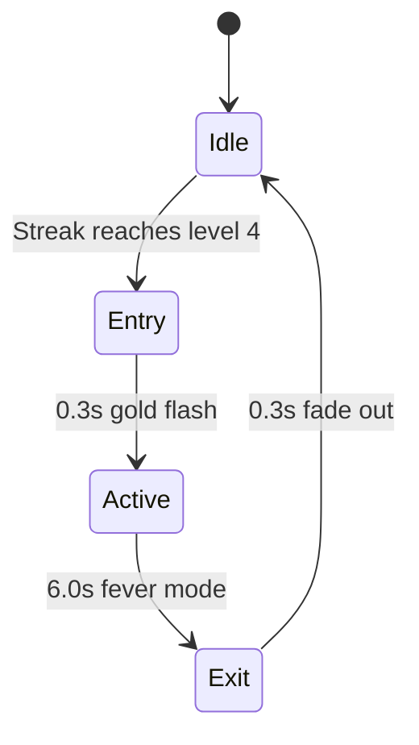

## Overview

Stardust Fever is the ultimate streak reward in SpaceFlapper. Triggered when you reach streak level 4 (12 consecutive obstacle passes), it activates a 6-second window of 3x scoring and gold stardust rain. This is the most lucrative scoring opportunity in the game.

## Trigger conditions

| Parameter | Value |
|-----------|-------|
| Trigger | Reaching streak level 4 |
| Required consecutive passes | 12 |
| Score requirement | None (streak-based only) |
| Mutual exclusion | Does not check (fires directly) |

<Callout kind="alert">
  Stardust Fever triggers directly from the streak system, bypassing the mutual exclusion check. It can overlap with other events, though this is rare since maintaining a 12-pass streak during another event is challenging.
</Callout>

## Event phases

| Phase | Duration | Multiplier | Visual |
|-------|----------|-----------|--------|
| Entry | 0.3s | 1x | Gold screen flash |
| Active | 6.0s | 3x | Gold vignette, rain, timer |
| Exit | 0.3s | 1x | Fade out |

## Scoring

| Parameter | Value |
|-----------|-------|
| Score multiplier | 3x |
| Duration | 6.0 seconds |
| Max potential bonus | ~18 points (at 1 pass/second) |

The 3x multiplier applies to every obstacle pass during the active phase. Combined with the rapid pacing at high difficulty, this can yield significant score boosts.

## Gold stardust rain

During the active phase, gold particles rain from the top of the screen:

| Rain parameter | Value |
|---------------|-------|
| Spawn interval | Every `0.15` seconds |
| Spawn position | Random X across screen, top edge |
| Fall duration | 1.5-2.5 seconds (random) |
| Horizontal drift | -30 to +30 points |
| Particle size | 2.0 point radius |
| Color | Gold (R:1.0, G:0.85, B:0.3) |

<Callout kind="info">
  The gold rain particles are purely decorative. They do not award stardust on contact. However, the `onSpawnGoldCollectible` callback allows the game to spawn actual gold collectibles during fever.
</Callout>

## Entry visuals

When fever triggers:
- **Gold flash**: Full-screen gold overlay at 30% opacity, fades over 0.3s
- **"STARDUST FEVER!" popup**: Gold text, scales from 0.5x to 1.2x, settles to 1.0x
- Text holds for 1.0 second then fades

## Active visuals

During the 6-second fever:
- **Gold vignette**: Pulses between 3% and 8% opacity (additive blend)
- **Timer label**: "FEVER: X.Xs" countdown in gold, positioned at screen top
- **"3x" multiplier**: Pulsing gold text (0.9x-1.2x scale)
- **Gold rain**: Continuous particle shower

## Cancellation

Stardust Fever is forcibly stopped if:
- The player dies
- The streak breaks (collision with obstacle)

When stopped early:
- Multiplier immediately resets to 1x
- All visuals are removed
- The `onFeverEnd` callback fires

<Callout kind="tip">
  To maximize Stardust Fever value, build your streak early in a run when obstacles are slower. The 12-pass requirement at easy difficulty is achievable, and the 3x multiplier applies to all passes regardless of difficulty level.
</Callout>

## Interaction with other events

| Event | Interaction |
|-------|------------|
| Speed Surge | Fever persists during surges (harder to maintain streak) |
| Gravity Flip | Fever multiplier (3x) overrides flip multiplier (2x) |
| Meteor Storm | Streak likely breaks during storm (ending fever) |
| Warp Zone | Auto-score during warp gets 3x if fever is active |

## Related pages

<Columns cols="2">
  <Card title="Streak and combo system" href="/mechanics/streak-combo" icon="flame" horizontal="false">
    How to build and maintain the streak for fever.
  </Card>

  <Card title="Stardust collectibles" href="/power-ups/stardust-collectibles" icon="star" horizontal="false">
    The currency system that fever enhances.
  </Card>
</Columns>
