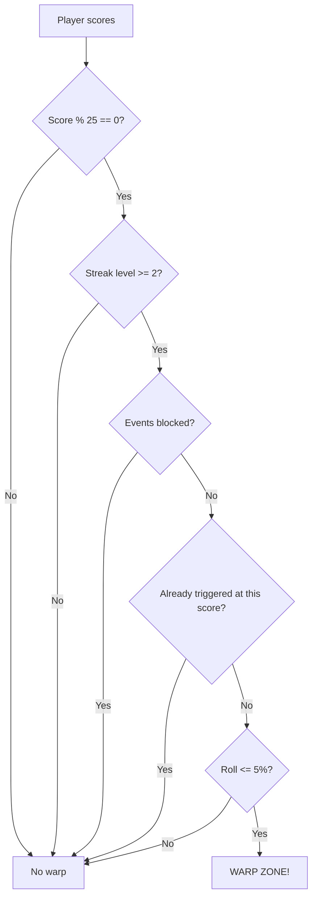
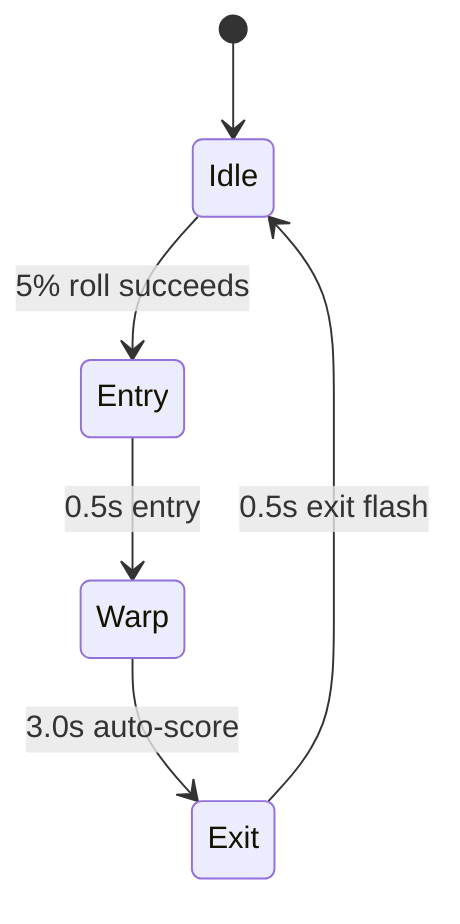

## Overview

Warp Zones are the rarest event in SpaceFlapper. With only a 5% trigger chance at score multiples of 25, they create a brief obstacle-free tunnel where you auto-earn points. Entering a warp zone feels like a reward for consistent play.

## Trigger conditions

| Parameter | Value |
|-----------|-------|
| Trigger chance | 5% |
| Score requirement | Multiple of 25 (25, 50, 75, ...) |
| Required streak level | Level 2+ (5 consecutive passes) |
| Mutual exclusion | Cannot start during other events |
| Repeat prevention | Cannot trigger at same score twice |

<Callout kind="info">
  The combination of streak level 2+, score multiple of 25, and 5% probability makes warp zones extremely rare. Most players will see fewer than 1 per game.
</Callout>

## Event phases

| Phase | Duration | Description |
|-------|----------|-------------|
| Entry | 0.5s | Obstacles accelerate off-screen (5x speed), spawning pauses |
| Warp | 3.0s | No obstacles, auto-score every 0.5s, particle tunnel |
| Exit | 0.5s | White flash, obstacle spawning resumes |

## Warp mechanics

### Entry phase

When a warp zone triggers:
1. Obstacle speed is temporarily set to **5x** to sweep existing obstacles off-screen
2. Obstacle spawning is **paused**
3. Player becomes **invincible**
4. Purple color overlay begins fading in

### Active warp

During the 3-second warp:
- **Auto-score**: +1 point every 0.5 seconds (6 points total)
- **No obstacles**: The screen is completely clear
- **Rainbow overlay**: Color-cycling hue overlay at 10% opacity
- **"WARP ZONE" text**: Gold popup with scale animation

| Auto-score parameter | Value |
|---------------------|-------|
| Score interval | Every `0.5` seconds |
| Total auto-points | 6 |
| Speed during warp | 1.0x (normal, but no obstacles) |

### Exit phase

When the warp ends:
- **White flash**: Full-screen white at 40% opacity, fading over 0.5s
- Speed returns to 1.0x
- Invincibility is removed
- Obstacle spawning resumes after a **0.5-second grace period**

<Callout kind="tip">
  Use the 3-second warp window to reposition yourself. With no obstacles and invincibility active, you can safely move to an optimal starting position for when obstacles resume.
</Callout>

## Visual design

### Entry visuals
- Purple-indigo color overlay fades from 0% to 10% opacity
- Additive blend mode for a ethereal glow effect

### Warp visuals
- **Rainbow color cycle**: Hue rotates through the spectrum every 1.5 seconds
- **"WARP ZONE" text**: Gold (R:1.0, G:0.9, B:0.3), font size 24
- Text pops in at 0.5x scale to 1.2x, settles to 1.0, then fades after 1 second

### Exit visuals
- White flash overlay at 40% opacity
- Fades linearly over 0.5 seconds

## Grace period

After the warp exit:
- A 0.5-second delay occurs before obstacle spawning resumes
- This prevents obstacles from appearing immediately in front of the player
- Invincibility ends at the start of exit phase

## Related pages

<Columns cols="2">
  <Card title="Streak and combo system" href="/mechanics/streak-combo" icon="flame" horizontal="false">
    Streak level 2+ is required to trigger warp zones.
  </Card>

  <Card title="Event overview" href="/events/overview" icon="zap" horizontal="false">
    All dynamic events and their rarity comparison.
  </Card>
</Columns>
