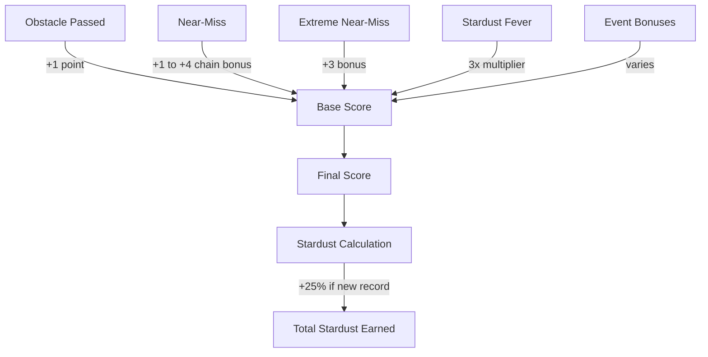

## Before you launch

When you open SpaceFlapper, you start on the menu screen. Your astronaut floats with a gentle bobbing animation at the center of the screen. Tap anywhere to begin your first run.

<Callout kind="info">
  The game starts immediately on your first tap. That tap also counts as your first flap, so your astronaut will thrust upward right away.
</Callout>

## Your first 30 seconds

The opening seconds of each run are the most forgiving. Obstacles are spaced widely, scroll speed is at its base level, and only static obstacle types appear. Use this window to find your rhythm.

<Steps>
  <Step title="Find your tap rhythm" icon="hand" titleType="p">
    Your astronaut falls under a gravity of -5.0 units. Each tap applies an 18-unit upward impulse. Aim for steady, evenly spaced taps to maintain a smooth flight path through the center of the screen.

    <Callout kind="tip">
      Staying near the vertical center gives you the most room to react in either direction. Avoid drifting to the top or bottom edges.
    </Callout>
  </Step>

  <Step title="Pass your first obstacles" icon="check-circle" titleType="p">
    The first obstacles are static pairs with wide gaps. Line up your astronaut with the gap and tap through. Each successful pass adds +1 to your score.

    Watch for the score counter at the top of the screen to confirm you passed cleanly.
  </Step>

  <Step title="Collect your first stardust" icon="star" titleType="p">
    Glowing star bit particles appear near obstacle gaps. Fly through them to collect stardust. You do not need to go out of your way -- many spawn directly in the flight path.

    Stardust collected during your run is added to your total at game over, along with performance-based stardust rewards.
  </Step>

  <Step title="Watch for power-ups" icon="zap" titleType="p">
    Power-ups spawn randomly and float in the play area. If you see a shield, rocket boost, or time warp icon, steer toward it. Power-ups activate on contact.

    | Power-Up | Duration | Effect |
    |----------|----------|--------|
    | Shield | 15 seconds | Absorbs one collision |
    | Rocket Boost | 3 seconds | Invincibility + 1.5x thrust |
    | Time Warp | 4 seconds | Slows game world |
  </Step>

  <Step title="Build your first streak" icon="flame" titleType="p">
    Each consecutive obstacle pass without dying increases your streak counter. As your streak grows, visual effects intensify:

    - Your astronaut gains a glow effect
    - Jetpack flame colors shift
    - A trail follows your movement

    At maximum streak, **Stardust Fever** triggers with a 3x score multiplier. Keep the streak alive as long as you can.
  </Step>
</Steps>

## The three scenes

As you survive longer, the parallax background transitions through three themed scenes. Each scene introduces a different visual atmosphere, though the core gameplay remains the same.

### Asteroid Belt

The starting scene. Dark space with scattered asteroid fields in the background. Obstacles at this stage are mostly static with wide gaps.

<Callout kind="tip">
  Use the Asteroid Belt phase to build an early streak. The wide gaps and slow speed make it the easiest section to chain consecutive passes.
</Callout>

### Solar Approach

The background shifts to warm solar tones as you approach a nearby star. By this point, difficulty has ramped up: gaps are narrower, speed is faster, and moving obstacles begin appearing.

<Callout kind="alert">
  Moving obstacles drift vertically, changing the gap position as they scroll toward you. Watch the movement direction before committing to a flight path.
</Callout>

### Europa Ice Field

The final scene features icy blue tones inspired by Jupiter's moon Europa. This is the highest difficulty zone with the tightest gaps, fastest scroll speeds, and the full range of obstacle types and dynamic events.

## How scoring builds up

Your score grows through multiple channels during a run:

<Callout kind="info">
  Setting a new high score grants a **25% stardust bonus** on top of your session earnings. Beating your record is always worth pushing for.
</Callout>

## Near-miss chain bonuses

Flying close to obstacles without hitting them triggers near-miss detection. Consecutive near-misses build a **close call chain** with escalating rewards:

| Chain Length | Bonus | On-Screen Text |
|-------------|-------|----------------|
| 1st close call | +1 | CLOSE! |
| 2nd consecutive | +2 | CLOSE x2! |
| 3rd consecutive | +3 | CLOSE x3! |
| 4th+ consecutive | +4 (capped) | INSANE! |

If your near-miss is within 18 pixels of an obstacle, it triggers an **extreme near-miss** with bullet time slow-motion and an additional +3 bonus.

<Callout kind="tip">
  Close call chains reset when you pass an obstacle without a near-miss. You do not need to near-miss every obstacle -- just consecutive ones to build the chain.
</Callout>

## What happens at game over

When you collide with an obstacle (without a shield), a cinematic death sequence plays:

1. The game enters slow-motion for 0.3 seconds
2. Your astronaut tumbles with a rotation animation
3. A fade-out with particle effects concludes the sequence

After the animation, the game over screen shows:

- Your final score and high score comparison
- **NEW RECORD** banner if you beat your high score
- **SO CLOSE** indicator if you were within 1-3 points of your record
- Stardust earned breakdown (base + collected + record bonus)
- Session statistics including best streak and near-miss count

Tap to retry immediately, or return to the menu.

<Callout kind="tip">
  After each run, check your stardust total in the shop. Unlocking a new suit gives your astronaut a fresh look and makes the next run feel different.
</Callout>
