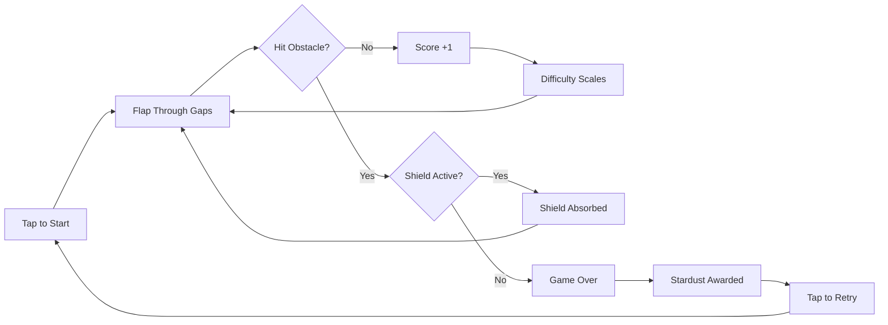

## Controls

SpaceFlapper uses a single input: **tap anywhere on the screen to flap**. Each tap applies an upward thrust impulse of 18 units to your astronaut. When you stop tapping, gravity pulls you back down.

Your astronaut is positioned at 30% from the left edge of the screen. You control only vertical movement -- obstacles scroll toward you from the right.

<Callout kind="tip">
  Short, rhythmic taps give you the most control. Holding or tapping too fast pushes you upward quickly, which can send you into the top boundary.
</Callout>

## Scoring basics

You earn **1 point** each time you pass through an obstacle gap. The score counter at the top of the screen updates immediately.

| Action | Points |
|--------|--------|
| Pass through an obstacle | +1 |
| Near-miss (close pass) | +1 bonus per chain level |
| Extreme near-miss (under 18px) | +3 bonus |
| Stardust Fever active | 3x score multiplier |
| Gravity Flip survived | +5 bonus |

<Callout kind="info">
  Near-miss bonuses stack in chains. The first close call gives +1, the second +2, the third +3, and the fourth onward gives +4. Chain resets when you pass an obstacle without a near-miss.
</Callout>

## What to collect

### Stardust (star bits)

Glowing collectible particles appear near obstacles. Fly through them to add stardust to your session total. Stardust is the in-game currency used for unlocking astronaut suits in the shop.

### Power-ups

Three power-ups spawn randomly during gameplay:

- **Shield** -- Absorbs one hit, lasts 15 seconds
- **Rocket Boost** -- Grants 3 seconds of invincibility with a 1.5x thrust multiplier
- **Time Warp** -- Slows the game world for 4 seconds, giving you more reaction time

<Callout kind="tip">
  Prioritize shields when you see them. A single shield save can extend your run significantly and help you reach higher difficulty tiers where stardust rewards increase.
</Callout>

## What to avoid

Anything solid will end your run on contact (unless you have an active shield or rocket boost):

- **Obstacles** -- Pipes, barriers, moving platforms, rotating hazards, and gravity wells
- **Screen boundaries** -- The top and bottom edges of the screen are lethal
- **Meteors** -- During Meteor Storm events, rocks fly across the screen in addition to normal obstacles

## The game loop

## Streaks

Passing obstacles consecutively without dying builds your **streak counter**. Higher streaks trigger visual effects like glow trails behind your astronaut and jetpack flame color changes.

At maximum streak level, **Stardust Fever** activates automatically, granting a 3x score multiplier for a limited time.

<Callout kind="info">
  Your best streak is tracked across all sessions. When you approach your personal record during a run, the game shows a proximity indicator so you know how close you are to beating it.
</Callout>

## Difficulty scaling

SpaceFlapper gets harder as you play. Difficulty increases based on both your **score** and **survival time**:

- Obstacle gaps get narrower
- Scroll speed increases
- Moving obstacles appear more frequently
- Spawn intervals decrease
- New obstacle types and dynamic events unlock at higher levels

<Callout kind="alert">
  Difficulty never resets during a run. If you reach a high score, the final obstacles will be noticeably faster and tighter than at the start. Practice smooth, consistent tapping to maintain control at higher speeds.
</Callout>
