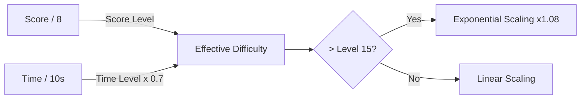

## Overview

SpaceFlapper uses a dual-axis difficulty system that scales based on both your **score** and **survival time**. Difficulty increases continuously with no hard cap -- the game becomes progressively brutal the longer you survive.

## Dual-axis scaling

Two independent factors contribute to the effective difficulty level:

- **Score-based level**: Increases by 1 every **8 points** scored
- **Time-based level**: Increases by 1 every **10 seconds** of survival

The effective difficulty combines both axes, with time contributing at 70% weight relative to score.

## Parameter scaling

Each difficulty parameter adjusts independently based on the effective level.

### Gap size

| Parameter | Value |
|-----------|-------|
| Base gap | `190` points |
| Decrease per score level | `10` points |
| Decrease per time level | `4` points |
| Minimum gap | `85` points |

<Callout kind="alert">
  At minimum gap size (85 points), the passage between obstacles is barely larger than the player's hitbox. This is intentionally nearly impossible.
</Callout>

### Scroll speed

| Parameter | Value |
|-----------|-------|
| Base speed | `140` pts/s |
| Increase per score level | `15` pts/s |
| Increase per time level | `8` pts/s |
| Maximum speed | `420` pts/s |

After effective level 15, scroll speed gains a **quadratic bonus**: `excess^2 * 0.5` additional speed per level beyond the threshold.

### Obstacle spawn interval

| Parameter | Value |
|-----------|-------|
| Base interval | `2.8` seconds |
| Decrease per score level | `0.12` seconds |
| Decrease per time level | `0.06` seconds |
| Minimum interval | `1.0` second |

### Moving obstacle probability

| Parameter | Value |
|-----------|-------|
| Base probability | `25%` |
| Increase per score level | `+6%` |
| Increase per time level | `+3%` |
| Maximum probability | `92%` |

### Drift multiplier

Controls how erratically moving obstacles move.

| Parameter | Value |
|-----------|-------|
| Base drift | `1.0x` |
| Increase per score level | `+0.12x` |
| Increase per time level | `+0.08x` |
| Maximum drift | `2.5x` |

## Exponential scaling

After effective difficulty level **15**, an exponential scaling factor of `1.08x` per level kicks in. This means difficulty accelerates faster the deeper you get into a run.

## Difficulty labels

The game assigns human-readable labels to difficulty ranges:

| Effective Level | Label |
|----------------|-------|
| 0-4 | Easy |
| 5-9 | Normal |
| 10-14 | Hard |
| 15-19 | Very Hard |
| 20-29 | Extreme |
| 30-39 | Insane |
| 40-49 | Nightmare |
| 50+ | IMPOSSIBLE |

<Callout kind="tip">
  Difficulty resets completely when you start a new game. Each run starts fresh at level 0 regardless of your previous high score.
</Callout>

## Example progression

Here is how key parameters evolve at representative difficulty levels:

| Effective Level | Gap Size | Speed | Spawn Rate | Moving % |
|----------------|----------|-------|------------|----------|
| 0 | 190 pts | 140 pts/s | 2.8s | 25% |
| 5 | 140 pts | 215 pts/s | 2.2s | 55% |
| 10 | 90 pts | 290 pts/s | 1.6s | 85% |
| 15 | 85 pts | 365 pts/s | 1.0s | 92% |
| 20+ | 85 pts | 420 pts/s | 1.0s | 92% |

## Related pages

<Columns cols="2">
  <Card title="Scoring system" href="/mechanics/scoring" icon="trophy" horizontal="false">
    How score drives difficulty increases.
  </Card>

  <Card title="Obstacle overview" href="/obstacles/overview" icon="shield-alert" horizontal="false">
    All obstacle types affected by difficulty scaling.
  </Card>
</Columns>
