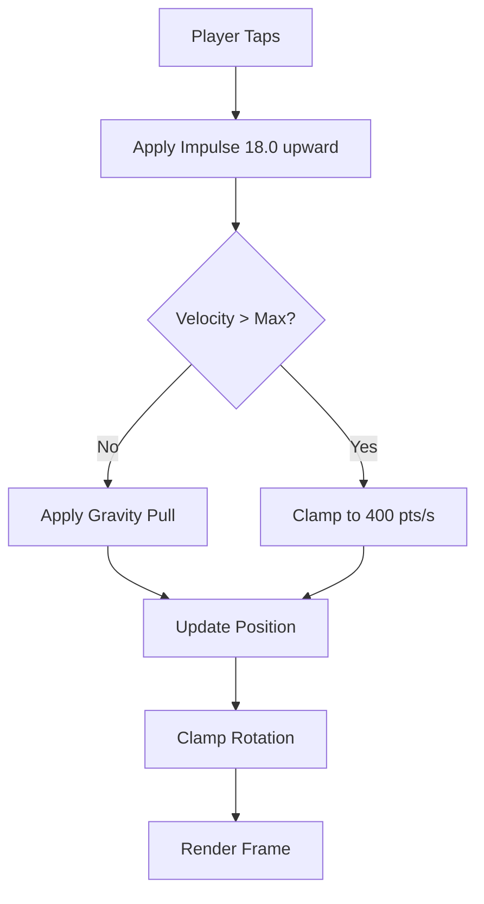

## Overview

SpaceFlapper uses a single-tap control scheme inspired by classic flappy-style games. Each tap applies an upward impulse to your astronaut, counteracting gravity. Mastering the timing and rhythm of taps is the foundation of all gameplay.

## Tap controls

Tap anywhere on the screen to thrust upward. Each tap applies an instantaneous impulse that pushes the player against gravity. There is no hold mechanic -- every input is a discrete tap.

| Parameter | Value | Description |
|-----------|-------|-------------|
| Thrust impulse | `18.0` | Upward force applied per tap |
| Max upward velocity | `400.0` pts/s | Velocity cap when rising |
| Max downward velocity | `600.0` pts/s | Terminal fall speed |
| Thrust multiplier (Rocket Boost) | `1.5x` | Stronger thrust during boost |

<Callout kind="info">
  When gravity is flipped during a Gravity Flip event, the thrust direction inverts automatically. Taps push you downward instead of upward.
</Callout>

## Physics model

The game uses SpriteKit's physics engine with a custom gravity vector. The player node has a rectangular physics body sized at **36 x 40 points**, which is smaller than the visual sprite for forgiving collision detection.

### Gravity

| State | Gravity Vector | Description |
|-------|---------------|-------------|
| Normal | `(0, -5.0)` | Standard downward pull |
| Flipped | `(0, +5.0)` | Inverted during Gravity Flip events |
| Recovery | Lerped | Smooth transition back to normal over 0.5s |

### Rotation

The astronaut sprite rotates slightly based on vertical velocity to provide visual feedback on movement direction.

| Parameter | Value | Description |
|-----------|-------|-------------|
| Rotation multiplier | `0.0015` | Converts velocity to rotation angle |
| Max up rotation | `0.4 rad` (~23 degrees) | Tilt when rising |
| Max down rotation | `-0.7 rad` (~40 degrees) | Tilt when falling |

## Player boundaries

The player's vertical position is constrained to the visible screen area. If you hit the top or bottom edge of the screen, you die. The game does not wrap or bounce at boundaries.

## Idle animations

When not thrusting, the astronaut plays a gentle bobbing animation to feel alive.

| Parameter | Value |
|-----------|-------|
| Bobbing amplitude | `3.0` points |
| Bobbing duration | `1.2` seconds per cycle |
| Idle flame birth rate | `12` particles/s |
| Thrust burst birth rate | `80` particles/s |
| Streak thrust birth rate | `120` particles/s |

<Callout kind="tip">
  Watch the jetpack flame intensity -- it changes with your streak level and provides a visual cue for how well you are performing.
</Callout>

## Visor expressions

The astronaut's visor displays different expressions based on gameplay events:

- **Neutral** -- default state
- **Happy** -- after collecting a power-up or stardust
- **Scared** -- near-miss with an obstacle
- **Determined** -- during high streaks

## Related pages

<Columns cols="2">
  <Card title="Scoring system" href="/mechanics/scoring" icon="trophy" horizontal="false">
    Learn how points are earned and multiplied.
  </Card>

  <Card title="Streak and combo system" href="/mechanics/streak-combo" icon="flame" horizontal="false">
    Discover how consecutive passes build streak levels.
  </Card>
</Columns>
