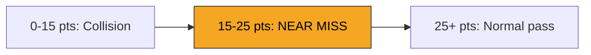

## Overview

The near-miss system rewards skilled play by detecting when you pass dangerously close to an obstacle without colliding. Flying within the near-miss zone earns bonus recognition through visual effects, haptic feedback, and contributes to your overall score.

## Detection zone

Near-miss detection uses the distance between the **edges** of the player's physics body and the obstacle's physics body -- not their centers.

| Parameter | Value | Description |
|-----------|-------|-------------|
| Minimum threshold | `15` points | Closer than this is a collision |
| Maximum threshold | `25` points | Beyond this is a normal pass |
| Detection zone | `15-25` points | The sweet spot for near-miss |

## Physics body dimensions

The detection system accounts for the different shapes of player and obstacle physics bodies.

### Player physics body

| Dimension | Value |
|-----------|-------|
| Shape | Rectangle |
| Width | `36` points |
| Height | `40` points |
| Half-width | `18` points |
| Half-height | `20` points |

### Obstacle physics bodies

| Obstacle type | Shape | Approximate radius |
|--------------|-------|-------------------|
| Standard asteroid (ObstacleNode) | Circle | `24.5` pts (70 * 0.7 / 2) |
| Moving obstacle | Circle | `17.9` pts (55 * 0.65 / 2) |
| Average fallback | Circle | `21.0` pts |

## Distance calculation

The system calculates rectangle-to-circle distance:

1. Find the closest point on the player rectangle to the obstacle circle center
2. Calculate the Euclidean distance from that point to the circle center
3. Subtract the circle radius to get edge-to-edge distance

<Callout kind="info">
  Each obstacle can only trigger one near-miss event. Once a near-miss is detected for a specific obstacle, it is marked as processed and will not trigger again.
</Callout>

## Detection timing

The near-miss check runs **every frame** from `GameScene.update()`. The system iterates over all active obstacle nodes in the scene and checks each one against the player's position.

## Feedback

When a near-miss is detected, the game fires a `NearMissEvent` containing:

- The obstacle node that was narrowly avoided
- The exact distance between physics body edges
- Both player and obstacle positions at the moment of detection

This event triggers:

- **Visual feedback**: A brief flash or particle effect near the player
- **Haptic feedback**: A light impact haptic on supported devices
- **Crystal shatter**: CrystalShardObstacle obstacles in the Europa scene shatter into fragments on near-miss

<Callout kind="tip">
  Near-misses are easier to achieve with moving obstacles due to their smaller physics bodies (17.9 pts radius vs. 24.5 pts for static asteroids).
</Callout>

## Related pages

<Columns cols="2">
  <Card title="Flight controls" href="/mechanics/flight-controls" icon="gamepad-2" horizontal="false">
    Master the tap physics to achieve consistent near-misses.
  </Card>

  <Card title="Streak and combo system" href="/mechanics/streak-combo" icon="flame" horizontal="false">
    Near-misses contribute to building your streak.
  </Card>
</Columns>
