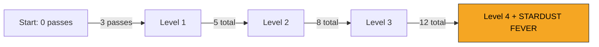

## Overview

The streak system tracks consecutive obstacle passes without colliding. As your streak grows, you progress through four levels that provide visual upgrades to your astronaut and ultimately trigger the powerful Stardust Fever event at maximum streak.

## Streak levels

| Level | Required passes | Visual effect |
|-------|----------------|---------------|
| None | 0 | No glow |
| Level 1 | 3 | Subtle glow around astronaut |
| Level 2 | 5 | Brighter glow, streak trail appears |
| Level 3 | 8 | Intense glow, enhanced jetpack flames |
| Level 4 | 12 | Maximum glow, triggers Stardust Fever |

## Level progression

The streak system tracks your `consecutivePasses` count. Each successful obstacle pass increments this counter by 1. The system checks if your count has crossed the threshold for the next level.

### Progress tracking

You can track your progress toward the next level:

- **Passes to next level**: The difference between the next threshold and your current count
- **Progress percentage**: Your position between the current and next threshold (0.0 to 1.0)

For example, at 6 consecutive passes (Level 2), you need 2 more passes to reach Level 3. Your progress toward Level 3 is `(6-5)/(8-5) = 33%`.

## Streak break

A collision with any obstacle immediately breaks your streak:

1. The streak break event fires with your final level and pass count
2. Consecutive passes reset to 0
3. Streak level drops back to None
4. All visual effects (glow, trail) are removed

<Callout kind="alert">
  Game over also breaks your streak. If you had an active streak when you die, the break event fires before the reset.
</Callout>

## Stardust Fever trigger

Reaching streak Level 4 (12 consecutive passes) triggers the **Stardust Fever** event:

- **3x score multiplier** for 6 seconds
- **Gold stardust rain** fills the screen
- **Gold vignette** visual overlay
- The `onStreakMaxReached` callback fires exactly once per max-level achievement

See the [Stardust Fever page](/events/stardust-fever) for the full event breakdown.

## Visual feedback

The astronaut's appearance changes with streak level:

| Level | Glow color | Jetpack flame | Trail effect |
|-------|-----------|---------------|-------------|
| None | No glow | Standard idle flame (12/s) | None |
| Level 1 | Subtle outline | Standard thrust (80/s) | None |
| Level 2 | Moderate glow | Enhanced thrust | Faint streak trail |
| Level 3 | Bright glow | Intense flames | Visible streak trail |
| Level 4 | Maximum glow | Maximum flames (120/s) | Full streak trail + Fever |

<Callout kind="tip">
  The streak system interacts with other mechanics. Gravity Flips require streak Level 1+ to trigger, and Warp Zones require streak Level 2+. Maintaining your streak unlocks access to these events.
</Callout>

## Event interactions

Your streak level gates certain dynamic events:

| Event | Required streak level |
|-------|-----------------------|
| Gravity Flip | Level 1+ |
| Warp Zone | Level 2+ |
| Stardust Fever | Level 4 (exact trigger) |

## Related pages

<Columns cols="2">
  <Card title="Stardust Fever" href="/events/stardust-fever" icon="sparkles" horizontal="false">
    The reward event triggered by reaching maximum streak.
  </Card>

  <Card title="Scoring system" href="/mechanics/scoring" icon="trophy" horizontal="false">
    How streak multipliers affect your score.
  </Card>
</Columns>
