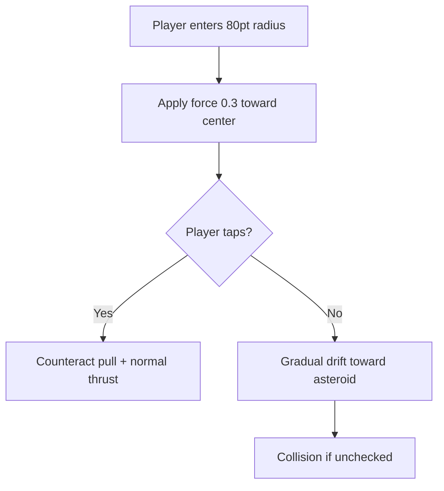

## Overview

The Asteroid Belt scene features four unique obstacle types that replace the standard pipe-style asteroids. These obstacles use procedurally generated visuals and include physics-based mechanics like magnetic pull and gravitational wells.

## Tumbling Rock

An irregularly shaped rotating asteroid with a procedurally generated polygon silhouette.

| Parameter | Value |
|-----------|-------|
| Vertex count | 6-10 (random) |
| Hitbox shrink | 0.65 |
| Rotation speed | 4.0-12.0 seconds per full rotation |
| Rotation direction | Random (clockwise or counter-clockwise) |
| Color palette | 5 variants: brown, gray, dark brown, slate, reddish brown |

### Behavior

Tumbling rocks scroll left with the obstacle speed and continuously rotate. Their irregular polygon shape means the visual threat changes as they turn, but the circular hitbox remains consistent.

<Callout kind="info">
  The procedural polygon generation means no two tumbling rocks look exactly alike. Each one gets a random vertex count, random color scheme, and random rotation parameters.
</Callout>

## Micro Swarm

A cluster of 5-8 tiny fast-moving asteroids that travel as a loose group.

| Parameter | Value |
|-----------|-------|
| Rock count | 5-8 per swarm |
| Individual rock size | 25-45% of base size |
| Swarm spread radius | 0.8x base size |
| Hitbox shrink | 0.60 |
| Color palette | 5 variants: dusty brown, stone gray, dark brown, warm gray, charcoal |

### Behavior

Each rock in the swarm has its own:
- **Base offset** from the swarm center
- **Drift amplitude** -- how far it wanders from its base position
- **Drift frequency** -- speed of wandering oscillation
- **Individual rotation speed** -- independent tumbling

The rocks drift and oscillate within the cluster, making the swarm feel organic and unpredictable.

<Callout kind="tip">
  The gaps between individual rocks in a swarm are often large enough to pass through, but the cluster moves as a unit. Look for the largest gap and time your passage.
</Callout>

## Iron Core

A magnetic metallic asteroid that applies an attractive force to the player when nearby.

| Parameter | Value |
|-----------|-------|
| Magnetic radius | `80` points |
| Magnetic force | `0.3` |
| Hitbox shrink | 0.65 |
| Rotation speed | 10 seconds per full rotation |
| Spawn weight | 20% |

### Magnetic pull

When the player enters the magnetic radius, the iron core applies a gentle pull toward its center. The force is subtle enough to be countered with normal tapping but can catch you off guard.

<Callout kind="alert">
  Iron Cores have a subtle metallic particle effect that hints at their magnetic field. Watch for the small iron filing particles orbiting the asteroid.
</Callout>

## Gravity Well

A dark void obstacle with strong gravitational pull toward its center. Only appears at difficulty level 10 or higher.

| Parameter | Value |
|-----------|-------|
| Pull radius | `90` points |
| Pull force | `0.8` |
| Hitbox shrink | 0.60 |
| Dodge bonus radius | `30` points |
| Unlock condition | Effective difficulty >= 10 |
| Spawn weight | 15% (when available) |

### Gravitational mechanics

The gravity well creates a much stronger pull than the iron core. At force 0.8 within a 90-point radius, it actively pulls you toward the dark void center.

### Gravity dodge bonus

If you pass within **30 points** of the gravity well center without colliding, you earn a gravity dodge bonus -- a special achievement for threading the most dangerous needle.

### Visual design

The gravity well features a dark void core with a swirling purple-black accretion disk, making it visually distinct from all other obstacles.

## Spawn weights

| Obstacle | Base weight | With Gravity Well (diff >= 10) |
|----------|-----------|-------------------------------|
| Tumbling Rock | 45% | ~39% |
| Micro Swarm | 35% | ~30% |
| Iron Core | 20% | ~17% |
| Gravity Well | -- | ~13% |

## Related pages

<Columns cols="2">
  <Card title="Obstacle overview" href="/obstacles/overview" icon="shield-alert" horizontal="false">
    Full catalog of all obstacle types across scenes.
  </Card>

  <Card title="Difficulty scaling" href="/mechanics/difficulty" icon="trending-up" horizontal="false">
    How difficulty level affects obstacle spawning and behavior.
  </Card>
</Columns>
