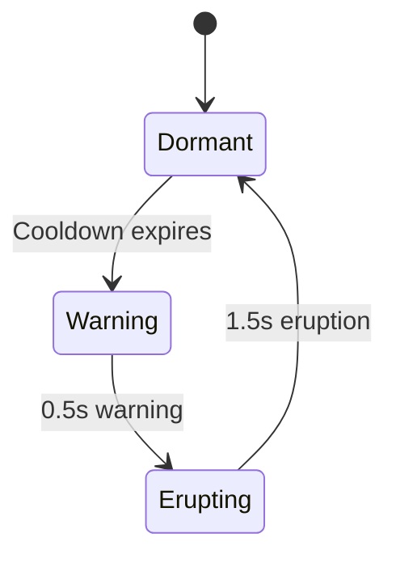
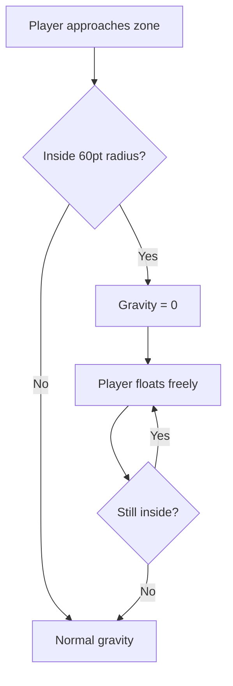

## Overview

The Europa Ice Moon scene features frozen obstacles inspired by Jupiter's icy moon. These obstacles introduce timed eruptions, shatterable crystals, and slow-moving ice chunks, along with environmental zero-gravity bubbles.

## Ice Geyser

A vertical erupting geyser that bursts upward in timed cycles. Collision only occurs during active eruption.

| Parameter | Value |
|-----------|-------|
| Eruption duration | `1.5` seconds |
| Cooldown duration | `2.0` seconds |
| Warning duration | `0.5` seconds |
| Hitbox shrink | 0.70 |
| Spawn weight | 30% |

### Eruption cycle

| Phase | Duration | Dangerous? | Visual cue |
|-------|----------|-----------|------------|
| Dormant | 2.0s | No | Base only visible |
| Warning | 0.5s | No | Rumble particles from base |
| Erupting | 1.5s | Yes | Full ice jet visible with spray |

<Callout kind="tip">
  Watch for the warning particles at the geyser base. You have 0.5 seconds to clear the eruption zone before the ice jet activates.
</Callout>

## Crystal Shard

An angular ice crystal with translucent refraction effects. Uniquely, it shatters into fragments on near-miss.

| Parameter | Value |
|-----------|-------|
| Hitbox shrink | 0.65 |
| Rotation speed | 12.0-20.0 seconds per rotation |
| Near-miss threshold | `25` points |
| Spawn weight | 40% (most common) |

### Shatter mechanic

When the player passes within the near-miss threshold of a crystal shard, it shatters into fragments. This is a one-time effect per crystal -- once shattered, it cannot shatter again.

The shatter provides:
- Visual reward with ice fragment particles
- Satisfying feedback for skilled play
- The `onNearMiss` callback fires for scoring integration

<Callout kind="info">
  Crystal shards are the most common obstacle in the Europa scene at 40% spawn weight. Their shatter mechanic encourages aggressive, close-range flying.
</Callout>

## Frozen Debris

A large, slow-moving ice chunk with an irregular rounded shape.

| Parameter | Value |
|-----------|-------|
| Speed multiplier | `0.7x` normal obstacle speed |
| Hitbox shrink | 0.65 |
| Vertex count | 7-10 (procedural) |
| Rotation speed | 15.0-25.0 seconds per rotation |
| Spawn weight | 30% |

### Slow-motion behavior

Frozen debris moves at **70% of normal obstacle speed**. This creates a unique pacing challenge -- the slower movement gives you more time to react but also means the obstacle occupies the screen longer.

### Visual design

- Procedurally generated irregular polygon (7-10 vertices)
- Blue-white ice coloring with frost surface details
- Subtle cyan glow
- Slow tumbling rotation

## Zero-Gravity Zone

A translucent environmental bubble that removes gravity when the player enters.

| Parameter | Value |
|-----------|-------|
| Zone radius | `60` points |
| Drift speed | `0.5x` obstacle speed |
| Visual | Translucent cyan bubble |
| Dangerous | No (environmental effect only) |

### Gravity removal

When the player enters the bubble:
- Gravity is set to zero
- The player floats freely until leaving the zone
- Thrust still works normally, but without gravity pull

When the player exits:
- Normal gravity resumes immediately

<Callout kind="alert">
  Zero-gravity zones drift left at half obstacle speed. Plan your exit carefully -- re-entering gravity while at the wrong altitude can be fatal.
</Callout>

## Spawn distribution

| Obstacle | Weight | With Gravity Well (diff >= 10) |
|----------|--------|-------------------------------|
| Crystal Shard | 40% | ~36% |
| Ice Geyser | 30% | ~27% |
| Frozen Debris | 30% | ~27% |
| Gravity Well | -- | ~11% |

## Related pages

<Columns cols="2">
  <Card title="Solar Approach obstacles" href="/obstacles/solar-approach" icon="sun" horizontal="false">
    The heat-themed counterpart to Europa's ice.
  </Card>

  <Card title="Near-miss detection" href="/mechanics/near-miss" icon="target" horizontal="false">
    How crystal shard shattering ties into near-miss mechanics.
  </Card>
</Columns>
