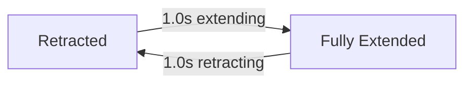

## Overview

The Solar Approach scene places you near a sun, with heat-themed obstacles that feature dynamic movement patterns and gravitational effects. All three obstacle types share a warm color palette of deep orange, solar yellow, and white-hot tones.

## Solar Flare

A horizontal plasma jet that extends and retracts from the screen edge in timed cycles.

| Parameter | Value |
|-----------|-------|
| Cycle duration | `2.0` seconds |
| Max extension | 60% of screen width |
| Flare height | `35` points |
| Hitbox shrink | 0.65 |
| Direction | From right (toward sun) or from left |
| Spawn weight | 35% |

### Extend/retract cycle

The solar flare continuously cycles between fully retracted and fully extended states.

### Collision behavior

The flare's hitbox scales with its current extension. When retracted, it poses no threat. When fully extended, it covers up to 60% of the screen width.

<Callout kind="tip">
  Time your passage when the flare is retracting. The safest window is during the first half of the retraction phase.
</Callout>

## Sunspot Vortex

A spinning dark obstacle with a spiral texture and optional gravitational pull.

| Parameter | Value |
|-----------|-------|
| Rotation speed | `1.5` rad/s |
| Gravity radius | `50` points |
| Gravity force | `0.5` |
| Has gravity | Default `true` |
| Hitbox shrink | 0.65 |
| Spawn weight | 30% |

### Gravitational pull

Most sunspot vortexes have gravitational pull enabled. When the player enters the 50-point gravity radius, a force of 0.5 pulls them toward the center. This is weaker than a Gravity Well (0.8 force, 90pt radius) but still dangerous.

### Visual design

The vortex features:
- Dark sunspot core with near-black coloring
- Spinning spiral texture rotating at 1.5 rad/s
- Penumbra edge glow in deep orange
- Continuous rotation animation

<Callout kind="info">
  The spiral visual rotation is purely aesthetic and does not affect the hitbox or gravity direction. The gravitational pull is always directed toward the center point.
</Callout>

## Plasma Loop

A curved arc obstacle resembling a magnetic field line or coronal loop.

| Parameter | Value |
|-----------|-------|
| Sway amplitude | `5.0` degrees |
| Sway cycle | `3.0` seconds |
| Arc height | 60% of bounding box height |
| Hitbox shrink | 0.65 |
| Spawn weight | 35% |

### Sway animation

The plasma loop gently sways back and forth, oscillating by 5 degrees in each direction over a 3-second cycle. This creates a subtle pendulum motion that changes the safe path through the obstacle.

### Visual design

The loop features:
- A Bezier curve shape representing a magnetic field line
- Glowing orange-yellow edges with additive blend mode
- Darker center channel
- Outer glow halo at 1.4x the loop size

## Spawn distribution

All three Solar Approach obstacles share roughly equal spawn chances:

| Obstacle | Weight | Effective % |
|----------|--------|------------|
| Solar Flare | 35 | 35% |
| Plasma Loop | 35 | 35% |
| Sunspot Vortex | 30 | 30% |

## Related pages

<Columns cols="2">
  <Card title="Europa Ice obstacles" href="/obstacles/europa-ice" icon="snowflake" horizontal="false">
    The frozen counterpart to solar obstacles.
  </Card>

  <Card title="Obstacle overview" href="/obstacles/overview" icon="shield-alert" horizontal="false">
    Full catalog across all scenes.
  </Card>
</Columns>
