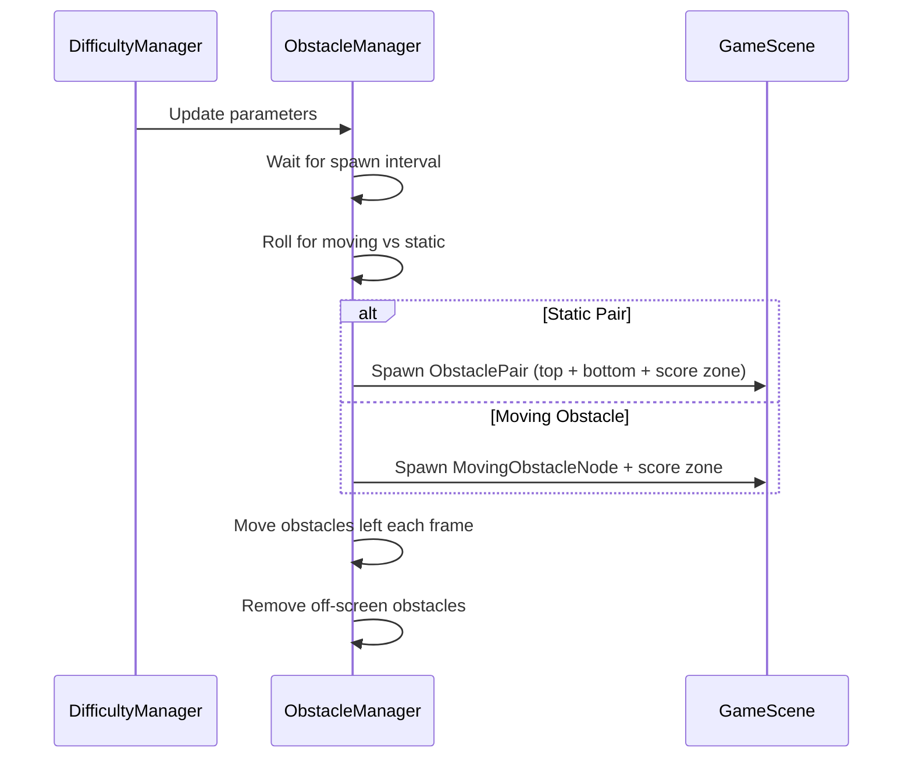

## Overview

Beyond scene-specific obstacles, SpaceFlapper features moving obstacles and the standard obstacle pair system that appear across multiple scenes. These provide variety through diverse visual types and movement patterns.

## Standard obstacle pairs (ObstacleNode)

The classic flappy-style obstacle: two asteroids positioned vertically with a gap between them.

| Parameter | Value |
|-----------|-------|
| Hitbox shrink | 0.70 |
| Color variants | 5 (purple, blue, pink, teal, orange) |
| Gap size | 190 pts (base) to 85 pts (minimum) |
| Physics body | Circle |

Each pair consists of a top and bottom `ObstacleNode` with a score zone in the gap. The gap size decreases with difficulty level.

## Moving obstacles (MovingObstacleNode)

Moving obstacles drift across the screen with various movement patterns. They feature 8 distinct visual types and 3 drift patterns.

### Visual types

| Type | Weight | Description |
|------|--------|-------------|
| Alien | 18% | Green alien creature |
| Satellite | 15% | Space satellite |
| UFO | 15% | Cartoon flying saucer |
| Drifting Asteroid | 15% | Small wandering rock |
| Space Mine | 12% | Spiked explosive mine |
| Comet | 10% | Fast-moving with trail |
| Space Jellyfish | 8% | Bioluminescent creature |
| Laser Drone | 7% | Small drone with laser |

### Drift patterns

Each moving obstacle gets a randomly assigned drift pattern:

<Tabs>
  <Tab title="Vertical" icon="arrow-up-down">
    Oscillates up and down while scrolling left.

    | Parameter | Range |
    |-----------|-------|
    | Amplitude | 30-60 points |
    | Frequency | 0.5-1.5 Hz |
  </Tab>

  <Tab title="Diagonal" icon="move-diagonal">
    Drifts at a slight angle from horizontal.

    | Parameter | Range |
    |-----------|-------|
    | Angle | -0.3 to 0.3 radians |
    | Speed | 20-50 pts/s |
  </Tab>

  <Tab title="Wave" icon="waves">
    Follows a sinusoidal wave path while drifting.

    | Parameter | Range |
    |-----------|-------|
    | Amplitude | 20-45 points |
    | Frequency | 0.8-1.8 Hz |
    | Base angle | -0.2 to 0.2 radians |
  </Tab>
</Tabs>

### Spawn probability

Moving obstacle spawn chance increases with difficulty:

| Difficulty | Probability |
|-----------|------------|
| Level 0 | 25% |
| Level 5 | 55% |
| Level 10 | 85% |
| Level 15+ | 92% (cap) |

The drift multiplier also scales with difficulty (base 1.0x, max 2.5x), making movement patterns more erratic at higher levels.

## Obstacle spawning lifecycle

## Scene-specific obstacle routing

The ObstacleManager routes to different obstacle sets based on the active scene:

| Scene | Obstacle set | Replaces |
|-------|-------------|----------|
| Default | ObstacleNode pairs + MovingObstacleNode | -- |
| Asteroid Belt | TumblingRock, MicroSwarm, IronCore, GravityWell | Standard pairs |
| Solar Approach | SolarFlare, PlasmaLoop, SunspotVortex | Standard pairs |
| Europa Ice | IceGeyser, CrystalShard, FrozenDebris, ZeroGravityZone | Standard pairs |

<Callout kind="info">
  Moving obstacles (MovingObstacleNode) can appear alongside scene-specific obstacles. They are spawned independently based on the moving obstacle probability from the difficulty system.
</Callout>

## Related pages

<Columns cols="2">
  <Card title="Obstacle overview" href="/obstacles/overview" icon="shield-alert" horizontal="false">
    Full catalog of all obstacle types.
  </Card>

  <Card title="Difficulty scaling" href="/mechanics/difficulty" icon="trending-up" horizontal="false">
    How difficulty affects spawn rates and movement.
  </Card>
</Columns>
