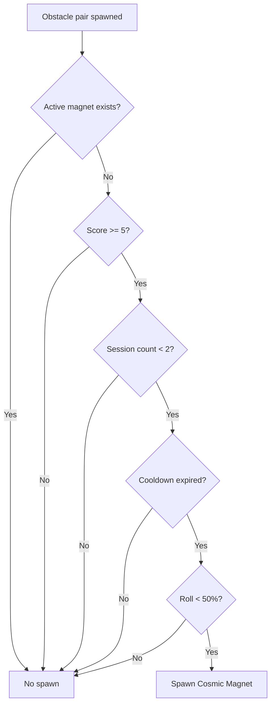
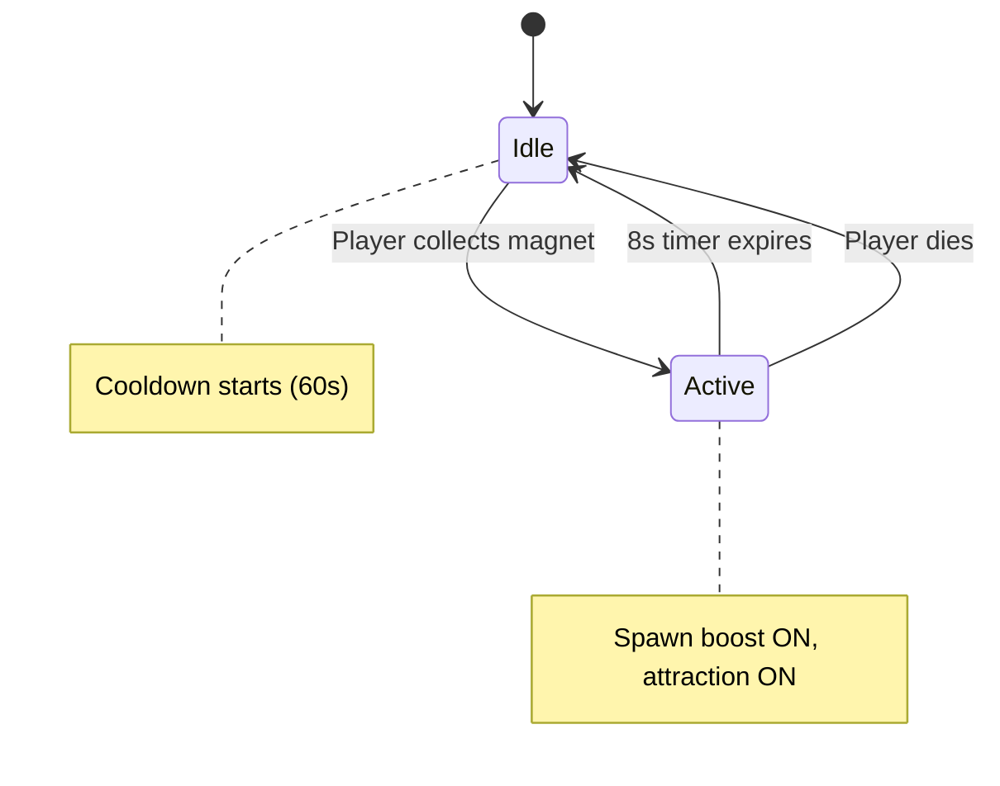

## Overview

The Cosmic Magnet is a rare collectible power-up that creates a magnetic field around the player, attracting nearby stardust collectibles and tripling the collectible spawn rate with all-gold spawns. It appears as a purple-gold swirling orb.

## Properties

| Parameter | Value |
|-----------|-------|
| Duration | `8` seconds |
| Attraction radius | `120` points |
| Attraction speed | `200` pts/s |
| Max per session | 2 |
| Cooldown between spawns | `60` seconds |
| Minimum score to spawn | 5 |
| Spawn chance (when eligible) | 50% |

<Callout kind="alert">
  The Cosmic Magnet is limited to a maximum of 2 per game session. Once both have been collected (or scrolled past), no more will spawn regardless of your score.
</Callout>

## Spawn rules

The Cosmic Magnet spawns through the CollectibleManager, not the PowerUpManager. It has stricter requirements:

## Magnetic attraction

When active, the magnet pulls nearby stardust collectibles toward the player:

| Distance behavior | Pull strength |
|-------------------|---------------|
| At edge of radius (120pt) | 0% (no pull) |
| Halfway (60pt) | 50% |
| Very close (10pt) | ~92% |
| Formula | `(1 - distance/radius) * 200 * deltaTime` |

The pull uses inverse distance scaling -- collectibles accelerate as they get closer to the player.

### Spawn rate boost

While the magnet is active:
- Collectible spawn chance becomes **100%** (guaranteed every gap)
- No minimum gap spacing requirement
- All collectibles spawn as **gold tier** (3 stardust each)

<Callout kind="tip">
  Maximize your Cosmic Magnet value by staying near the center of gaps where collectibles spawn. The 120-point attraction radius covers a significant area, but being centered ensures you catch stardust from both above and below.
</Callout>

## Visual design

### Orb appearance

The Cosmic Magnet node features:
- **Inner orb**: Purple circle (radius 8pt) with gold stroke
- **Outer glow ring**: Larger purple circle (radius 14pt) with faint gold border
- **Orbiting dots**: 4 gold dots orbiting at 12pt radius
- **Bob animation**: 4-point vertical bob, 1.2s per cycle

### Active effect visuals

When collected and active:
- **Vortex ring**: Purple pulsing ring around the player (radius 18pt)
- **Ring pulse**: 0.9x - 1.3x scale, 0.6s per cycle
- **Slow rotation**: Full 360 degrees in 3.0s
- **Timer label**: "Magnet: X.Xs" displayed at screen top

### Collection effect

On collection:
- 12 alternating purple and gold burst particles
- Particles expand 30-60 points outward
- "COSMIC MAGNET!" popup text rises and fades

## Lifecycle

## Related pages

<Columns cols="2">
  <Card title="Stardust collectibles" href="/power-ups/stardust-collectibles" icon="star" horizontal="false">
    The collectibles that the magnet attracts.
  </Card>

  <Card title="Power-up overview" href="/power-ups/overview" icon="zap" horizontal="false">
    All power-ups and their spawn mechanics.
  </Card>
</Columns>
