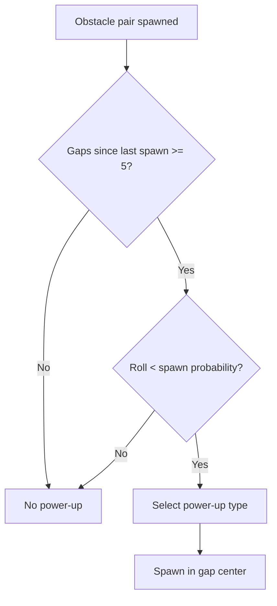

## Overview

SpaceFlapper features five collectible power-ups that spawn in obstacle gaps. Three are standard crystal power-ups (Star Shield, Rocket Boost, Time Warp), one is a rare collectible (Cosmic Magnet), and stardust collectibles serve as the progression currency.

## Spawn mechanics

Power-ups are tied to obstacle pair spawns. Each time a new obstacle pair appears, the system rolls to determine if a power-up should spawn in the gap.

### Spawn probability

| Parameter | Value |
|-----------|-------|
| Base spawn chance | 8% per obstacle pair |
| Increase per difficulty level | +0.5% |
| Maximum spawn chance | 15% |
| Minimum gaps between spawns | 5 |

### Distribution weights

When a power-up spawns, the type is selected by weighted random:

| Power-up | Weight | Chance |
|----------|--------|--------|
| Star Shield | 0.00 - 0.40 | 40% |
| Rocket Boost | 0.40 - 0.75 | 35% |
| Time Warp | 0.75 - 1.00 | 25% |

<Callout kind="info">
  The Cosmic Magnet spawns through a separate system managed by the CollectibleManager, not the PowerUpManager. It has its own spawn rules and cooldowns.
</Callout>

## Power-up visual design

All three standard power-ups share a hexagonal crystal gem shape with distinct color themes:

| Power-up | Color | Glow | Special effect |
|----------|-------|------|---------------|
| Star Shield | Cyan | Pulsing cyan glow | Floating animation |
| Rocket Boost | Orange | Fast pulsing orange | Flame particles below |
| Time Warp | Purple | Medium pulsing purple | Swirling orbit particles |

### Common animations

All crystal power-ups share these base animations:

- **Floating**: Gentle 3-point vertical bob
- **Rotation**: Subtle 0.05 radian wobble
- **Glow pulse**: Scale between 0.85x-1.4x with alpha fade

## Collection

When the player's physics body contacts a power-up:

1. The power-up's collection effect plays (burst particles + flash)
2. The power-up node is removed from the scene
3. The corresponding effect activates on the player
4. A "COSMIC MAGNET!" or similar popup text appears for rare items

## Active power-up rules

- Only one standard power-up effect can be active at a time
- Collecting a new power-up while one is active replaces the current effect
- Power-ups have fixed durations and expire automatically
- Death immediately cancels any active power-up

| Power-up | Duration |
|----------|----------|
| Star Shield | 15 seconds |
| Rocket Boost | 3 seconds |
| Time Warp | 4 seconds |
| Cosmic Magnet | 8 seconds |

## Movement and cleanup

Active power-ups in the scene move left with obstacles. When they scroll past the left edge of the screen, they are automatically removed and will not count against spawn spacing.

## Power-up detail pages

<Columns cols="2">
  <Card title="Star Shield" href="/power-ups/star-shield" icon="shield" horizontal="false">
    Survive one hit with an energy shield.
  </Card>

  <Card title="Rocket Boost" href="/power-ups/rocket-boost" icon="rocket" horizontal="false">
    Invincible 1.5x thrust for 3 seconds.
  </Card>

  <Card title="Time Warp" href="/power-ups/time-warp" icon="clock" horizontal="false">
    Slow obstacles to 50% speed for 4 seconds.
  </Card>

  <Card title="Cosmic Magnet" href="/power-ups/cosmic-magnet" icon="magnet" horizontal="false">
    Attract stardust with a magnetic field.
  </Card>
</Columns>
