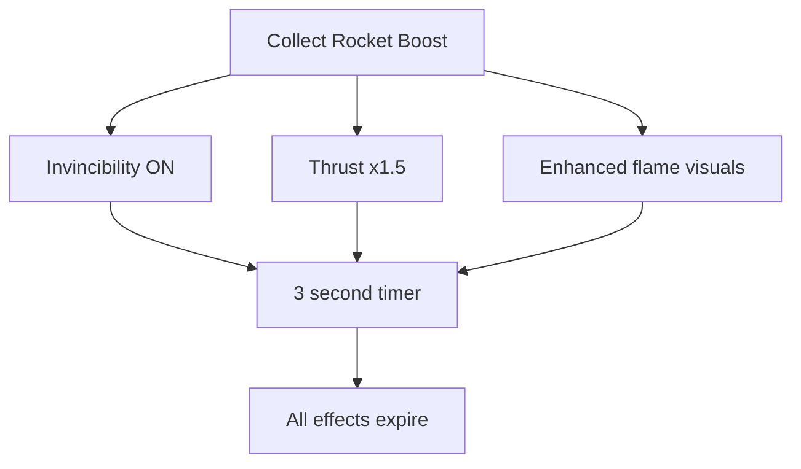

## Overview

The Rocket Boost is a short-duration, high-impact power-up that grants temporary invincibility and enhanced thrust. It appears as an orange crystal with flame particle effects trailing below it.

## Properties

| Parameter | Value |
|-----------|-------|
| Duration | `3` seconds |
| Thrust multiplier | `1.5x` |
| Invincibility | Yes (full) |
| Spawn weight | 35% |
| Crystal color | Orange |
| Glow pulse cycle | `0.6` seconds |

## Boost behavior

When you collect a Rocket Boost:

1. The player becomes invincible for 3 seconds
2. Tap thrust is multiplied by 1.5x (impulse becomes 27 instead of 18)
3. Enhanced flame visual effects appear on the jetpack
4. After 3 seconds, both effects expire simultaneously

<Callout kind="alert">
  The Rocket Boost is the shortest power-up at only 3 seconds. Use the invincibility window aggressively -- pass through obstacles you would normally avoid.
</Callout>

## Visual design

### Crystal appearance

The Rocket Boost crystal shares the hexagonal gem shape but with a warm orange palette:
- **Base color**: Pure orange (R:1.0, G:0.5, B:0.0)
- **Highlight**: Light amber (R:1.0, G:0.8, B:0.4)
- **Shadow facet**: Dark orange (R:0.7, G:0.25, B:0.0)
- **Glow**: Orange with 50% alpha

### Flame particle effect

A unique downward-pointing flame emitter sits below the crystal:

| Flame parameter | Value |
|----------------|-------|
| Birth rate | 40 particles/s |
| Lifetime | 0.4s |
| Emission angle | Downward (pi/2) |
| Angle range | pi/4 |
| Speed | 60 pts/s |
| Blend mode | Additive |
| Color variation | Red +/-0.2, Green +/-0.3, Blue +/-0.1 |

### Animations

| Animation | Parameters |
|-----------|-----------|
| Glow pulse scale | 0.85x - 1.4x (faster than shield) |
| Glow pulse alpha | 0.25 - 0.7 |
| Float bob | 3 points vertical, 0.5s per direction |
| Rotation wobble | 0.05 radians, 0.8s per cycle |

### Collection effect

On collection:
- **Particle burst**: 30 orange particles at 100 pts/s with flame color variation
- **Flash ring**: Expanding to 2.5x scale over 0.2s
- Flame emitter stops immediately on collection

## Strategy

<Callout kind="tip">
  The Rocket Boost is most valuable during dense obstacle sections or when approaching a difficult sequence. The 1.5x thrust also helps escape tight spots during Gravity Flip events.
</Callout>

## Related pages

<Columns cols="2">
  <Card title="Star Shield" href="/power-ups/star-shield" icon="shield" horizontal="false">
    Longer duration single-hit protection.
  </Card>

  <Card title="Time Warp" href="/power-ups/time-warp" icon="clock" horizontal="false">
    Slow down obstacles instead of powering through.
  </Card>
</Columns>
