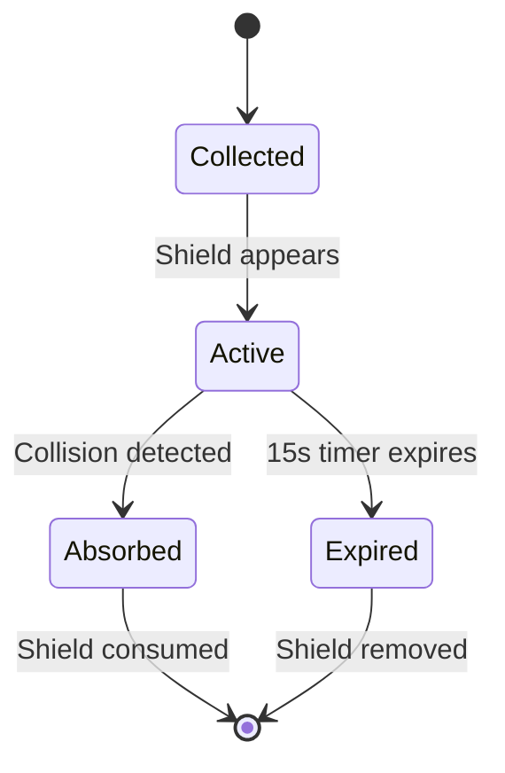

## Overview

The Star Shield is the most common power-up in SpaceFlapper, appearing as a cyan crystal with a pulsing glow. When collected, it creates an energy shield around the astronaut that absorbs one collision.

## Properties

| Parameter | Value |
|-----------|-------|
| Duration | `15` seconds |
| Shield diameter | `48` points |
| Hits absorbed | 1 |
| Spawn weight | 40% (most common) |
| Crystal color | Cyan |
| Glow pulse cycle | `0.8` seconds |

## Shield behavior

When you collect a Star Shield:

1. A circular shield node (48pt diameter) appears around the astronaut
2. A timer starts counting down from 15 seconds
3. The shield persists until it absorbs a hit or the timer expires

### Hit absorption

When you collide with an obstacle while shielded:
- The shield absorbs the impact
- The shield node is removed
- You continue playing without losing a life
- A brief visual flash indicates the absorption

<Callout kind="tip">
  During Meteor Storm events, the shield can absorb a meteor hit. However, using your shield this way reduces your storm survival bonus from 10 to 5 points.
</Callout>

## Visual design

### Crystal appearance

The Star Shield crystal is a hexagonal gem shape rendered in cyan tones:
- **Base color**: Bright cyan (R:0, G:0.9, B:1.0)
- **Highlight**: Light cyan (R:0.7, G:1.0, B:1.0)
- **Shadow facet**: Deep cyan (R:0, G:0.5, B:0.7)
- **Glow**: Cyan with 50% alpha

### Animations

| Animation | Parameters |
|-----------|-----------|
| Glow pulse scale | 0.9x - 1.3x |
| Glow pulse alpha | 0.2 - 0.6 |
| Float bob | 3 points vertical, 0.6s per direction |
| Rotation wobble | 0.05 radians, 1.0s per cycle |

### Collection effect

On collection, the crystal plays:
- **Particle burst**: 20 cyan particles expanding outward at 80 pts/s
- **Flash ring**: Expanding circle that scales to 2.0x and fades over 0.15s
- Particles last 0.5 seconds with alpha decay

## Interaction with events

| Event | Shield interaction |
|-------|-------------------|
| Meteor Storm | Absorbs one meteor hit, reduces bonus to +5 |
| Gravity Flip | Shield persists through gravity inversion |
| Speed Surge | Shield persists during 2x speed |
| Comet Ride | Shield not needed (already invincible) |

## Related pages

<Columns cols="2">
  <Card title="Power-up overview" href="/power-ups/overview" icon="zap" horizontal="false">
    Spawn mechanics and distribution weights.
  </Card>

  <Card title="Rocket Boost" href="/power-ups/rocket-boost" icon="rocket" horizontal="false">
    The invincibility power-up alternative.
  </Card>
</Columns>
