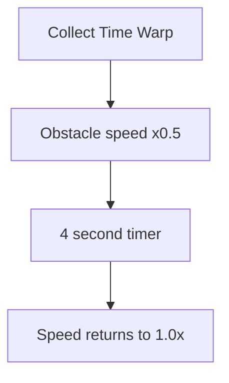

## Overview

The Time Warp is the rarest of the three standard power-ups, appearing as a purple crystal with swirling orbit particles. When collected, it slows all obstacle movement to 50% speed for 4 seconds, giving you more time to react.

## Properties

| Parameter | Value |
|-----------|-------|
| Duration | `4` seconds |
| Speed reduction | 50% (obstacles move at half speed) |
| Spawn weight | 25% (rarest standard power-up) |
| Crystal color | Purple |
| Glow pulse cycle | `0.7` seconds |

## Warp behavior

When you collect a Time Warp:

1. All obstacle scroll speed is halved
2. Obstacle spawn timing remains unchanged (but obstacles move slower)
3. The effect persists for 4 seconds
4. Speed returns to normal when the timer expires

<Callout kind="info">
  The Time Warp affects obstacle movement speed only, not gravity or player physics. You still fall and thrust at normal speed, which effectively makes you more maneuverable relative to the obstacles.
</Callout>

## Visual design

### Crystal appearance

The Time Warp crystal uses a mystical purple palette:
- **Base color**: Deep purple (R:0.6, G:0.2, B:0.9)
- **Highlight**: Light purple (R:0.8, G:0.5, B:1.0)
- **Shadow facet**: Dark violet (R:0.35, G:0.1, B:0.55)
- **Glow**: Purple with 50% alpha

### Swirl particle effect

A unique orbital particle system surrounds the crystal:

| Swirl parameter | Value |
|----------------|-------|
| Birth rate | 25 particles/s |
| Lifetime | 1.0s |
| Emission | Full 360 degrees |
| Speed | 15 pts/s |
| Position range | 60% of crystal size |
| Rotation | Full 360-degree orbit in 2.0s |
| Blend mode | Additive |
| Color variation | Red +/-0.15, Green +/-0.2, Blue +/-0.1 |

### Animations

| Animation | Parameters |
|-----------|-----------|
| Glow pulse scale | 0.88x - 1.35x |
| Glow pulse alpha | 0.22 - 0.65 |
| Float bob | 3 points vertical, 0.55s per direction |
| Rotation wobble | 0.05 radians, 0.9s per cycle |
| Swirl emitter rotation | 360 degrees in 2.0s |

### Collection effect

On collection:
- **Particle burst**: 35 purple particles at 110 pts/s
- **Flash ring**: Expanding to 2.8x scale over 0.22s
- **Swirl rings**: 3 expanding concentric rings with staggered delays (0.08s apart)
- Each ring expands to 2.5-3.5x scale with fade-out

<Callout kind="tip">
  Time Warp is especially powerful during high-difficulty runs where obstacle speed exceeds 300 pts/s. The half-speed effect creates a breathing room window that can extend your run by several more passes.
</Callout>

## Scoring interaction

The Time Warp does not directly multiply your score. However, the slower obstacle speed means:
- More time to line up passes through gaps
- Easier near-miss opportunities
- More stardust collection time if collectibles are present

## Related pages

<Columns cols="2">
  <Card title="Rocket Boost" href="/power-ups/rocket-boost" icon="rocket" horizontal="false">
    The aggressive alternative -- power through instead of slowing down.
  </Card>

  <Card title="Difficulty scaling" href="/mechanics/difficulty" icon="trending-up" horizontal="false">
    How obstacle speed scales to make Time Warp valuable.
  </Card>
</Columns>
