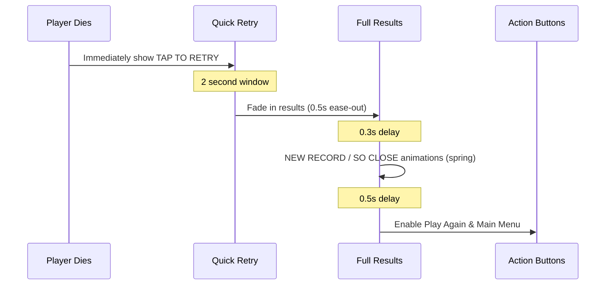

## Game over flow

When your run ends, SpaceFlapper presents results in two phases:

1. **Quick retry window** (first 2 seconds) -- a pulsing "TAP TO RETRY" overlay for fast restarts
2. **Full results screen** -- detailed run breakdown with scores, stardust, badges, and options

<Callout kind="tip">
  Tap anywhere during the first 2 seconds to instantly restart without viewing the full results screen.
</Callout>

## Quick retry window

For the first 2 seconds after death, a minimal overlay appears with:

- Semi-transparent black background (40% opacity)
- Pulsing "TAP TO RETRY" text that fades in and out
- Tapping anywhere triggers an immediate restart

## Full results screen

After the quick retry window closes, the full results animate in with the following sections:

### Score display

The score section adapts based on your performance:

| Condition | Display |
|-----------|---------|
| **New record** | Gold "NEW RECORD!" banner with spring animation, followed by standard score/best |
| **So close to record** | "SO CLOSE!" header with side-by-side score comparison (Your Score vs Your Best) and gap indicator |
| **Standard run** | Large current score with smaller best score below |

The "so close" comparison shows your score and your previous high score side-by-side with a "Just X away!" message highlighting the gap.

### Streak comparison

When your best streak in the current run is close to your all-time best streak, a separate "SO CLOSE!" streak section appears below the score:

- Side-by-side comparison of current streak vs best streak
- "Just X away!" gap indicator

### Ghost rival section

If ghost rival data exists, the game over screen shows one of two messages:

| Situation | Icon | Message | Color |
|-----------|------|---------|-------|
| You outlived the ghost | Trophy | "Outlived your best!" | Gold |
| Ghost outlived you | Running figure | "Ghost survived X more obstacles" | Cyan |

### Stardust earned

This section shows your stardust rewards:

- Sparkle icon with the amount earned (e.g., "+42")
- Purple-to-pink gradient styling
- If you set a new record, a gold "Record bonus: +X" line appears
- Your total stardust balance is shown below in smaller text

### Run recap badges

Performance badges earned during the run appear as a horizontal row of capsule-shaped tags. See the [run recap badges page](/progression/run-recap) for details on all badge types.

### Micro-goal suggestion

When no special conditions are active (no new record, no "so close" display), a motivational micro-goal appears as italic text at the bottom:

| Condition | Suggested Goal |
|-----------|---------------|
| Near-misses < 3 | Suggests trying for near-misses |
| Best streak < 3 | Suggests building a streak |
| Score below high score | "Beat your best of X!" |
| Default | General encouragement |

## Action buttons

Two buttons appear after the results load (with a short delay to prevent accidental taps):

- **Play Again** -- cyan-to-blue gradient capsule, restarts the game
- **Main Menu** -- subtle white outline capsule, returns to the main menu

Both buttons are disabled for 0.5 seconds after the results screen appears to prevent accidental input.

## Animation timeline

## Related pages

<Columns cols="2">
  <Card title="Run Recap Badges" href="/progression/run-recap" icon="award" horizontal={false}>
    Full list of badges that can appear on the game over screen.
  </Card>

  <Card title="Stardust Currency" href="/progression/stardust" icon="sparkles" horizontal={false}>
    Understand how the stardust earned amount is calculated.
  </Card>
</Columns>

<Columns cols="2">
  <Card title="Ghost Rival" href="/progression/ghost-rival" icon="ghost" horizontal={false}>
    Learn how ghost rival results are determined and displayed.
  </Card>

  <Card title="Micro-Goals" href="/progression/micro-goals" icon="target" horizontal={false}>
    Details on the milestone celebrations and goal suggestions.
  </Card>
</Columns>
