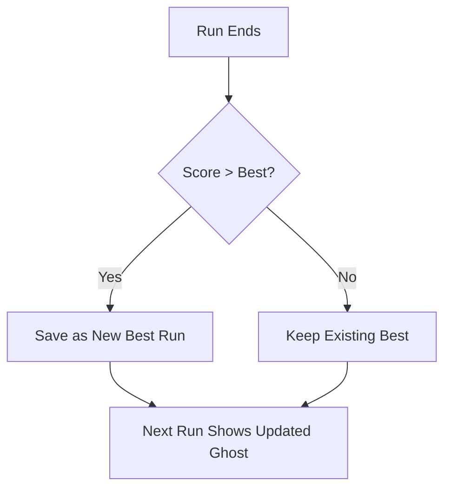

## What is the ghost rival

The ghost rival is a translucent replay of your personal best run. When you start a new game, the ghost astronaut appears and follows the exact path you took during your best performance. You race against yourself, trying to outlive your previous best.

## How it works

### Recording

Every run is recorded from the moment you start playing:

- Player Y position is sampled every **0.1 seconds**
- The X position is fixed (both player and ghost fly at 30% from the left edge)
- When you die, the recording saves your position samples, death timestamp, and final score

### Saving the best run

After each run, the game compares your score to the stored best run:

- If your score **exceeds** the previous best (or no best exists), the current run replaces the stored recording
- The best run data is persisted in `UserDefaults` under the key `ghostRival_bestRun`

### Replay

On your next run, the ghost appears and replays the stored best run:

- The ghost follows the recorded Y positions using linear interpolation between samples
- Ghost opacity is set to **25%** (0.25 alpha) for a translucent, non-intrusive appearance
- The ghost uses the same X position as the player

## Competitive elements

### Outliving the ghost

If you survive longer than the ghost's recorded death time, the game triggers a celebration:

- A **"OUTLIVED YOUR BEST!"** popup appears in gold text
- Gold burst particles radiate from the ghost's last position
- The `onGhostOutlived` callback fires for additional game logic

<Callout kind="tip">
  Outliving your ghost means you're on track for a new personal best. Keep pushing to set a higher score.
</Callout>

### Ghost ahead indicator

If the ghost outlives you (your run ends before the ghost's recorded death), the game calculates how far ahead the ghost was:

- The remaining time gap is estimated as approximately **1 obstacle per 1.5 seconds**
- This gap is displayed on the game over screen as "Ghost survived X more obstacles"

| Scenario | Game Over Display |
|----------|-------------------|
| You outlived the ghost | Trophy icon + "Outlived your best!" in gold |
| Ghost outlived you | Running figure icon + "Ghost survived X more obstacles" in cyan |
| No ghost data exists | No ghost section displayed |

## Ghost visual appearance

The ghost is rendered as a translucent astronaut silhouette:

- **Size**: 40x48 pixels (2x for retina)
- **Color**: Cyan (#00CCFF) with varying opacity per body part
- **Helmet**: 90% opacity circle
- **Body**: 70% opacity rounded rectangle
- **Jetpack**: 50% opacity accent

The ghost fades out with a 0.3-second animation when it "dies" (reaches its recorded death timestamp) or when the run ends.

## Data structure

Each recorded run stores:

| Field | Type | Description |
|-------|------|-------------|
| `samples` | Array | Position samples with timestamp and Y coordinate |
| `deathTimestamp` | TimeInterval | When the recorded run ended |
| `finalScore` | Int | Score achieved in the recorded run |

Each position sample contains:

| Field | Type | Description |
|-------|------|-------------|
| `timestamp` | TimeInterval | Time since run start |
| `yPosition` | CGFloat | Player's Y coordinate at that moment |

## Related pages

<Columns cols="2">
  <Card title="Game Over Screen" href="/progression/game-over" icon="square" horizontal={false}>
    See how ghost rival results are displayed after each run.
  </Card>

  <Card title="Statistics" href="/progression/statistics" icon="bar-chart-2" horizontal={false}>
    Your best score and streak feed into ghost rival tracking.
  </Card>
</Columns>
