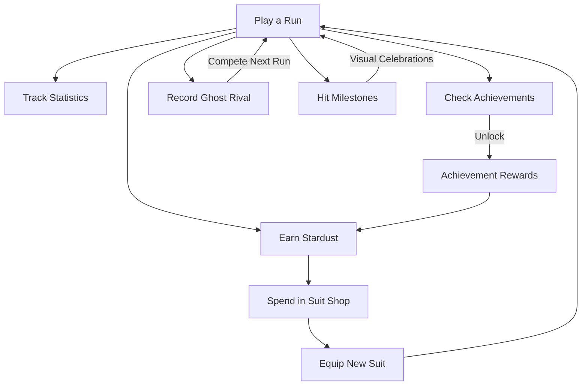
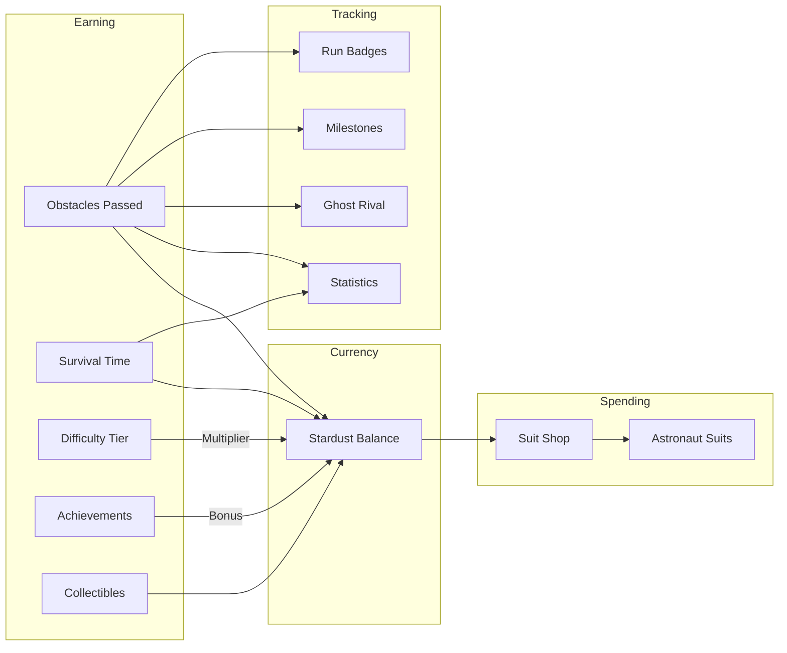

## How progression works

SpaceFlapper's progression system rewards you for every run, whether you survive 5 seconds or 5 minutes. Each gameplay session feeds into multiple interconnected systems that track your growth, unlock cosmetic rewards, and give you goals to chase.

The core loop is simple: **play runs, earn stardust, unlock suits, chase achievements.**

## The progression loop

## Stardust economy

Stardust is the single currency in SpaceFlapper. You earn it from two base sources during every run:

- **1 stardust per obstacle passed**
- **0.5 stardust per second survived**

These base amounts are then multiplied by your current difficulty tier, ranging from 1.0x at Easy up to 5.0x at Impossible. Achievement unlocks also grant one-time stardust bonuses.

You spend stardust exclusively in the suit shop to purchase and equip new astronaut suits.

<Callout kind="tip">
  Higher difficulty means higher stardust multipliers. Surviving longer into harder tiers is the fastest way to earn stardust.
</Callout>

## Interconnected systems

## Explore each system

<Columns cols="2">
  <Card title="Stardust Currency" href="/progression/stardust" icon="sparkles" horizontal={false}>
    Learn how stardust is earned through obstacles, survival time, difficulty multipliers, and collectibles.
  </Card>

  <Card title="Suit Shop" href="/progression/suit-shop" icon="shirt" horizontal={false}>
    Browse all available astronaut suits with prices, colors, and unlock conditions.
  </Card>

  <Card title="Achievements" href="/progression/achievements" icon="trophy" horizontal={false}>
    View every achievement, its unlock requirement, and stardust reward.
  </Card>

  <Card title="Statistics" href="/progression/statistics" icon="bar-chart-2" horizontal={false}>
    Discover all the lifetime and best-performance stats tracked across your runs.
  </Card>
</Columns>

<Columns cols="2">
  <Card title="Ghost Rival" href="/progression/ghost-rival" icon="ghost" horizontal={false}>
    Compete against a replay of your personal best run with the ghost rival system.
  </Card>

  <Card title="Game Over Screen" href="/progression/game-over" icon="square" horizontal={false}>
    Understand what's displayed when a run ends, including scores, stardust, and badges.
  </Card>

  <Card title="Run Recap Badges" href="/progression/run-recap" icon="award" horizontal={false}>
    See which performance badges you can earn each run and what triggers them.
  </Card>

  <Card title="Micro-Goals" href="/progression/micro-goals" icon="target" horizontal={false}>
    Learn about the milestone celebrations that trigger at score thresholds during gameplay.
  </Card>
</Columns>
