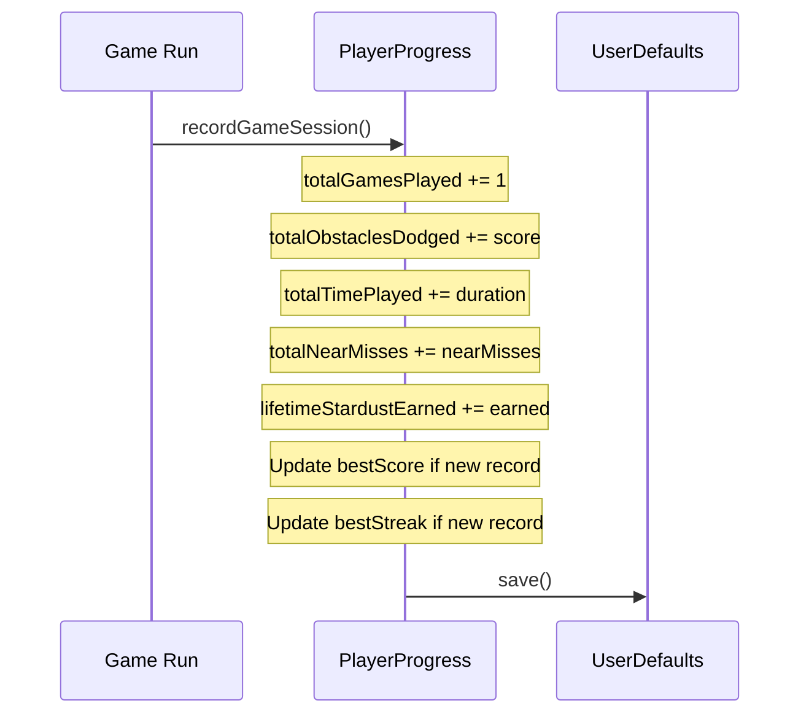

## Statistics overview

SpaceFlapper tracks your gameplay across every run. The statistics screen presents your data in three categories: best performances, lifetime totals, and rewards.

## Tracked statistics

### Best performances

These track your all-time personal records across all runs.

| Statistic | Description | How It Updates |
|-----------|-------------|----------------|
| Best Score | Highest number of obstacles passed in a single run | Updates when a run's score exceeds the previous best |
| Best Streak | Longest consecutive obstacle pass streak in a single run | Updates when a run's best streak exceeds the previous best |

### Lifetime totals

These accumulate across all runs and never reset.

| Statistic | Description |
|-----------|-------------|
| Total Games Played | Number of completed game sessions |
| Total Obstacles Dodged | Sum of all obstacles passed across all runs |
| Total Time Played | Cumulative survival time across all runs |
| Total Near Misses | Sum of all near-miss events across all runs |

### Rewards tracking

| Statistic | Description |
|-----------|-------------|
| Lifetime Stardust Earned | Total stardust earned across all runs (never decreases when spending) |
| Power-Ups Collected | Total number of power-ups collected |

<Callout kind="info">
  The power-ups collected statistic includes a breakdown by type: Star Shield, Rocket Boost, and Time Warp.
</Callout>

## How statistics update

At the end of each run, the game records a complete session snapshot:

The `recordGameSession` method receives six parameters from each run:

| Parameter | Type | Description |
|-----------|------|-------------|
| `score` | Int | Obstacles passed this run |
| `obstaclesDodged` | Int | Same as score (obstacles passed) |
| `timePlayed` | TimeInterval | Seconds survived |
| `nearMisses` | Int | Near-miss count this run |
| `bestStreakInSession` | Int | Longest streak this run |
| `stardustEarned` | Int | Stardust awarded this run |

## Statistics display

The statistics screen groups data into visually distinct sections:

- **Best Performances** -- gold/orange themed, showing Best Score and Best Streak with trophy icons
- **Lifetime Totals** -- purple/pink themed, showing cumulative counts with individual icons per stat
- **Rewards** -- yellow/orange themed, showing stardust and power-up totals

Time played is formatted contextually:
- Under 60 seconds: displayed as seconds (e.g., "45s")
- 1-59 minutes: displayed as minutes and seconds (e.g., "12m 30s")
- 60+ minutes: displayed as hours and minutes (e.g., "2h 15m")

Large numbers use locale-aware formatting with thousands separators.

## Persistence

All statistics are stored locally in `UserDefaults` under the `SpaceFlapper.PlayerProgress` key as JSON-encoded data. Statistics persist across app launches and are never reset.

<Callout kind="alert">
  Uninstalling the app deletes all statistics since they are stored in UserDefaults. There is no cloud backup.
</Callout>

## Related pages

<Columns cols="2">
  <Card title="Achievements" href="/progression/achievements" icon="trophy" horizontal={false}>
    Achievements reference your statistics to determine unlock conditions.
  </Card>

  <Card title="Game Over Screen" href="/progression/game-over" icon="square" horizontal={false}>
    See how run results contribute to your lifetime statistics.
  </Card>
</Columns>
