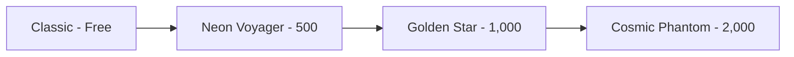

## The suit shop

The suit shop is where you spend your hard-earned stardust on cosmetic astronaut suits. Each suit changes the colors of your astronaut's body, accent details, and visor. Suits are purely cosmetic and do not affect gameplay.

## Available suits

| Suit | ID | Price | Description |
|------|----|-------|-------------|
| Classic | `default` | Free | Standard issue astronaut suit. White body with red accents and blue visor. |
| Neon Voyager | `neon` | 500 | Dark body with neon cyan accents and magenta visor. Glow in the dark with style. |
| Golden Star | `gold` | 1,000 | Full gold body with darker gold accents and bronze visor. For the elite space explorers. |
| Cosmic Phantom | `cosmic` | 2,000 | Deep purple body with violet accents and light cyan visor. Harness the power of the cosmos. |

### Suit color details

Each suit defines three color zones on the astronaut:

| Suit | Body Color | Accent Color | Visor Color |
|------|-----------|-------------|-------------|
| Classic | White (#F2F2F7) | Red (#E6664D) | Blue (#3399E6) |
| Neon Voyager | Dark (#1A1A26) | Cyan (#00FFCC) | Magenta (#E600E6) |
| Golden Star | Gold (#FFD700) | Dark Gold (#D9A621) | Bronze (#4D331A) |
| Cosmic Phantom | Deep Purple (#33194D) | Violet (#9933CC) | Light Cyan (#66CCFF) |

## How purchasing works

<Steps>
  <Step title="Open the suit shop" icon="shopping-bag" titleType="p">
    Access the suit shop from the main menu. Your current stardust balance is displayed at the top of the shop screen.
  </Step>

  <Step title="Browse available suits" icon="eye" titleType="p">
    Suits are displayed in a 2-column grid. Each card shows a color preview, the suit name, description, and an action button.

    Suits show one of three states:
    - **Locked** -- displays the stardust price. The purchase button is disabled if you cannot afford it.
    - **Owned** -- displays an "Equip" button.
    - **Equipped** -- displays an "Equipped" label with a purple highlight border.
  </Step>

  <Step title="Purchase a suit" icon="sparkles" titleType="p">
    Tap the price button on a locked suit to purchase it. The stardust cost is deducted from your balance immediately, and the suit becomes available to equip.

    <Callout kind="alert">
      Suit purchases are permanent. There are no refunds, so make sure you want the suit before purchasing.
    </Callout>
  </Step>

  <Step title="Equip your suit" icon="check" titleType="p">
    Tap "Equip" on any owned suit to wear it. The astronaut sprite updates immediately to reflect your new suit colors. You can switch between owned suits at any time for free.
  </Step>
</Steps>

## Suit unlock progression

The Classic suit is unlocked by default. All other suits require stardust purchases. There are no level requirements or achievement prerequisites -- any suit can be purchased as soon as you have enough stardust.

<Callout kind="tip">
  To unlock all suits, you need a total of 3,500 stardust. Focus on surviving into Expert and Impossible difficulty tiers to maximize your earning rate.
</Callout>

## Related pages

<Columns cols="2">
  <Card title="Stardust Currency" href="/progression/stardust" icon="sparkles" horizontal={false}>
    Learn how to earn stardust faster through difficulty multipliers and collectibles.
  </Card>

  <Card title="Achievements" href="/progression/achievements" icon="trophy" horizontal={false}>
    Unlock achievements for bonus stardust rewards to fund your suit collection.
  </Card>
</Columns>
