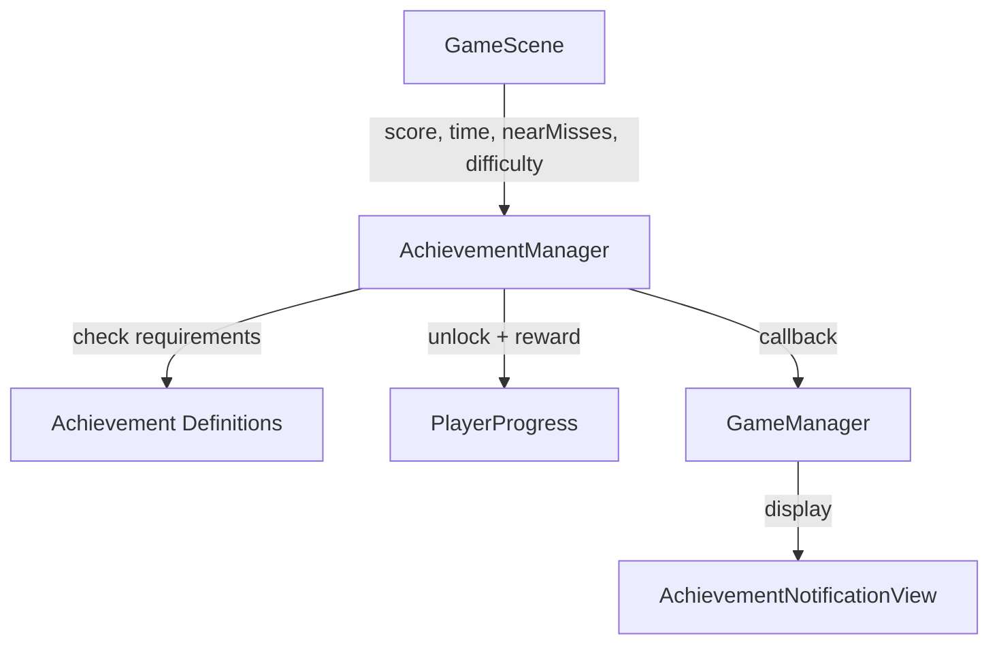

## Overview

SpaceFlapper's achievement system tracks player milestones across four categories: score targets, survival time, near-miss skill, and difficulty progression. Each achievement awards a stardust bonus when unlocked and triggers an in-game notification banner.



## Achievement definitions

All achievements are defined as static data in `AchievementManager.allAchievements`:

| ID | Name | Requirement | Stardust Reward |
|----|------|-------------|-----------------|
| `first_flight` | First Flight | Score 1 point | 10 |
| `getting_started` | Getting Started | Score 10 points | 25 |
| `space_rookie` | Space Rookie | Score 25 points | 50 |
| `asteroid_dodger` | Asteroid Dodger | Score 50 points | 100 |
| `space_ace` | Space Ace | Score 75 points | 150 |
| `half_minute_hero` | Half Minute Hero | Survive 30 seconds | 30 |
| `close_call` | Close Call | 3 near-misses in one run | 40 |
| `rising_challenge` | Rising Challenge | Reach Hard difficulty | 50 |

<Callout kind="info">
  All achievement names and descriptions support localization through the `L()` function. Keys follow the pattern `achievement.[id].name` and `achievement.[id].description`.
</Callout>

## Achievement data model

The `Achievement` struct defines each achievement:

```swift AchievementManager.swift
struct Achievement: Identifiable {
    let id: String
    let name: String
    let description: String
    let stardustReward: Int
    let requirement: AchievementRequirement
}
```

## Requirement types

The `AchievementRequirement` enum defines four categories of unlock conditions:

```swift AchievementManager.swift
enum AchievementRequirement {
    case score(Int)
    case survivalTime(TimeInterval)
    case nearMissesInRun(Int)
    case reachDifficulty(DifficultyTier)
}
```

| Case | Parameter | Checked Against |
|------|-----------|----------------|
| `.score(Int)` | Required score | Current run score |
| `.survivalTime(TimeInterval)` | Required seconds | Current run survival time |
| `.nearMissesInRun(Int)` | Required near-misses | Current run near-miss count |
| `.reachDifficulty(DifficultyTier)` | Required tier | Current effective difficulty |

## Checking and unlocking

The `checkAchievements` method evaluates all incomplete achievements against the current game state:

```swift AchievementManager.swift
@discardableResult
func checkAchievements(
    score: Int,
    survivalTime: TimeInterval,
    nearMissCount: Int,
    effectiveDifficulty: Double
) -> [Achievement] {
    var newlyUnlocked: [Achievement] = []

    for achievement in Self.allAchievements {
        guard !playerProgress.isAchievementCompleted(achievement.id) else { continue }

        if isRequirementMet(achievement.requirement, score: score,
            survivalTime: survivalTime, nearMissCount: nearMissCount,
            effectiveDifficulty: effectiveDifficulty) {
            unlockAchievement(achievement)
            newlyUnlocked.append(achievement)
        }
    }
    return newlyUnlocked
}
```

<Callout kind="tip">
  Already-completed achievements are skipped via `playerProgress.isAchievementCompleted()`, so this method is safe to call repeatedly during gameplay without duplicate unlocks.
</Callout>

## Unlock flow

When an achievement requirement is met, the `unlockAchievement` method executes four steps:

<Steps>
  <Step title="Mark completed" icon="check" titleType="p">
    Sets the achievement's completion state in `PlayerProgress`:

    ```swift
    playerProgress.setAchievementCompleted(achievement.id, completed: true)
    ```
  </Step>

  <Step title="Award stardust" icon="sparkles" titleType="p">
    Adds the achievement's stardust reward to the player's balance:

    ```swift
    playerProgress.addStardust(achievement.stardustReward)
    ```
  </Step>

  <Step title="Persist changes" icon="save" titleType="p">
    Saves the updated progress to UserDefaults:

    ```swift
    playerProgress.save()
    ```
  </Step>

  <Step title="Notify listeners" icon="bell" titleType="p">
    Triggers the callback and tracks for session display:

    ```swift
    sessionUnlockedAchievements.append(achievement)
    onAchievementUnlocked?(achievement, achievement.stardustReward)
    ```
  </Step>
</Steps>

## Notification system

The `onAchievementUnlocked` callback is a closure of type `(Achievement, Int) -> Void` where the second parameter is the stardust reward. `GameManager` sets this callback to trigger the `AchievementNotificationView` banner.

The notification banner slides in from the top of the screen with a spring animation and displays:

- Achievement name (localized)
- "ACHIEVEMENT UNLOCKED" label
- Stardust reward amount

```swift AchievementNotificationView.swift
HStack(spacing: 12) {
    // Star icon with glow animation
    ZStack {
        Image(systemName: "star.fill")
            .font(.system(size: 32))
            .foregroundColor(.yellow)
            .blur(radius: 8)
            .opacity(glowOpacity)

        Image(systemName: "star.fill")
            .font(.system(size: 28))
            .foregroundStyle(
                LinearGradient(colors: [.yellow, .orange], ...)
            )
    }

    // Achievement text
    VStack(alignment: .leading, spacing: 2) {
        Text(L("achievements.unlocked"))
        Text(achievement.localizedName)
    }

    Spacer()

    // Reward indicator
    HStack(spacing: 4) {
        Text("+\(achievement.stardustReward)")
        Image(systemName: "sparkles")
    }
}
```

## Persistence

Achievement completion states are stored as a `[String: Bool]` dictionary within `PlayerProgress.achievementCompletionStates`. This dictionary maps achievement IDs to their completion status and is serialized alongside all other player data via `JSONEncoder`.

## Session tracking

The `sessionUnlockedAchievements` array tracks achievements unlocked during the current game session. Call `resetSession()` at the start of each new game to clear this list.

## Public API reference

| Method / Property | Type | Description |
|-------------------|------|-------------|
| `checkAchievements(score:survivalTime:nearMissCount:effectiveDifficulty:)` | `[Achievement]` | Checks all achievements and returns newly unlocked ones |
| `getAllAchievementsWithStatus()` | `[(Achievement, Bool)]` | All achievements with completion status |
| `isCompleted(_ achievementID:)` | `Bool` | Check if a specific achievement is completed |
| `completedCount` | `Int` | Number of completed achievements |
| `totalCount` | `Int` | Total number of achievements |
| `resetSession()` | `Void` | Clears session-unlocked tracking |
| `onAchievementUnlocked` | `((Achievement, Int) -> Void)?` | Callback for unlock events |

## DifficultyTier comparison

The `DifficultyTier` enum conforms to `Comparable` for the `.reachDifficulty` requirement check. Tiers are ordered: Easy < Medium < Hard < Expert < Impossible.

```swift AchievementManager.swift
extension DifficultyTier: Comparable {
    static func < (lhs: DifficultyTier, rhs: DifficultyTier) -> Bool {
        let order: [DifficultyTier] = [.easy, .medium, .hard, .expert, .impossible]
        guard let lhsIndex = order.firstIndex(of: lhs),
              let rhsIndex = order.firstIndex(of: rhs) else { return false }
        return lhsIndex < rhsIndex
    }
}
```

## Related pages

<Columns cols="2">
  <Card title="PlayerProgress Model" href="/technical/player-progress" icon="database" horizontal="false">
    Where achievement completion states are stored.
  </Card>

  <Card title="Overlay Views Reference" href="/technical/overlay-views" icon="layers" horizontal="false">
    The AchievementsView that displays all achievements to the player.
  </Card>
</Columns>
