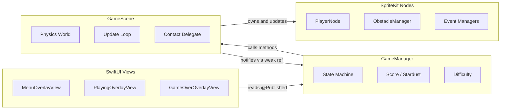

## System architecture

SpaceFlapper uses a layered architecture that separates SwiftUI views from SpriteKit game rendering through a central `GameManager` coordinator. The app has zero external dependencies -- every system is built with Apple's native frameworks: SwiftUI, SpriteKit, GameplayKit, and Combine.

```mermaid
graph TD
    subgraph SwiftUI["SwiftUI Layer"]
        App[SpaceFlapperApp]
        CV[ContentView]
        Menu[MenuOverlayView]
        Playing[PlayingOverlayView]
        GameOver[GameOverOverlayView]
        Shop[ShopView]
        Stats[StatisticsView]
        Achieve[AchievementsView]
        Settings[SettingsView]
    end

    subgraph Bridge["Bridge Layer"]
        GCV[GameContainerView]
        GM[GameManager]
    end

    subgraph SpriteKit["SpriteKit Layer"]
        GS[GameScene]
        Player[PlayerNode]
        OM[ObstacleManager]
        BG[ParallaxBackgroundManager]
        NM[NearMissDetector]
        CM[ComboManager]
        MM[MilestoneManager]
        STM[StreakTrailManager]
    end

    subgraph Events["Event Managers"]
        SS[SpeedSurgeManager]
        WZ[WarpZoneManager]
        MS[MeteorStormManager]
        CMag[CosmicMagnetManager]
        SF[StardustFeverManager]
        GR[GhostRivalManager]
        GF[GravityFlipManager]
        CR[CometRideManager]
    end

    subgraph Progression["Progression Layer"]
        PM[ProgressionManager]
        PP[PlayerProgress]
        AM[AchievementManager]
        DM[DifficultyManager]
    end

    App --> CV
    CV --> GCV
    CV --> Menu
    CV --> Playing
    CV --> GameOver
    Menu --> Shop
    Menu --> Stats
    Menu --> Achieve
    Menu --> Settings

    GCV --> GS
    GM <--> GS
    CV --> GM

    GS --> Player
    GS --> OM
    GS --> BG
    GS --> NM
    GS --> CM
    GS --> MM
    GS --> STM
    GS --> SS
    GS --> WZ
    GS --> MS
    GS --> CMag
    GS --> SF
    GS --> GR
    GS --> GF
    GS --> CR

    GM --> DM
    GM --> PM
    PM --> PP
    PM --> AM
```



## Design patterns

### Manager pattern

SpaceFlapper uses the Manager pattern extensively. Each manager encapsulates a distinct gameplay subsystem with its own state, update loop, and reset logic. `GameScene` owns all managers and calls their `update(deltaTime:)` methods each frame.

| Manager | Responsibility |
|---------|---------------|
| `GameManager` | Central coordinator, state machine, score, published state for SwiftUI |
| `ObstacleManager` | Obstacle spawning, movement, recycling, and difficulty parameter application |
| `DifficultyManager` | Progressive difficulty scaling based on score and survival time |
| `ComboManager` | Streak tracking, level-up thresholds, and break detection |
| `NearMissDetector` | Proximity detection between player and obstacles |
| `ParallaxBackgroundManager` | Multi-layer scrolling star field and nebula background |
| `MilestoneManager` | Score milestone celebration effects |
| `StreakTrailManager` | Visual particle trail following the player during streaks |

### Observer pattern via Combine

`GameManager` is an `ObservableObject` with `@Published` properties. SwiftUI views observe these properties reactively:

```swift GameManager.swift
class GameManager: ObservableObject {
    @Published var currentState: GameState = .menu
    @Published var score: Int = 0
    @Published var highScore: Int = 0
    @Published private(set) var currentStreakLevel: ComboManager.StreakLevel = .none
    @Published private(set) var totalStardust: Int = 0
    // ...
}
```

SwiftUI views like `ContentView` use `@StateObject` to own the `GameManager` instance, while child views receive it as a parameter. State changes propagate automatically through SwiftUI's reactive rendering.

### Callback-based event delegation

Event managers communicate with `GameScene` through closure callbacks rather than delegate protocols. This keeps each manager decoupled from the scene:

```swift GameScene.swift
let manager = SpeedSurgeManager(scene: self)
manager.onSpeedChange = { [weak self] speed in
    self?.obstacleManager?.setSpeedModifier(speed)
}
manager.onSurgeBonus = { [weak self] in
    self?.gameManager?.addNearMissBonus()
}
```

<Callout kind="tip">
  Every callback uses `[weak self]` to prevent retain cycles. Event managers hold strong references to their closures, while closures hold weak references back to the scene.
</Callout>

### State machine pattern (GameplayKit)

Game flow is controlled by a `GKStateMachine` with three `GKState` subclasses (`MenuState`, `PlayingState`, `GameOverState`). Each state defines valid transitions via `isValidNextState(_:)` and performs setup/teardown in `didEnter(from:)`. See the [State Machine](/technical/state-machine) page for full details.

### Node hierarchy pattern

SpriteKit nodes follow a parent-child hierarchy. `PlayerNode` is an `SKNode` container that owns its sprite, thrust emitter, shield, and glow as child nodes. This allows the entire player assembly to move, rotate, and scale as a unit.

## Layer architecture

The application is organized into four distinct layers:



| Layer | Framework | Communication direction |
|-------|-----------|------------------------|
| **SwiftUI Views** | SwiftUI | Reads `@Published` properties from GameManager |
| **GameManager** | GameplayKit + Combine | Calls GameScene methods, owns DifficultyManager and ProgressionManager |
| **GameScene** | SpriteKit | Owns all nodes and managers, calls GameManager via weak reference |
| **SpriteKit Nodes** | SpriteKit | Managed by GameScene, no direct access to GameManager |

<Callout kind="info">
  Data flows primarily downward (views read state, GameManager controls scene, scene manages nodes). Upward communication happens through weak references and closures, never through direct property access to parent layers.
</Callout>

## Event manager mutual exclusion

Event managers use an `isEventBlocked` closure to prevent multiple events from overlapping. Each manager checks whether conflicting events are active before triggering:

```swift GameScene.swift
manager.isEventBlocked = { [weak self] in
    guard let self = self else { return true }
    return self.warpZoneManager?.isWarping == true
        || self.meteorStormManager?.isStorming == true
        || self.gravityFlipManager?.isActive == true
        || self.cometRideManager?.isActive == true
}
```

This ensures only one major event runs at a time, preventing chaotic overlapping effects while keeping each manager unaware of the others' implementation details.
