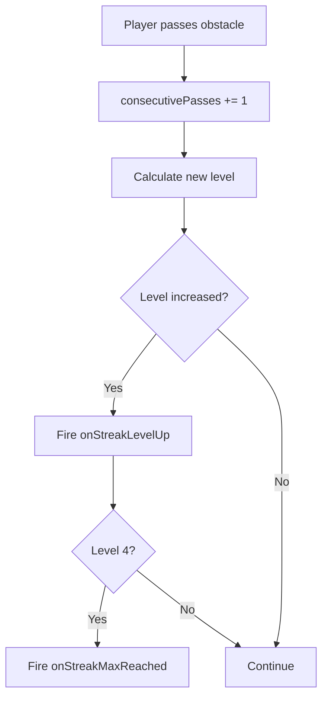
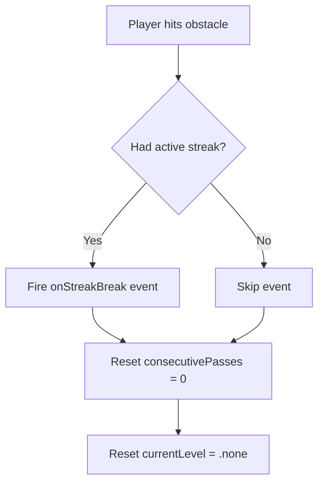

## Overview

The combo system tracks consecutive obstacle passes and rewards sustained performance with escalating visual effects and gameplay benefits. `ComboManager` handles the logic while `StreakTrailManager` renders particle trail effects behind the player that intensify with each streak level.

## Streak levels

| Level | Required Passes | Trail Color | Visual Effect |
|-------|----------------|-------------|--------------|
| None | 0 | No trail | - |
| Level 1 | 3 | Cyan | Subtle particle trail |
| Level 2 | 5 | Cyan-orange | Medium trail + increased density |
| Level 3 | 8 | Orange | Strong trail + high density |
| Level 4 | 12+ | Bright yellow-orange | Maximum trail + "ON FIRE!" label + triggers Stardust Fever |

### Level determination

```swift ComboManager.swift
static func level(forPasses passes: Int) -> StreakLevel {
    for level in StreakLevel.allCases.reversed() {
        if passes >= level.requiredPasses && level != .none {
            return level
        }
    }
    return .none
}
```

## ComboManager

### Properties

| Property | Type | Description |
|----------|------|-------------|
| `consecutivePasses` | `Int` | Current count of consecutive obstacle passes |
| `currentLevel` | `StreakLevel` | Current streak level based on pass count |
| `passesToNextLevel` | `Int?` | Passes needed to reach next level (`nil` at max) |
| `progressToNextLevel` | `Double` | Progress toward next level (0.0 to 1.0) |

### Event callbacks

```swift ComboManager.swift
var onStreakLevelUp: StreakLevelUpHandler?    // Level increased
var onStreakBreak: StreakBreakHandler?        // Collision broke streak
var onStreakMaxReached: (() -> Void)?         // Level 4 reached
```

### Event types

```swift ComboManager.swift
struct StreakLevelUpEvent {
    let newLevel: StreakLevel
    let consecutivePasses: Int
}

struct StreakBreakEvent {
    let brokenLevel: StreakLevel
    let finalConsecutivePasses: Int
}
```

### Core methods

| Method | Description |
|--------|-------------|
| `recordObstaclePass()` | Increments pass count, checks for level-up, fires `onStreakMaxReached` at level 4 |
| `recordCollision()` | Fires break event (if streak was active), resets to `.none` |
| `reset()` | Fires break event at game over, resets all state |

### Obstacle pass flow



### Streak break flow



<Callout kind="info">
  `recordCollision()` fires the break event before resetting, providing the final pass count and broken level to listeners. `reset()` also fires the break event if a streak was active, ensuring clean state at game over.
</Callout>

## StreakTrailManager

### Trail configurations per level

| Level | Birth Rate | Lifetime | Scale | Speed | Glow Width |
|-------|-----------|----------|-------|-------|------------|
| Level 1 | 40/s | 0.4s | 0.35 | 60pt/s | 1.0 |
| Level 2 | 60/s | 0.5s | 0.40 | 70pt/s | 2.0 |
| Level 3 | 90/s | 0.6s | 0.45 | 80pt/s | 3.0 |
| Level 4 | 130/s | 0.7s | 0.55 | 100pt/s | 5.0 |

### Trail colors

| Level | Color | RGB |
|-------|-------|-----|
| Level 1 | Cyan | (0.0, 0.9, 1.0) |
| Level 2 | Cyan-orange | (0.3, 0.85, 0.9) |
| Level 3 | Orange | (1.0, 0.6, 0.2) |
| Level 4 | Bright yellow-orange | (1.0, 0.8, 0.2) |

### Emitter setup

```swift StreakTrailManager.swift
emitter.emissionAngle = .pi          // Emit behind player
emitter.emissionAngleRange = .pi / 8  // Slight spread
emitter.particleBlendMode = .add      // Additive blending for glow
emitter.position = CGPoint(x: -15, y: 0)  // Behind player
emitter.zPosition = 98               // Below player (100)
emitter.targetNode = scene           // Particles stay in world space
```

### Level transitions

When the streak level changes, the trail smoothly transitions over 0.3 seconds:

```swift StreakTrailManager.swift
private func transitionTrail(to config: TrailConfig) {
    let colorAction = SKAction.customAction(withDuration: 0.3) { node, elapsed in
        let progress = elapsed / 0.3
        emitter.particleBirthRate = current + (target - current) * progress
        emitter.particleColor = config.color
    }
    emitter.run(colorAction)
}
```

### Level-up burst effect

Each level-up triggers a circular particle burst at the player position:

```swift StreakTrailManager.swift
let emitter = SKEmitterNode()
emitter.particleBirthRate = 200
emitter.numParticlesToEmit = 25
emitter.particleSpeed = 150
emitter.emissionAngleRange = .pi * 2  // Full circle burst
```

The burst color matches the new level's trail color, and `SoundManager.shared.playStreakLevelUpSound()` and `HapticManager.shared.playStreakLevelUp()` provide audio/haptic feedback.

### "ON FIRE!" label

At streak level 4, an animated label appears above the player:

- Font: AvenirNext-Heavy, 14pt
- Color: Orange (1.0, 0.6, 0.1)
- Animation: Pop-in (0.15s) followed by continuous pulse (scale 0.95-1.15x, 0.4s cycle)
- Glow: Shadow label with shifted orange color
- Position: 35pt above player, follows player node
- Disappears when streak breaks with a fade-out + shrink animation (0.2s)

## Integration with GameManager

`GameManager` bridges combo events to UI state:

```swift GameManager.swift
func onObstaclePassed(consecutivePasses: Int, currentLevel: ComboManager.StreakLevel) {
    currentStreakCount = consecutivePasses
    currentStreakLevel = currentLevel

    if consecutivePasses > sessionBestStreak {
        sessionBestStreak = consecutivePasses
    }
    checkNewStreakRecord()
}
```

The `sessionBestStreak` is recorded in the player's progress at game over and compared against `bestStreak` for "SO CLOSE" and record celebration displays.
