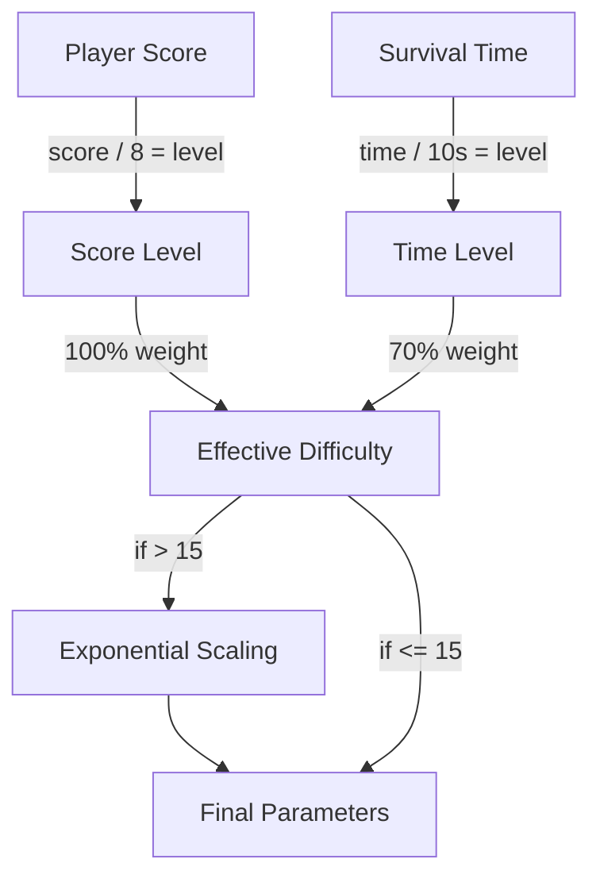

## Overview

`DifficultyManager` implements an ultra-hard progressive difficulty system that scales based on both player score and survival time. Difficulty increases continuously with no cap, using exponential curves for aggressive late-game scaling that remains fair but increasingly brutal.

## Dual scaling model

Difficulty increases through two independent axes that combine into an effective difficulty level:



### Effective difficulty formula

```swift DifficultyManager.swift
var effectiveDifficulty: Double {
    let scoreFactor = Double(currentLevel)
    let timeFactor = Double(currentTimeLevel) * 0.7

    var combined = scoreFactor + timeFactor

    if combined > Double(exponentialScalingThreshold) {
        let excess = combined - Double(exponentialScalingThreshold)
        combined = Double(exponentialScalingThreshold) + excess * exponentialScalingFactor
    }

    return combined
}
```

<Callout kind="info">
  Time contributes 70% as much as score to prevent players from gaming the system by surviving without scoring. The exponential scaling factor of 1.08x kicks in after level 15, making high-level play progressively harder.
</Callout>

## Base values and scaling rates

### Score-based scaling (per level)

| Parameter | Base Value | Change Per Level | Cap |
|-----------|-----------|-----------------|-----|
| Gap size | 190pt | -10pt | 85pt (minimum) |
| Scroll speed | 140pt/s | +15pt/s | 420pt/s (maximum) |
| Moving obstacle probability | 25% | +6% | 92% (maximum) |
| Spawn interval | 2.8s | -0.12s | 1.0s (minimum) |
| Drift multiplier | 1.0x | +0.12x | 2.5x (maximum) |

### Time-based scaling (per 10 seconds)

| Parameter | Change Per Time Level |
|-----------|----------------------|
| Gap size | -4pt |
| Scroll speed | +8pt/s |
| Moving obstacle probability | +3% |
| Spawn interval | -0.06s |
| Drift multiplier | +0.08x |

### Score level threshold

Score levels increase every **8 obstacles passed** (the `scorePerLevel` constant).

## DifficultyParameters struct

The `parameters` computed property returns a snapshot of all current difficulty values:

```swift DifficultyManager.swift
struct DifficultyParameters {
    let gapSize: CGFloat
    let scrollSpeed: CGFloat
    let movingObstacleProbability: Double
    let spawnInterval: TimeInterval
    let movingObstacleDriftMultiplier: CGFloat
    let level: Int
    let timeLevel: Int
    let effectiveLevel: Double
}
```

## Exponential late-game scaling

Beyond the exponential threshold (level 15), scroll speed receives an additional quadratic bonus:

```swift DifficultyManager.swift
if effective > Double(exponentialScalingThreshold) {
    let excess = effective - Double(exponentialScalingThreshold)
    speedIncrease += CGFloat(excess * excess) * 0.5  // Quadratic bonus
}
```

This creates an increasingly steep difficulty curve that makes ultra-high scores extremely challenging.

## Difficulty descriptions

| Effective Level | Description |
|----------------|-------------|
| 0-4 | Easy |
| 5-9 | Normal |
| 10-14 | Hard |
| 15-19 | Very Hard |
| 20-29 | Extreme |
| 30-39 | Insane |
| 40-49 | Nightmare |
| 50+ | IMPOSSIBLE |

## Public methods

| Method | Returns | Description |
|--------|---------|-------------|
| `updateForScore(_ score: Int)` | `Bool` | Updates score-based difficulty. Returns `true` if level increased. Fires `onDifficultyIncrease` callback. |
| `updateForTime(_ deltaTime: TimeInterval)` | `Bool` | Updates time-based difficulty. Returns `true` if time level increased. Silent (no callback). |
| `reset()` | `Void` | Resets all difficulty state to initial values. |
| `setDifficultyIncreaseHandler(_ handler:)` | `Void` | Sets the callback for score-based difficulty increases. |

## Properties

| Property | Type | Description |
|----------|------|-------------|
| `currentLevel` | `Int` | Current score-based difficulty level |
| `currentTimeLevel` | `Int` | Current time-based difficulty level |
| `effectiveDifficulty` | `Double` | Combined score + time difficulty with exponential scaling |
| `parameters` | `DifficultyParameters` | Computed snapshot of all current parameters |
| `survivalTime` | `TimeInterval` | Total elapsed survival time |
| `difficultyDescription` | `String` | Human-readable difficulty label |

<Callout kind="tip">
  Time-based difficulty increases are intentionally silent (no callback) to avoid spamming the player with notifications every 10 seconds. Only score-based increases trigger the visual/audio difficulty cue through `GameManager.onDifficultyIncrease()`.
</Callout>

## Example progression

| Score | Time | Score Level | Time Level | Effective | Gap | Speed | Moving % |
|-------|------|------------|------------|-----------|-----|-------|----------|
| 0 | 0s | 0 | 0 | 0.0 | 190pt | 140pt/s | 25% |
| 16 | 20s | 2 | 2 | 3.4 | 156pt | 198pt/s | 41% |
| 40 | 60s | 5 | 6 | 9.2 | 62pt | 302pt/s | 61% |
| 80 | 120s | 10 | 12 | 18.4 | 85pt | 420pt/s | 85% |
