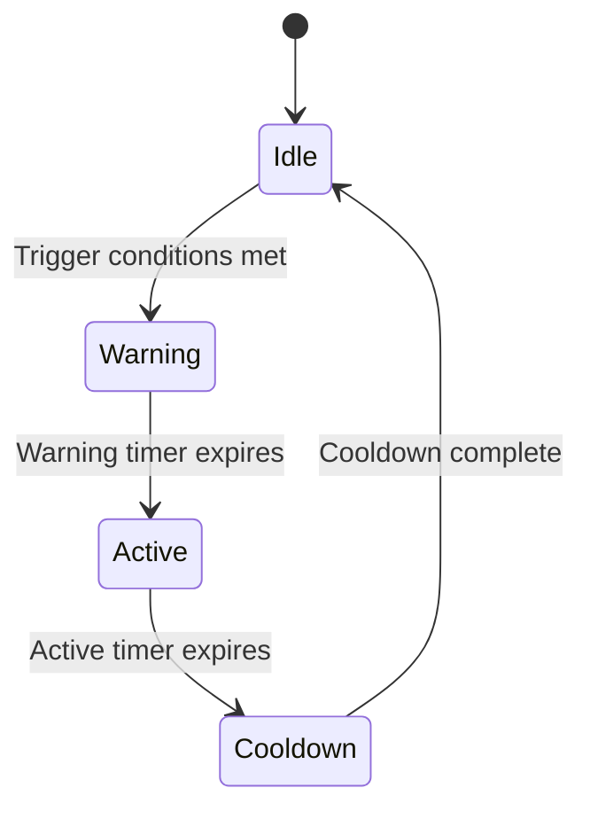
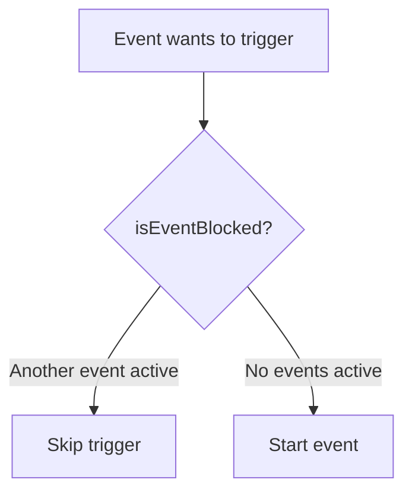

## Overview

SpaceFlapper features six event systems that dynamically modify gameplay. Each event manager follows a consistent phase-based lifecycle pattern with trigger conditions, mutual exclusion, and visual/audio feedback. Events add variety and challenge to runs, preventing gameplay from becoming monotonous at higher scores.

## Event summary

| Event | Manager | Trigger | Min Score | Duration | Reward |
|-------|---------|---------|-----------|----------|--------|
| Speed Surge | `SpeedSurgeManager` | Timer (15-25s) | 10 | 3s surge | Survival bonus |
| Meteor Storm | `MeteorStormManager` | Timer (45-60s) | 15 | 6s storm | +5/+10 points |
| Gravity Flip | `GravityFlipManager` | Timer (35-50s) | 25 | 6s active | +5 points, 2x multiplier |
| Comet Ride | `CometRideManager` | Timer (45-60s) | 20 | 4.5s ride | Score per shattered obstacle |
| Stardust Fever | `StardustFeverManager` | Streak level 4 | - | 6s active | 3x score multiplier |
| Warp Zone | `WarpZoneManager` | Score multiple of 25 (5% chance) | - | 3s warp | Auto-score every 0.5s |

## Common architecture

All event managers share a consistent design pattern:



### Shared characteristics

- **Phase enum** - Each manager defines an enum with `idle` plus event-specific phases
- **Phase timer** - A `phaseTimer` tracks time within the current phase
- **Mutual exclusion** - An `isEventBlocked` callback prevents overlapping events
- **Callbacks** - Closures connect to `GameScene` for physics, scoring, and visual changes
- **Reset/Stop** - Every manager supports clean reset and immediate stop

---

## Speed Surge

Doubles obstacle speed for a brief burst with red visual warning.

### Phases

| Phase | Duration | Behavior |
|-------|----------|----------|
| Warning | 1.5s | Red vignette pulse, "INCOMING!" text |
| Surge | 3.0s | 2x obstacle speed, screen shake |
| Recovery | 0.5s | Speed lerps from 2.0 back to 1.0 |

### Trigger conditions

- Score >= 10
- Minimum 10s cooldown between surges
- No other event active
- Timer interval: 15-25s (randomized)

### Key callbacks

```swift SpeedSurgeManager.swift
var onSpeedChange: ((CGFloat) -> Void)?   // 1.0 = normal, 2.0 = surge
var onSurgeWarning: (() -> Void)?          // Warning phase start
var onSurgeStart: (() -> Void)?            // Surge begins (haptic)
var onSurgeEnd: (() -> Void)?              // Surge ends (haptic)
```

---

## Meteor Storm

The flagship dramatic event. Meteors rain from the upper-right using a bell curve spawn rate.

### Phases

| Phase | Duration | Behavior |
|-------|----------|----------|
| Warning | 2.0s | Screen shake, "METEOR STORM INCOMING" label, orange vignette |
| Storm | 6.0s | Meteors spawn with bell curve rate, progress bar |
| Cooldown | 1.5s | Remaining meteors drift off, obstacles resume |

### Spawn rate curve (meteors/second)

| Time (s) | 0 | 1 | 2 | 3 | 4 | 5 | 6 |
|----------|---|---|---|---|---|---|---|
| Rate | 3 | 5 | 8 | 8 | 6 | 4 | 2 |

### Meteor size distribution

| Size | Probability |
|------|------------|
| Small | 60% |
| Medium | 30% |
| Large | 10% |

### Trigger conditions

- Score >= 15
- Game time >= 30s
- No active power-up
- No other event active
- Timer interval: 45-60s (randomized)

### Survival bonus

| Condition | Bonus |
|-----------|-------|
| Survived with shield hit | +5 points |
| Perfect survival (no hits) | +10 points + "STORM MASTER!" banner |

---

## Gravity Flip

Inverts gravity and thrust direction as a skill challenge with 2x score multiplier.

### Phases

| Phase | Duration | Behavior |
|-------|----------|----------|
| Warning | 1.0s | "GRAVITY FLIP!" label, purple vignette |
| Active | 6.0s | Gravity inverted (dy: +5.0), thrust reversed, 2x multiplier |
| Recovery | 0.5s | Gravity lerps back to normal |

### Trigger conditions

- Score >= 25
- Streak level >= 1
- No other event active
- Timer interval: 35-50s (randomized)

### Physics changes

```swift GravityFlipManager.swift
private let invertedGravity = CGVector(dx: 0, dy: 5.0)
private let normalGravity = CGVector(dx: 0, dy: -5.0)
```

<Callout kind="tip">
  Surviving the full 6-second flip awards +5 bonus points and displays a "GRAVITY MASTER!" celebration popup with purple burst particles.
</Callout>

---

## Comet Ride

A comet crosses the screen that the player can mount for an invincible ride that shatters obstacles.

### Phases

| Phase | Duration | Behavior |
|-------|----------|----------|
| Approaching | 2.0s | Light streak indicator on right edge |
| Mountable | 1.5s | Comet crosses screen, player can mount by proximity |
| Riding | 4.5s | Player attached, invincible, shatters obstacles on contact |
| Dismount | 0.5s | Comet disintegrates, player released with 1.5s grace invincibility |

### Trigger conditions

- Score >= 20
- No other event active
- Timer interval: 45-60s (randomized)

### Mounting mechanic

The comet has a "saddle area" - the player must position themselves within this zone during the 1.5s mountable window. Missing the comet displays a "MISSED IT!" popup.

---

## Stardust Fever

A streak reward event triggered at peak performance with 3x scoring and gold rain visuals.

### Phases

| Phase | Duration | Behavior |
|-------|----------|----------|
| Entry | 0.3s | Gold screen flash |
| Active | 6.0s | 3x score multiplier, gold vignette, gold rain particles, timer display |
| Exit | 0.3s | Vignette fade out |

### Trigger condition

Triggered exclusively when the player reaches **streak level 4** (12 consecutive obstacle passes). Unlike other events, this is performance-triggered, not timer-based.

### Gold rain particles

During the active phase, gold rain particles spawn every 0.15s from the top of the screen with randomized fall trajectories.

<Callout kind="alert">
  Stardust Fever ends immediately if the player's streak breaks (collision). The `stop()` method resets the multiplier to 1x instantly.
</Callout>

---

## Warp Zone

A rare bonus zone with no obstacles and auto-scoring. Triggered by score milestones with low probability.

### Phases

| Phase | Duration | Behavior |
|-------|----------|----------|
| Entry | 0.5s | Obstacles accelerate off-screen (5x speed), player becomes invincible |
| Warp | 3.0s | No obstacles, auto-score +1 every 0.5s, rainbow color cycle overlay |
| Exit | 0.5s | White flash, 0.5s grace period before obstacles resume |

### Trigger conditions

- Score is a multiple of 25
- Streak level >= 2
- 5% random chance per eligible score
- No other event active
- Cannot trigger at same score twice

```swift WarpZoneManager.swift
func checkTrigger(score: Int, streakLevel: Int) -> Bool {
    guard score > 0 && score % 25 == 0 else { return false }
    guard streakLevel >= requiredStreakLevel else { return false }
    let roll = Double.random(in: 0...1)
    return roll <= triggerChance  // 5%
}
```

## Mutual exclusion

Events check an `isEventBlocked` callback before triggering. `GameScene` implements this to prevent multiple events from running simultaneously:


