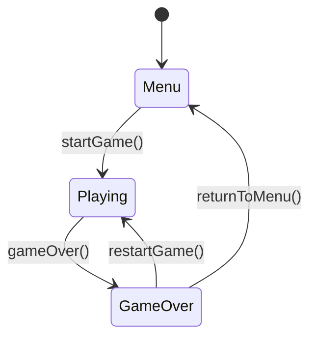
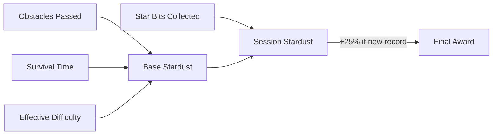

## Overview

`GameManager` is the central orchestrator of SpaceFlapper's game systems. It implements `ObservableObject` for SwiftUI bindings and uses a `GKStateMachine` from GameplayKit to manage state transitions between menu, playing, and game over states.

GameManager coordinates score tracking, difficulty progression, stardust economy, streak management, and achievement notifications across all subsystems.

## State machine

GameManager uses three `GKState` subclasses to enforce valid transitions:



Each state transition triggers specific side effects through `didEnter(from:)`:

```swift GameManager.swift
class PlayingState: GKState {
    override func didEnter(from previousState: GKState?) {
        gameManager?.currentState = .playing
        gameManager?.score = 0
        gameManager?.scoreMultiplier = 1
        gameManager?.nearMissCount = 0
        gameManager?.resetSessionCollectedStardust()
        gameManager?.resetStreakState()
        gameManager?.resetCelebrationFlags()
        gameManager?.gameScene?.startGame()
    }
}
```

<Callout kind="info">
  The state machine enforces that you cannot skip states. For example, `MenuState` only allows transitioning to `PlayingState`, preventing invalid jumps directly to `GameOverState`.
</Callout>

## Published properties

| Property | Type | Description | Default |
|----------|------|-------------|---------|
| `currentState` | `GameState` | Current game state enum (`.menu`, `.playing`, `.gameOver`) | `.menu` |
| `score` | `Int` | Current score for the active session | `0` |
| `highScore` | `Int` | All-time high score, persisted to `UserDefaults` | `0` |
| `scoreMultiplier` | `Int` | Active score multiplier (set by Stardust Fever: 3x) | `1` |
| `difficultyLevel` | `Int` | Current difficulty level from `DifficultyManager` | `0` |
| `nearMissCount` | `Int` | Near-miss count for the current session | `0` |
| `isAudioEnabled` | `Bool` | Audio/haptic toggle, persisted to `UserDefaults` | `true` |
| `lastEarnedStardust` | `Int` | Stardust earned in the last completed session | `0` |
| `totalStardust` | `Int` | Total accumulated stardust across all sessions | `0` |
| `sessionCollectedStardust` | `Int` | Stardust collected from star bits during current session | `0` |
| `currentStreakLevel` | `ComboManager.StreakLevel` | Current streak level for UI display | `.none` |
| `currentStreakCount` | `Int` | Current consecutive pass count | `0` |
| `bestStreak` | `Int` | All-time best streak, persisted via `ProgressionManager` | `0` |

## Game over result properties

These properties drive the post-game UI for "SO CLOSE" and "NEW RECORD" displays:

| Property | Type | Description |
|----------|------|-------------|
| `didSetNewRecord` | `Bool` | Whether the player set a new high score this session |
| `isScoreSoClose` | `Bool` | Whether the score was within 1-3 points of the high score |
| `scoreGap` | `Int` | Gap between score and high score (when SO CLOSE applies) |
| `previousHighScore` | `Int` | High score before this session's update |
| `isStreakSoClose` | `Bool` | Whether the best streak was within 1-2 of the all-time best |
| `recordBonusStardust` | `Int` | Bonus stardust awarded for new record (+25%) |

## State transition methods

| Method | Description |
|--------|-------------|
| `startGame()` | Resets difficulty, enters `PlayingState` |
| `gameOver()` | Enters `GameOverState`, computes results |
| `returnToMenu()` | Enters `MenuState`, resets the game scene |
| `restartGame()` | Resets scene and difficulty, enters `PlayingState` directly from game over |

## Score management

```swift GameManager.swift
func incrementScore() {
    score += 1 * scoreMultiplier
    SoundManager.shared.playScoreSoundWithStreak(level: currentStreakLevel.rawValue)
    HapticManager.shared.playScore()
    gameScene?.checkMilestones(forScore: score)
    checkNewScoreRecord()
    gameScene?.updatePersonalBestBreadcrumb()

    if difficultyManager.updateForScore(score) {
        difficultyLevel = difficultyManager.currentLevel
    }
    updateDifficultyParameters()
}
```

The `addNearMissBonus()` method awards +1 bonus point immediately for near-misses and increments the `nearMissCount` for achievement tracking.

## Difficulty coordination

GameManager bridges `DifficultyManager` parameters to the game scene every time the score changes or time passes:

```swift GameManager.swift
func updateDifficultyParameters() {
    let params = difficultyManager.parameters
    gameScene?.updateDifficulty(
        gapSize: params.gapSize,
        speed: params.scrollSpeed,
        movingProbability: params.movingObstacleProbability,
        spawnInterval: params.spawnInterval,
        driftMultiplier: params.movingObstacleDriftMultiplier,
        effectiveLevel: params.effectiveLevel
    )
}
```

<Callout kind="tip">
  Call `updateTimeDifficulty(deltaTime:)` every frame from `GameScene.update()` to ensure time-based difficulty scaling remains active even when the player is not scoring.
</Callout>

## Stardust economy

Stardust is awarded at game over based on multiple factors:



The `awardStardustForSession()` method calculates base stardust from `ProgressionManager`, adds collected star bits, applies the +25% new record bonus, and records the game session statistics.

## Streak management

| Method | Description |
|--------|-------------|
| `onStreakLevelUp(level:consecutivePasses:)` | Updates UI properties and notifies scene to update trail effects |
| `onStreakBreak(level:finalPasses:)` | Resets streak properties and fades out trail effects |
| `onObstaclePassed(consecutivePasses:currentLevel:)` | Updates streak count and checks for new streak record |
| `resetStreakState()` | Resets all streak properties to defaults |

## Achievement notifications

Achievements are queued and displayed sequentially with auto-dismiss after 2 seconds:

```swift GameManager.swift
private func queueAchievementNotification(_ achievement: Achievement) {
    pendingAchievementNotifications.append(achievement)
    if currentAchievementNotification == nil {
        showNextAchievementNotification()
    }
}
```

The notification queue ensures achievements display one at a time with a 0.3-second gap between them.

## Initialization sequence

The `init()` method sets up systems in this order:

1. Load persisted high score from `UserDefaults`
2. Load audio preference from `UserDefaults`
3. Set up `ProgressionManager` (stardust, achievements)
4. Load best streak from persisted progress
5. Set up `DifficultyManager` with difficulty increase handler
6. Set up `GKStateMachine` and enter `MenuState`
7. Start background music via `SoundManager`
