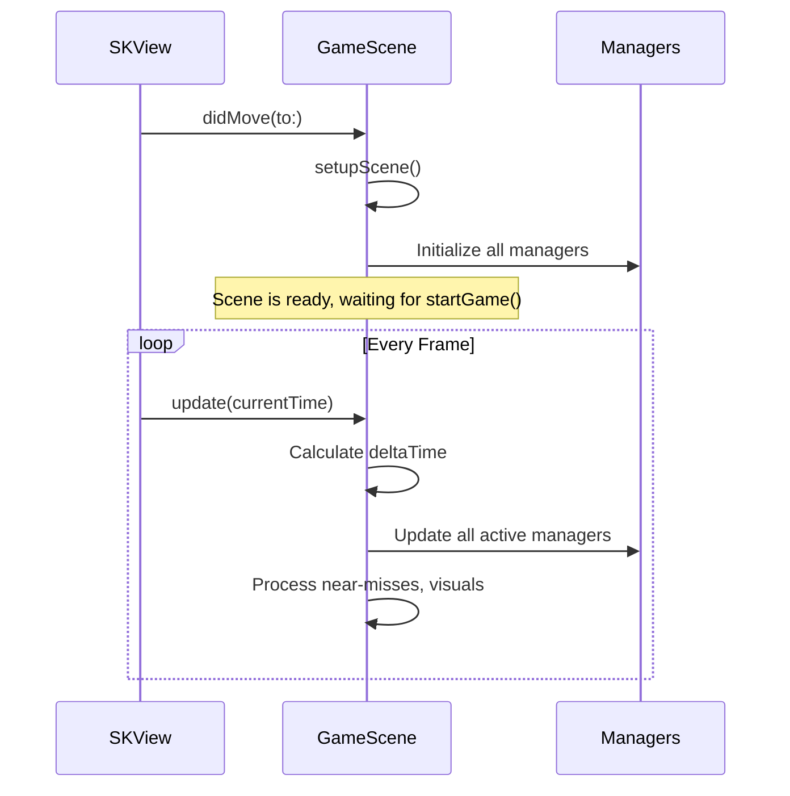

## Overview

`GameScene` is the core `SKScene` subclass that hosts the gameplay. It manages the SpriteKit node tree, physics world, touch input, and the per-frame update loop. Rather than implementing game logic directly, it delegates to specialized manager classes.

## Manager delegation

GameScene instantiates and coordinates these managers:

| Manager | Responsibility |
|---------|---------------|
| `ParallaxBackgroundManager` | Multi-layer scrolling star field |
| `ObstacleManager` | Obstacle spawning, movement, recycling |
| `NearMissDetector` | Proximity-based near-miss detection |
| `MilestoneManager` | Score milestone celebrations |
| `ComboManager` | Streak tracking and level-ups |
| `StreakTrailManager` | Visual trail effects behind player |
| `SpeedSurgeManager` | Speed surge events |
| `WarpZoneManager` | Warp zone tunnel events |
| `MeteorStormManager` | Meteor storm events |
| `CosmicMagnetManager` | Cosmic magnet collectibles |
| `StardustFeverManager` | Stardust fever multiplier events |
| `GhostRivalManager` | Ghost rival replay system |
| `GravityFlipManager` | Gravity inversion events |
| `CometRideManager` | Comet ride events |

## Physics categories

Physics contact detection uses bitmask categories defined as constants:

```swift GameScene.swift
struct PhysicsCategory {
    static let none: UInt32       = 0
    static let player: UInt32     = 0b1       // 1
    static let obstacle: UInt32   = 0b10      // 2
    static let score: UInt32      = 0b100     // 4
    static let boundary: UInt32   = 0b1000    // 8
    static let powerUp: UInt32    = 0b10000   // 16
    static let collectible: UInt32 = 0b100000 // 32
}
```

The physics world is configured with downward gravity matching space theme physics:

```swift GameScene.swift
physicsWorld.gravity = CGVector(dx: 0, dy: -5.0)
physicsWorld.contactDelegate = self
```

## Scene lifecycle



### Setup sequence

The `setupScene()` method initializes systems in this order:

1. Set background color (`0.02, 0.02, 0.08`)
2. Configure physics world gravity and contact delegate
3. `setupBackground()` - parallax star field
4. `setupPlayer()` - player node with equipped suit
5. `setupBoundaries()` - top and bottom screen boundaries
6. `setupObstacles()` - obstacle manager
7. `setupNearMissDetector()` - proximity detection
8. `setupMilestoneManager()` - score celebrations
9. `setupComboManager()` - streak tracking
10. `setupStreakTrailManager()` - visual trails
11. Setup all event managers (speed surge, warp zone, meteor storm, etc.)

### Player setup

```swift GameScene.swift
private func setupPlayer() {
    let equippedSuit = getEquippedSuit()
    let playerNode = PlayerNode(suit: equippedSuit)
    playerNode.position = CGPoint(x: size.width * 0.3, y: size.height * 0.5)
    playerNode.name = "player"

    playerNode.configurePhysicsCategory(
        category: PhysicsCategory.player,
        contact: PhysicsCategory.obstacle | PhysicsCategory.score |
                 PhysicsCategory.boundary | PhysicsCategory.powerUp |
                 PhysicsCategory.collectible,
        collision: PhysicsCategory.boundary
    )
    playerNode.startIdleAnimation()
    addChild(playerNode)
    player = playerNode
}
```

## Update loop

The `update(_ currentTime:)` method runs every frame and performs:

1. **Delta time calculation** - tracks `lastUpdateTime` with a 0.1s max cap
2. **Difficulty updates** - calls `gameManager?.updateTimeDifficulty(deltaTime:)`
3. **Obstacle movement** - delegates to `ObstacleManager`
4. **Event manager updates** - updates all active event managers
5. **Background scrolling** - updates parallax layers
6. **Near-miss detection** - checks proximity to obstacles
7. **Streak trail updates** - positions trail effects
8. **Bullet time processing** - manages slow-motion state
9. **Zero-gravity zone checks** - handles zero-G areas

## Touch handling

```swift GameScene.swift
override func touchesBegan(_ touches: Set<UITouch>, with event: UIEvent?) {
    guard gameManager?.currentState == .playing else { return }
    guard !isDeathAnimationPlaying else { return }
    player?.flap()
}
```

The touch handler gates input on the playing state and death animation flag. During a comet ride, the player is attached to the comet and flap input may be suppressed.

## Physics contact handling

`GameScene` conforms to `SKPhysicsContactDelegate` and handles contacts between:

| Body A | Body B | Result |
|--------|--------|--------|
| Player | Obstacle | Death sequence (unless shielded or invincible) |
| Player | Score Zone | Increment score, check streak, check warp zone |
| Player | Boundary | Death sequence |
| Player | Power-Up | Activate power-up effect |
| Player | Collectible | Collect stardust/star bit |

<Callout kind="alert">
  Shield absorption consumes the shield and plays the shield break effect instead of triggering death. The `hasShield` flag on `PlayerNode` is checked before processing obstacle collisions.
</Callout>

## Key scene methods

| Method | Description |
|--------|-------------|
| `startGame()` | Starts obstacle spawning, event managers, enables gravity |
| `resetGame()` | Removes all obstacles, resets managers, repositions player |
| `updateDifficulty(gapSize:speed:...)` | Forwards difficulty parameters to `ObstacleManager` |
| `updateStreakTrail(level:)` | Updates `StreakTrailManager` with new streak level |
| `onStreakBreak()` | Notifies trail manager and resets visual effects |
| `triggerDifficultyVisualCue()` | Flashes screen on difficulty increase |
| `triggerNewRecordParticles()` | Spawns celebration particles for new high score |
| `checkMilestones(forScore:)` | Delegates to `MilestoneManager` for celebrations |
| `updatePersonalBestBreadcrumb()` | Updates the high score proximity indicator |
| `updatePlayerSuit()` | Applies new suit appearance when changed in shop |

## Bullet time system

Extreme near-misses (within 18pt) trigger a brief slow-motion effect:

| Parameter | Value |
|-----------|-------|
| Duration | 0.4s total |
| Ease in | 0.05s |
| Held | 0.3s |
| Ease out | 0.05s |
| Cooldown | 5.0s between triggers |
| Threshold | 18pt distance to obstacle |

## Zero-gravity zones

Zero-gravity zones spawn periodically during gameplay:

| Parameter | Value |
|-----------|-------|
| Spawn interval | 20-30s |
| Gravity lerp duration | 0.3s (smooth transition) |
