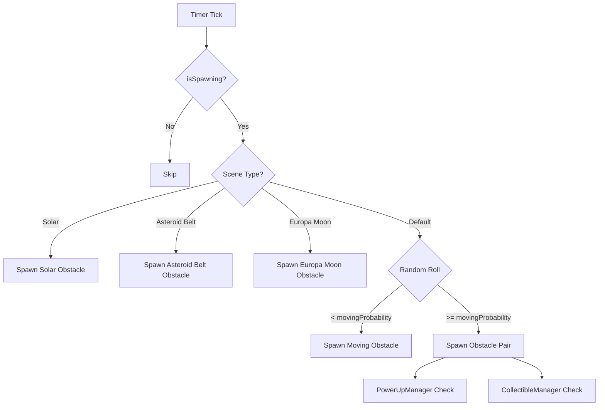

## Overview

`ObstacleManager` handles the complete lifecycle of obstacles in SpaceFlapper. It manages spawning obstacle pairs with gaps, moving obstacles, scene-specific obstacle types, and coordinates with `PowerUpManager` and `CollectibleManager` for item placement within gaps.

## Obstacle types by scene

SpaceFlapper features multiple scenes, each with unique obstacle sets:

| Scene | Obstacle Types | Selection Method |
|-------|---------------|-----------------|
| Deep Space (default) | Static asteroid pairs + moving asteroids | Probability-based (moving vs static) |
| Solar Approach | Solar Flare (35%), Plasma Loop (35%), Sunspot Vortex (30%) | Weighted random |
| Asteroid Belt | Tumbling Rock (45%), Micro Swarm (35%), Iron Core (20%), Gravity Well (15% at difficulty >= 10) | Weighted random |
| Europa Moon | Ice Geyser (30%), Crystal Shard (40%), Frozen Debris (30%), Gravity Well (15% at difficulty >= 10) | Weighted random |

<Callout kind="info">
  Gravity Well obstacles only appear once the effective difficulty level reaches 10 or above, preventing them from overwhelming newer players.
</Callout>

## Core data structures

### ObstaclePair

Represents a static obstacle pair (top and bottom asteroids with a gap):

```swift ObstacleManager.swift
struct ObstaclePair {
    let topObstacle: ObstacleNode
    let bottomObstacle: ObstacleNode
    let scoreZone: SKNode
}
```

### MovingObstacle

Represents a single moving obstacle that drifts vertically:

```swift ObstacleManager.swift
struct MovingObstacle {
    let node: MovingObstacleNode
    let scoreZone: SKNode
}
```

## Dynamic difficulty parameters

These parameters are updated by `DifficultyManager` through `GameScene`:

| Parameter | Default | Description |
|-----------|---------|-------------|
| `currentSpeed` | 140pt/s | Horizontal scroll speed |
| `currentGapSize` | 190pt | Vertical gap between obstacle pairs |
| `currentMovingProbability` | 0.25 | Chance of spawning a moving obstacle vs pair |
| `currentSpawnInterval` | 2.8s | Time between spawns |
| `currentDriftMultiplier` | 1.0x | Vertical movement amplitude for moving obstacles |
| `speedModifier` | 1.0x | Multiplier applied by power-ups (e.g., Time Warp: 0.5x) |

## Static configuration

| Constant | Value | Description |
|----------|-------|-------------|
| `obstacleWidth` | 70pt | Width of each asteroid obstacle |
| `minGapY` | 0.2 | Minimum gap center as fraction of screen height |
| `maxGapY` | 0.8 | Maximum gap center as fraction of screen height |
| `movingObstacleSize` | 55pt | Size of moving obstacle nodes |

## Spawning logic

The spawning system runs on a timer, checking `currentSpawnInterval` each frame:



### Gap placement

For obstacle pairs, the gap center Y position is randomized within the `minGapY`-`maxGapY` range of the screen height. The top and bottom obstacles are sized to fill the remaining space above and below the gap.

### Power-up and collectible integration

When an obstacle pair spawns, `ObstacleManager` notifies `PowerUpManager` and `CollectibleManager` with `GapSpawnData` containing the gap center position and size. These managers independently decide whether to spawn items in the gap.

## Public methods

| Method | Description |
|--------|-------------|
| `startSpawning()` | Begins the obstacle spawn timer |
| `stopSpawning()` | Stops spawning but keeps existing obstacles |
| `updateDifficulty(gapSize:speed:movingProbability:spawnInterval:driftMultiplier:effectiveLevel:)` | Updates all dynamic parameters |
| `setSpeedModifier(_ modifier: CGFloat)` | Sets power-up speed modifier (e.g., 0.5 for Time Warp) |
| `moveObstacles(deltaTime:)` | Moves all active obstacles leftward |
| `removeOffscreenObstacles()` | Cleans up obstacles past the left screen edge |
| `removeAllObstacles()` | Removes all obstacles immediately |
| `reset()` | Full reset of all state and active obstacles |

## Scene type activation

Scene types are controlled through boolean flags:

```swift ObstacleManager.swift
var isSolarSceneActive: Bool = false
var isAsteroidBeltSceneActive: Bool = false
var isEuropaMoonSceneActive: Bool = false
```

<Callout kind="tip">
  Only one scene type should be active at a time. The default deep space obstacles spawn when all scene flags are `false`.
</Callout>

## Obstacle movement

All obstacles move leftward at `currentSpeed * speedModifier` points per second. Moving obstacles additionally oscillate vertically using a sine wave multiplied by `currentDriftMultiplier`.

Obstacles are removed when their x-position falls below a threshold past the left screen edge, preventing unbounded memory growth.
