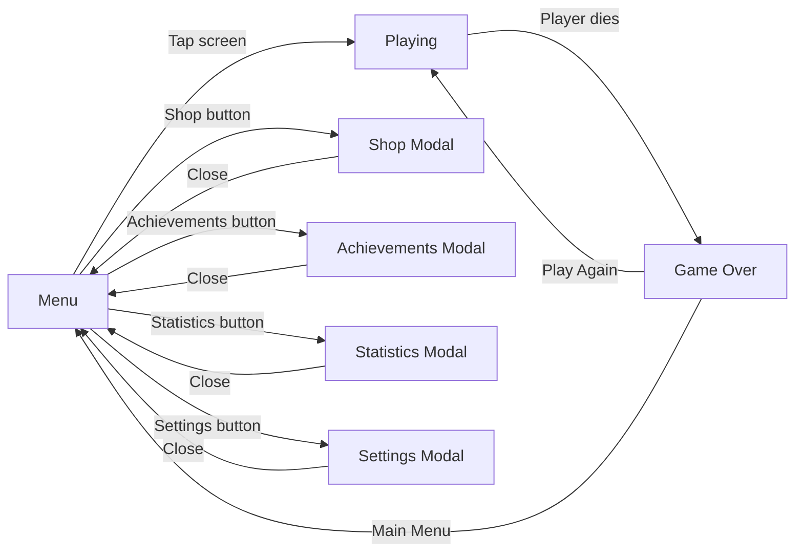

## Overview

SpaceFlapper uses SwiftUI overlay views rendered on top of the SpriteKit game scene. These overlays handle all user interface elements -- from the main menu to the in-game HUD to post-game results. Each overlay observes `GameManager` and automatically updates when game state changes.

## Menu overlay

**File**: `MenuOverlayView.swift`

The main menu is the first screen players see. It displays the game title, stardust balance, high score, and navigation buttons.

### Elements displayed

| Element | Description |
|---------|-------------|
| Game title | "SPACE" and "FLAPPER" with gradient styling |
| Stardust counter | Current balance with star icon |
| High score | Best score (shown only if > 0) |
| "TAP TO START" | Pulsing text that triggers gameplay |
| Navigation buttons | Shop, Achievements, Statistics, Settings (top-left) |
| Audio toggle | Sound on/off button (top-right) |

### Navigation buttons

```swift MenuOverlayView.swift
// Top-left button row
Button(action: { showShop = true }) {
    Image(systemName: "bag.fill")         // Shop
}
Button(action: { showAchievements = true }) {
    Image(systemName: "trophy.fill")      // Achievements
}
Button(action: { showStatistics = true }) {
    Image(systemName: "chart.bar.fill")   // Statistics
}
Button(action: { showSettings = true }) {
    Image(systemName: "gearshape.fill")   // Settings
}
```

Each button opens a `.fullScreenCover` modal. The audio toggle calls `gameManager.toggleAudio()` directly.

<Callout kind="info">
  Number formatting uses the current localization locale, so stardust displays as "1,000" in English but "1.000" in German.
</Callout>

## Playing overlay (HUD)

**File**: `PlayingOverlayView.swift`

The in-game HUD shows the current score, streak display, and proximity markers for high score and best streak.

### Score display

The score uses a layered rendering approach with glow effects:

| Layer | Purpose |
|-------|---------|
| Glow layer | Cyan blur that pulses on score increment |
| Main text | 80pt white text with gradient and shadow |
| Bounce animation | Spring animation on every score increment |

```swift PlayingOverlayView.swift
.onChange(of: gameManager.score) { newScore in
    guard newScore > 0 else { return }
    withAnimation(.spring(response: 0.15, dampingFraction: 0.4)) {
        scoreScale = 1.3
        scoreOffset = -8
    }
    withAnimation(.spring(response: 0.3, dampingFraction: 0.5).delay(0.1)) {
        scoreScale = 1.0
        scoreOffset = 0
    }
}
```

### Best score proximity marker

A contextual marker appears below the score when approaching the high score:

| Proximity | Condition | Display |
|-----------|-----------|---------|
| Hidden | Score < best - 5 | Nothing |
| Approaching | Score >= best - 5 | "BEST: [score]" in gray |
| Almost | Score >= best - 1 | "BEST: [score] ALMOST!" with pulse |
| New Best | Score >= best | "NEW BEST!" with gold glow |

### Streak display

The `StreakDisplayView` component shows the current obstacle streak with visual escalation across four levels:

| Level | Streak Count | Icon | Color Theme |
|-------|-------------|------|-------------|
| Level 1 | 3+ | `bolt.fill` | Cyan |
| Level 2 | 5+ | `bolt.fill` | Light cyan |
| Level 3 | 8+ | `bolt.fill` | Orange |
| Level 4 | 15+ | `flame.fill` | Gold/orange |

### Floating celebration text

Two floating text animations trigger for milestone moments:

- **"NEW RECORD!"** -- Pops in with spring animation, floats upward 80pt, then fades out
- **"BEST STREAK!"** -- Same pattern, positioned below the streak display

## Game over overlay

**File**: `GameOverOverlayView.swift`

The game over screen has two phases: a quick-retry window and a full results display.

### Quick-retry window (first 2 seconds)

Immediately after dying, a pulsing "TAP TO RETRY" text appears on a semi-transparent background. Tapping anywhere restarts the game instantly. After 2 seconds, the full results panel slides in.

```swift GameOverOverlayView.swift
if isQuickRetryWindowActive {
    Text("TAP TO RETRY")
        .font(.system(size: 24, weight: .bold, design: .rounded))
        .foregroundColor(.white.opacity(0.8))
        .opacity(retryTextOpacity)
} else {
    resultsContent
}
```

### Full results panel

The results panel includes:

| Section | Condition | Content |
|---------|-----------|---------|
| NEW RECORD banner | `didSetNewRecord` is true | Gold animated text |
| SO CLOSE score | Score within range of high score | Side-by-side score vs. best comparison |
| Standard score | Default | Large score + best score display |
| SO CLOSE streak | Streak within range of best | Streak vs. best streak comparison |
| Ghost rival | Ghost run data available | "OUTLIVED YOUR BEST!" or gap display |
| Stardust earned | Stardust > 0 | Amount with record bonus if applicable |
| Run recap badges | Threshold met | Near-miss, streak, speed demon, close call badges |
| Micro-goal | No special condition active | Suggestion for next run |

### Run recap badges

Badges appear as pill-shaped capsules when performance thresholds are met:

| Badge | Threshold | Icon | Color |
|-------|-----------|------|-------|
| Near Miss | 3+ near-misses | `bolt.fill` | Cyan |
| Streak | 3+ streak | `flame.fill` | Orange |
| Speed Demon | Hard difficulty reached | `hare.fill` | Red |
| Close Call Chain | 2+ consecutive near-misses | `link` | Yellow |

### Action buttons

- **Play Again** -- Cyan/blue gradient capsule, calls `gameManager.restartGame()`
- **Main Menu** -- Semi-transparent capsule, calls `gameManager.returnToMenu()`

Both buttons are disabled during the initial 2.5 seconds to prevent accidental taps.

## Shop view

**File**: `ShopView.swift`

The suit shop displays all available astronaut suits in a 2-column grid.

### Layout

| Section | Content |
|---------|---------|
| Header | "SHOP" title with purple gradient, stardust balance |
| Suits grid | 2-column `LazyVGrid` of suit cards |
| Close button | Dismisses the modal |

### Suit card states

Each suit card shows a visual preview (rendered with `Canvas`), name, description, and an action button:

| State | Button | Action |
|-------|--------|--------|
| Equipped | "EQUIPPED" (disabled, purple) | None |
| Owned but not equipped | "EQUIP" (cyan/blue gradient) | Calls `equipSuit()` |
| Locked, can afford | Price with sparkles icon (purple/pink) | Calls `purchaseSuit()` |
| Locked, cannot afford | Price grayed out (disabled) | None |

### Purchase flow

```swift ShopView.swift
private func purchaseSuit(_ suit: Suit) {
    var progress = gameManager.progressionManager.currentProgress
    if progress.spendStardust(suit.price) {
        progress.unlockSuit(suit.id)
        gameManager.progressionManager.updateProgress(progress)
        gameManager.objectWillChange.send()
    }
}
```

<Callout kind="alert">
  The shop works with a copy of `PlayerProgress` (value type). After mutation, it must be written back via `updateProgress()` and the UI manually notified with `objectWillChange.send()`.
</Callout>

### Available suits

| Suit | Price | Primary | Accent | Visor |
|------|-------|---------|--------|-------|
| Classic | Free | White | Red-orange | Blue |
| Neon Voyager | 500 | Dark gray | Cyan-green | Magenta |
| Golden Star | 1,000 | Gold | Dark gold | Brown |
| Cosmic Phantom | 2,000 | Dark purple | Purple | Light blue |

## Achievements view

**File**: `AchievementsView.swift`

Displays all 8 achievements in a scrollable list with completion status and stardust rewards.

### Layout

| Section | Content |
|---------|---------|
| Header | "ACHIEVEMENTS" with gold gradient, progress counter (e.g., "3 / 8") |
| Achievement list | `LazyVStack` of achievement cards |
| Close button | Dismisses the modal |

### Achievement card content

Each card displays:

- **Icon**: Gold checkmark circle (completed) or category-specific icon (locked)
- **Name and description**: Localized text
- **Progress indicator**: Shows current progress for locked achievements (e.g., "Best: 42/50")
- **Reward badge**: Stardust amount with sparkles icon

## Statistics view

**File**: `StatisticsView.swift`

Displays lifetime gameplay statistics organized into three sections.

### Sections

| Section | Icon | Statistics |
|---------|------|-----------|
| Best Performances | `trophy.fill` | Best Score, Best Streak |
| Lifetime Totals | `infinity` | Obstacles Dodged, Total Time Played, Near-Misses |
| Rewards | `sparkles` | Lifetime Stardust, Power-Ups Collected |

Each statistic row displays an icon, label, and formatted value. If the player has collected power-ups, a breakdown by type appears below the Rewards section.

### Time formatting

Total time played uses `DateComponentsFormatter` with locale-aware abbreviated units:

```swift StatisticsView.swift
private func formatTime(_ seconds: TimeInterval) -> String {
    let totalSeconds = max(0, Int(seconds.rounded(.down)))
    let allowedUnits: NSCalendar.Unit
    if totalSeconds >= 3600 {
        allowedUnits = [.hour, .minute]
    } else if totalSeconds >= 60 {
        allowedUnits = [.minute, .second]
    } else {
        allowedUnits = [.second]
    }
    let formatter = DateComponentsFormatter()
    formatter.allowedUnits = allowedUnits
    formatter.unitsStyle = .abbreviated
    return formatter.string(from: TimeInterval(totalSeconds)) ?? "\(totalSeconds)"
}
```

## Settings view

**File**: `SettingsView.swift`

The settings screen provides language selection for the 5 supported languages.

### Layout

| Section | Content |
|---------|---------|
| Header | "SETTINGS" with cyan/blue gradient |
| Language section | Globe icon with "Language" label |
| Language list | 5 language rows with flags, names, and checkmark for selected |
| Close button | Dismisses the modal |

### Language switching

Tapping a language row calls `localizationManager.setLanguage(code)`, which immediately:

1. Persists the preference to `UserDefaults`
2. Loads the new `.lproj` bundle
3. Triggers `@Published` change notification
4. All views re-render with the new language

<Callout kind="tip">
  Language changes take effect instantly across all screens -- no app restart required.
</Callout>

## Achievement notification view

**File**: `AchievementNotificationView.swift`

A banner that slides in from the top of the screen when an achievement unlocks during gameplay. It renders at `zIndex(100)` to appear above all other overlays.

### Animation sequence

| Phase | Timing | Effect |
|-------|--------|--------|
| Slide in | 0s | Spring animation from -120pt offset to 0 |
| Icon pop | 0.15s delay | Star icon scales from 0.5 to 1.0 with spring |
| Glow pulse | 0.1s delay | Icon glow flashes to 0.8 opacity then settles to 0.3 |

### Banner content

- Star icon with glow effect
- "ACHIEVEMENT UNLOCKED" label in small yellow text
- Achievement name in 18pt bold white text
- Stardust reward amount in cyan

## State transitions summary



## Related pages

<Columns cols="2">
  <Card title="SwiftUI + SpriteKit Bridge" href="/technical/swiftui-spritekit" icon="link" horizontal="false">
    How the game scene and UI overlays communicate.
  </Card>

  <Card title="View Hierarchy" href="/technical/view-hierarchy" icon="git-branch" horizontal="false">
    Complete view tree and composition diagram.
  </Card>
</Columns>
