## Overview

`ParallaxBackgroundManager` renders a multi-layer parallax star field background that scrolls at different speeds to create depth perception. The background evolves visually based on the player's score, transitioning through four stages from deep space to an aurora-filled legendary display.

## Layer configuration

Each parallax layer is defined by a `LayerConfig` struct:

```swift ParallaxBackgroundManager.swift
struct LayerConfig {
    let speed: CGFloat           // Scrolling speed (points per second)
    let starCount: Int           // Number of stars in this layer
    let starSizeRange: ClosedRange<CGFloat>  // Star size variation
    let opacity: CGFloat         // Layer opacity (distant = dimmer)
    let zPosition: CGFloat       // Layer depth
    let color: SKColor           // Star color
}
```

### Depth model

Distant layers scroll slower and appear dimmer, while near layers scroll faster and appear brighter. This creates the parallax depth illusion:

```mermaid
graph LR
    A[Far Layer<br/>Slow + Dim] --> B[Mid Layer<br/>Medium] --> C[Near Layer<br/>Fast + Bright]
    style A fill:#1a1a3e
    style B fill:#2a2a5e
    style C fill:#3a3a7e
```



<Callout kind="info">
  Stars are rendered as `SKShapeNode` circles with `glowWidth` for soft halos. Each star's size is randomized within the layer's `starSizeRange` for natural variation.
</Callout>

## Background evolution stages

The background visually evolves based on the player's current score:

| Stage | Score Range | Description | Visual Characteristics |
|-------|-----------|-------------|----------------------|
| Deep Space | 0-25 | Default starting background | Deep blue/purple tones, static stars |
| Warming Up | 26-50 | Subtle warming | Warmer color tints, shooting stars begin appearing |
| Nebula | 51-99 | Enhanced atmosphere | Pink/cyan nebula accents, enhanced particle effects |
| Legendary | 100+ | Maximum visual intensity | Aurora waves, maximum particle density |

### Stage determination

```swift ParallaxBackgroundManager.swift
enum EvolutionStage: Int, CaseIterable {
    case deepSpace = 0
    case warmingUp = 1
    case nebula = 2
    case legendary = 3

    static func stage(for score: Int) -> EvolutionStage {
        switch score {
        case 0...25:   return .deepSpace
        case 26...50:  return .warmingUp
        case 51...99:  return .nebula
        default:       return .legendary
        }
    }
}
```

## Scrolling mechanism

The background uses a tile-based infinite scrolling system. Each layer contains two copies of the star field placed side by side. As the left copy scrolls off-screen, it repositions to the right of the second copy, creating seamless infinite scrolling.

### Update loop

The `update(deltaTime:)` method is called every frame from `GameScene`:

1. Move each layer's nodes leftward by `speed * deltaTime`
2. Check if any tile has scrolled fully off-screen
3. Reposition off-screen tiles to create continuous scroll
4. Update evolution stage if score has changed
5. Apply stage-specific visual enhancements

## Public methods

| Method | Description |
|--------|-------------|
| `setupBackground()` | Creates all layers and populates with stars |
| `update(deltaTime:)` | Scrolls layers and manages tile recycling |
| `updateForScore(_:)` | Checks and transitions evolution stage |
| `reset()` | Returns to deep space stage |

## Scene-specific backgrounds

Different game scenes can have unique background configurations:

| Scene | Background Style |
|-------|-----------------|
| Deep Space | Blue/purple star field (default) |
| Solar Approach | Warm orange/yellow gradients, solar corona effects |
| Asteroid Belt | Dense star field with asteroid dust particles |
| Europa Moon | Icy blue tones with surface detail layers |

<Callout kind="tip">
  Background transitions between scenes use smooth color interpolation to avoid jarring visual changes. The evolution system applies on top of the scene-specific base, so a legendary deep space looks different from a legendary solar approach.
</Callout>

## Performance

The parallax system is optimized for mobile performance:

- **Fixed star count** per layer prevents dynamic allocation during gameplay
- **Tile recycling** avoids creating/destroying nodes
- **Layer opacity** reduces GPU overdraw for distant layers
- **Minimal draw calls** by grouping stars into layer container nodes
- **zPosition sorting** eliminates depth-fighting artifacts
