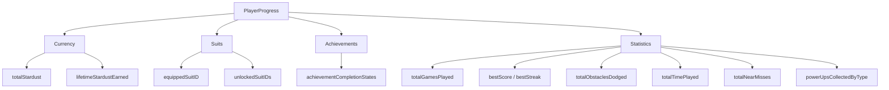

## Overview

`PlayerProgress` is the central data model for all persistent player state in SpaceFlapper. It is a `Codable` struct that serializes to JSON and persists via `UserDefaults`. Every field tracked across sessions -- stardust balance, suit ownership, achievement completion, and gameplay statistics -- lives in this single model.



## Stored properties

The following table lists every property stored in `PlayerProgress`:

| Property | Type | Default | Description |
|----------|------|---------|-------------|
| `totalStardust` | `Int` | `0` | Current spendable stardust balance |
| `equippedSuitID` | `String` | `"default"` | ID of the currently equipped suit |
| `unlockedSuitIDs` | `[String]` | `["default"]` | All suit IDs the player owns |
| `achievementCompletionStates` | `[String: Bool]` | `[:]` | Map of achievement ID to completion status |
| `totalGamesPlayed` | `Int` | `0` | Lifetime number of games played |
| `totalObstaclesDodged` | `Int` | `0` | Lifetime total obstacles successfully passed |
| `totalTimePlayed` | `TimeInterval` | `0` | Lifetime total seconds played |
| `bestScore` | `Int` | `0` | All-time highest score |
| `bestStreak` | `Int` | `0` | All-time longest obstacle streak |
| `totalNearMisses` | `Int` | `0` | Lifetime near-miss count |
| `lifetimeStardustEarned` | `Int` | `0` | Total stardust earned across all sessions |
| `powerUpsCollectedByType` | `[String: Int]` | `[:]` | Count of each power-up type collected |

## Persistence strategy

`PlayerProgress` uses `UserDefaults` with JSON encoding for storage. The struct conforms to `Codable`, allowing the entire model to serialize and deserialize as a single JSON blob.

```swift PlayerProgress.swift
private static let storageKey = "SpaceFlapper.PlayerProgress"

func save() {
    guard let data = try? JSONEncoder().encode(self) else { return }
    UserDefaults.standard.set(data, forKey: Self.storageKey)
}

static func load() -> PlayerProgress? {
    guard let data = UserDefaults.standard.data(forKey: storageKey) else { return nil }
    return try? JSONDecoder().decode(PlayerProgress.self, from: data)
}

static func loadOrCreate() -> PlayerProgress {
    load() ?? PlayerProgress()
}
```

<Callout kind="info">
  The `loadOrCreate()` pattern ensures a fresh `PlayerProgress` instance with sensible defaults is always available, even on first launch.
</Callout>

## Stardust management

Two mutating methods control the stardust balance:

```swift PlayerProgress.swift
mutating func addStardust(_ amount: Int) {
    totalStardust += amount
}

mutating func spendStardust(_ amount: Int) -> Bool {
    guard totalStardust >= amount else { return false }
    totalStardust -= amount
    return true
}
```

`spendStardust` returns a `Bool` indicating whether the player had sufficient funds. The caller (typically `ShopView`) uses this to gate suit purchases.

## Suit management

Three methods handle suit ownership and equipping:

| Method | Return | Description |
|--------|--------|-------------|
| `unlockSuit(_ suitID:)` | `Void` | Adds a suit ID to `unlockedSuitIDs` if not already present |
| `isSuitUnlocked(_ suitID:)` | `Bool` | Checks if a suit ID exists in the unlocked list |
| `equipSuit(_ suitID:)` | `Bool` | Sets the equipped suit if it is unlocked; returns success |

```swift PlayerProgress.swift
mutating func equipSuit(_ suitID: String) -> Bool {
    guard isSuitUnlocked(suitID) else { return false }
    equippedSuitID = suitID
    return true
}
```

<Callout kind="alert">
  Equipping a suit does not automatically save. The caller must call `save()` or use `ProgressionManager.updateProgress()` to persist the change.
</Callout>

## Session recording

After each game run, `recordGameSession` aggregates the session results into lifetime statistics:

```swift PlayerProgress.swift
mutating func recordGameSession(
    score: Int,
    obstaclesDodged: Int,
    timePlayed: TimeInterval,
    nearMisses: Int,
    bestStreakInSession: Int,
    stardustEarned: Int
) {
    totalGamesPlayed += 1
    totalObstaclesDodged += obstaclesDodged
    totalTimePlayed += timePlayed
    totalNearMisses += nearMisses
    lifetimeStardustEarned += stardustEarned

    if score > bestScore {
        bestScore = score
    }
    if bestStreakInSession > bestStreak {
        bestStreak = bestStreakInSession
    }
}
```

The `bestScore` and `bestStreak` fields use a "max" pattern -- they only update when the new value exceeds the existing record.

## Computed properties

| Property | Type | Description |
|----------|------|-------------|
| `totalPowerUpsCollected` | `Int` | Sum of all values in `powerUpsCollectedByType` |

```swift PlayerProgress.swift
var totalPowerUpsCollected: Int {
    powerUpsCollectedByType.values.reduce(0, +)
}
```

## Related pages

<Columns cols="2">
  <Card title="Progression Manager" href="/technical/progression-manager" icon="trending-up" horizontal="false">
    How stardust is calculated and awarded after each run.
  </Card>

  <Card title="Achievement System" href="/technical/achievement-system" icon="trophy" horizontal="false">
    Achievement definitions, unlock logic, and reward distribution.
  </Card>
</Columns>
