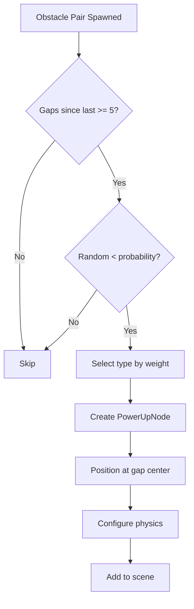
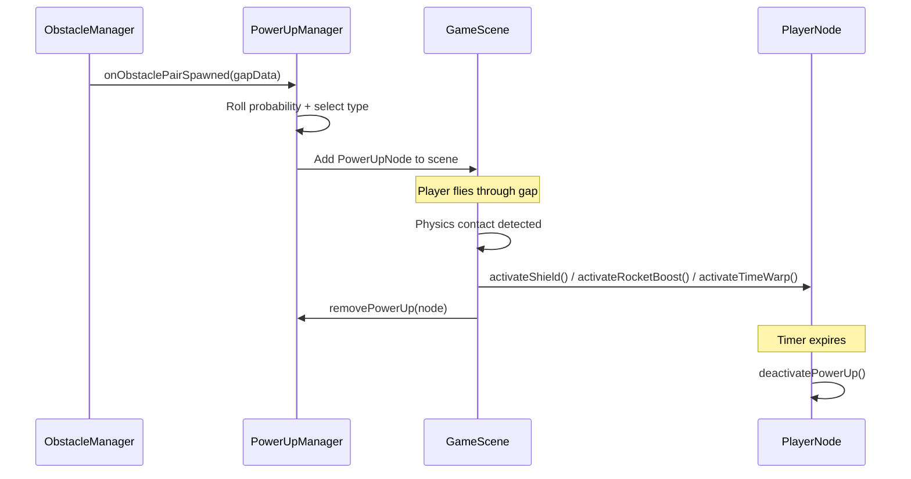

## Overview

SpaceFlapper's power-up system consists of `PowerUpManager` for spawn control and three power-up classes (`StarShieldPowerUp`, `RocketBoostPowerUp`, `TimeWarpPowerUp`) that extend the abstract `PowerUpNode` base class. Power-ups spawn in obstacle gaps with probability-based selection and provide temporary gameplay advantages.

## PowerUpManager

### Spawn configuration

| Parameter | Value | Description |
|-----------|-------|-------------|
| `baseSpawnProbability` | 8% | Base chance per obstacle pair |
| `probabilityIncreasePerLevel` | 0.5% | Increase per difficulty level |
| `maximumSpawnProbability` | 15% | Cap on spawn probability |
| `minimumGapsBetweenSpawns` | 5 | Minimum obstacle pairs between power-ups |

### Spawn probability formula

```swift PowerUpManager.swift
private func calculateSpawnProbability() -> Double {
    let difficultyBonus = currentDifficultyLevel * probabilityIncreasePerLevel
    return min(baseSpawnProbability + difficultyBonus, maximumSpawnProbability)
}
```

### Type distribution

| Power-Up | Weight | Probability |
|----------|--------|-------------|
| Star Shield | 0.0-0.4 | 40% |
| Rocket Boost | 0.4-0.75 | 35% |
| Time Warp | 0.75-1.0 | 25% |

```swift PowerUpManager.swift
private func selectPowerUpType() -> PowerUpType {
    let roll = Double.random(in: 0..<1)
    if roll < PowerUpType.shield.spawnThreshold {      // < 0.4
        return .shield
    } else if roll < PowerUpType.rocketBoost.spawnThreshold {  // < 0.75
        return .rocketBoost
    } else {
        return .timeWarp
    }
}
```

### Spawn flow



### Public methods

| Method | Description |
|--------|-------------|
| `onObstaclePairSpawned(gapData:)` | Evaluates spawn chance and creates power-up if selected |
| `updateDifficulty(level:)` | Updates effective difficulty for probability scaling |
| `removePowerUp(_:)` | Removes a collected power-up from tracking |
| `moveActivePowerUps(by:)` | Moves all power-ups with obstacle movement |
| `removeOffscreenPowerUps(threshold:)` | Cleans up off-screen power-ups |
| `reset()` | Removes all power-ups and resets spawn tracking |

---

## Star Shield

**Class:** `StarShieldPowerUp` extends `PowerUpNode`

Grants the player a protective shield that absorbs one hit from any obstacle or meteor.

### Behavior

| Property | Value |
|----------|-------|
| Duration | 15 seconds (auto-expire) |
| Hits absorbed | 1 |
| Visual | Cyan crystal with pulsing glow |
| Shield visual | 48pt diameter cyan circle around player |

### Visual design

- **Crystal shape**: Hexagonal gem with faceted highlights
- **Glow effect**: Pulsing circle behind crystal (0.8s cycle, scale 0.9-1.3x)
- **Float animation**: 3pt vertical bob (0.6s cycle)
- **Collection burst**: 20 cyan particles expanding outward

### Colors

| Element | Color (RGBA) |
|---------|-------------|
| Crystal base | (0.0, 0.9, 1.0, 1.0) - Cyan |
| Crystal highlight | (0.7, 1.0, 1.0, 1.0) - Light cyan |
| Crystal shadow | (0.0, 0.5, 0.7, 1.0) - Dark cyan |
| Glow | (0.0, 0.9, 1.0, 0.5) - Cyan 50% |

---

## Rocket Boost

**Class:** `RocketBoostPowerUp` extends `PowerUpNode`

Grants 1.5x thrust power and invincibility for 3 seconds.

### Behavior

| Property | Value |
|----------|-------|
| Duration | 3 seconds |
| Thrust multiplier | 1.5x |
| Invincibility | Yes |
| Visual | Orange crystal with flame particles |

### Visual design

- **Crystal shape**: Same hexagonal gem as shield, orange palette
- **Glow effect**: Faster pulse (0.6s cycle, scale 0.85-1.4x)
- **Flame emitter**: 40 particles/s shooting downward below crystal
- **Float animation**: 3pt vertical bob (0.5s cycle)
- **Collection burst**: 30 orange particles with flame color variation

### Flame emitter configuration

```swift RocketBoostPowerUp.swift
emitter.particleBirthRate = 40
emitter.particleLifetime = 0.4
emitter.emissionAngle = .pi / 2  // Downward
emitter.emissionAngleRange = .pi / 4
emitter.particleSpeed = 60
emitter.particleColor = flameColor  // Orange (1.0, 0.6, 0.1)
emitter.particleBlendMode = .add
```

---

## Time Warp

**Class:** `TimeWarpPowerUp` extends `PowerUpNode`

Slows all obstacles to 50% speed for 4 seconds.

### Behavior

| Property | Value |
|----------|-------|
| Duration | 4 seconds |
| Speed modifier | 0.5x (obstacles move at half speed) |
| Visual | Purple crystal with swirl particles |

### Visual design

- **Crystal shape**: Same hexagonal gem, purple palette
- **Glow effect**: 0.7s cycle pulse (scale 0.88-1.35x)
- **Swirl emitter**: 25 particles/s orbiting in a ring, full 360-degree rotation every 2s
- **Float animation**: 3pt vertical bob (0.55s cycle)
- **Collection burst**: 35 purple particles + 3 expanding swirl rings

### Swirl emitter configuration

```swift TimeWarpPowerUp.swift
emitter.particleBirthRate = 25
emitter.particleLifetime = 1.0
emitter.emissionAngleRange = .pi * 2  // Full circle
emitter.particleSpeed = 15
emitter.particleColor = swirlColor  // Purple (0.7, 0.4, 1.0)
emitter.particlePositionRange = CGVector(
    dx: powerUpSize.width * 0.6,
    dy: powerUpSize.height * 0.6
)
```

### Swirl ring collection effect

On collection, three expanding rings animate outward with staggered timing (0.08s apart), creating a time-distortion visual:

```swift TimeWarpPowerUp.swift
for i in 0..<3 {
    let ring = SKShapeNode(circleOfRadius: powerUpSize.width * 0.5)
    ring.strokeColor = swirlColor.withAlphaComponent(0.7 - CGFloat(i) * 0.2)
    // Expand to 2.5x-3.5x over 0.3s with easeOut timing
}
```

## Power-up lifecycle



<Callout kind="alert">
  Only one power-up can be active at a time. Collecting a new power-up while one is active replaces the current effect.
</Callout>
