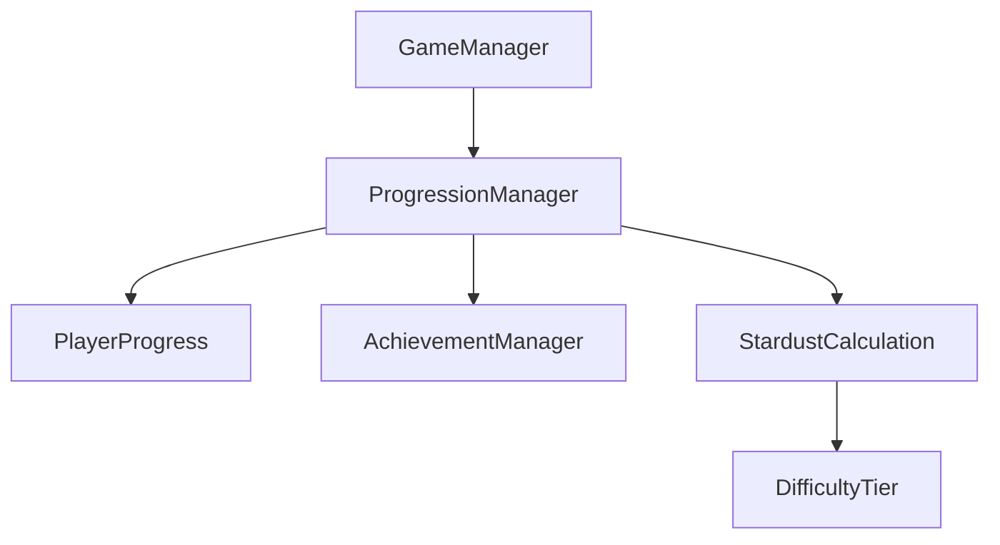
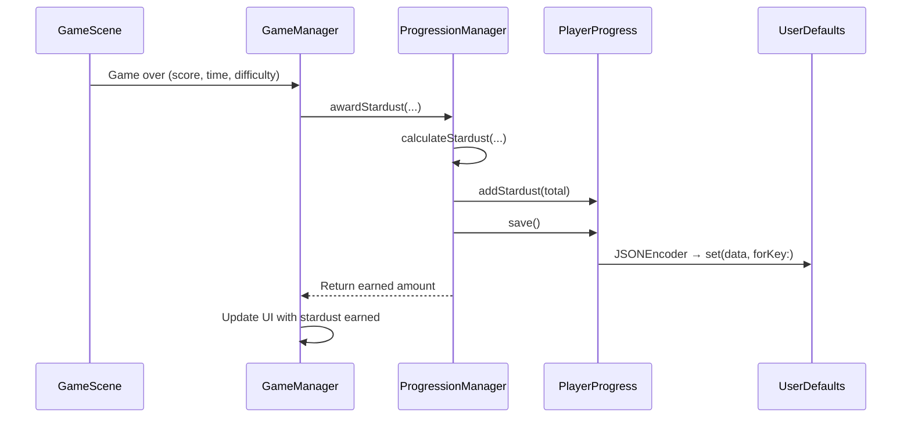

## Overview

`ProgressionManager` is the central coordinator for player progression. It owns the `PlayerProgress` model and the `AchievementManager`, and provides the stardust calculation engine that converts gameplay performance into currency rewards.



## Initialization

On creation, `ProgressionManager` loads existing progress from `UserDefaults` or creates a fresh instance:

```swift ProgressionManager.swift
init() {
    self.playerProgress = PlayerProgress.loadOrCreate()
    self.achievementManager = AchievementManager(playerProgress: playerProgress)
}
```

## Stardust calculation

The stardust calculation uses a formula with two base components and a difficulty multiplier.

### Formula

```
obstacleStardust = obstaclesPassed * 1.0
timeStardust     = survivalTimeSeconds * 0.5
baseTotal        = obstacleStardust + timeStardust
finalTotal       = floor(baseTotal * difficultyMultiplier)
```

### Difficulty tiers and multipliers

The effective difficulty level (from `DifficultyManager`) maps to a tier with a corresponding multiplier:

| Tier | Effective Level Range | Multiplier |
|------|----------------------|------------|
| Easy | 0 - 4.99 | 1.0x |
| Medium | 5 - 9.99 | 1.25x |
| Hard | 10 - 19.99 | 1.5x |
| Expert | 20 - 49.99 | 2.0x |
| Impossible | 50+ | 5.0x |

```swift ProgressionManager.swift
static func from(effectiveLevel: Double) -> DifficultyTier {
    if effectiveLevel < 5 {
        return .easy
    } else if effectiveLevel < 10 {
        return .medium
    } else if effectiveLevel < 20 {
        return .hard
    } else if effectiveLevel < 50 {
        return .expert
    } else {
        return .impossible
    }
}
```

<Callout kind="tip">
  The Impossible tier awards 5x stardust, making long survival runs at extreme difficulty highly rewarding.
</Callout>

### StardustCalculation result

The `calculateStardust` method returns a `StardustCalculation` struct with a full breakdown:

| Property | Type | Description |
|----------|------|-------------|
| `obstacleStardust` | `Int` | Stardust from obstacles passed |
| `timeStardust` | `Int` | Stardust from survival time |
| `baseTotal` | `Int` | Sum before multiplier |
| `difficultyTier` | `DifficultyTier` | The tier used for calculation |
| `multiplier` | `Double` | The multiplier applied |
| `total` | `Int` | Final stardust amount after multiplier |

```swift ProgressionManager.swift
func calculateStardust(
    obstaclesPassed: Int,
    survivalTimeSeconds: TimeInterval,
    effectiveDifficultyLevel: Double
) -> StardustCalculation {
    let tier = DifficultyTier.from(effectiveLevel: effectiveDifficultyLevel)
    let obstacleStardust = Double(obstaclesPassed) * stardustPerObstacle
    let timeStardust = survivalTimeSeconds * stardustPerSecond
    let baseTotal = obstacleStardust + timeStardust
    let multipliedTotal = baseTotal * tier.multiplier
    let finalTotal = Int(multipliedTotal)

    return StardustCalculation(
        obstacleStardust: Int(obstacleStardust),
        timeStardust: Int(timeStardust),
        baseTotal: Int(baseTotal),
        difficultyTier: tier,
        multiplier: tier.multiplier,
        total: finalTotal
    )
}
```

## Awarding stardust

The `awardStardust` method calculates and persists stardust in one call:

```swift ProgressionManager.swift
@discardableResult
func awardStardust(
    obstaclesPassed: Int,
    survivalTimeSeconds: TimeInterval,
    effectiveDifficultyLevel: Double
) -> Int {
    let calculation = calculateStardust(
        obstaclesPassed: obstaclesPassed,
        survivalTimeSeconds: survivalTimeSeconds,
        effectiveDifficultyLevel: effectiveDifficultyLevel
    )
    playerProgress.addStardust(calculation.total)
    playerProgress.save()
    return calculation.total
}
```

<Callout kind="info">
  `calculateStardust` is also used by the Game Over screen to show the stardust breakdown without awarding it again.
</Callout>

## Public API reference

| Method / Property | Type | Description |
|-------------------|------|-------------|
| `awardStardust(obstaclesPassed:survivalTimeSeconds:effectiveDifficultyLevel:)` | `Int` | Calculates, awards, and persists stardust |
| `calculateStardust(...)` | `StardustCalculation` | Preview calculation without persisting |
| `addStardust(_ amount:)` | `Void` | Adds stardust directly (from collectibles) |
| `totalStardust` | `Int` | Current stardust balance |
| `currentProgress` | `PlayerProgress` | Read access to underlying progress |
| `updateProgress(_ progress:)` | `Void` | Replaces progress and persists |
| `reloadProgress()` | `Void` | Reloads progress from UserDefaults |
| `achievementManager` | `AchievementManager` | Access to the achievement system |

## Data flow



## Related pages

<Columns cols="2">
  <Card title="PlayerProgress Model" href="/technical/player-progress" icon="database" horizontal="false">
    The data model that ProgressionManager reads and writes.
  </Card>

  <Card title="Achievement System" href="/technical/achievement-system" icon="trophy" horizontal="false">
    Achievement checking runs alongside stardust calculation.
  </Card>
</Columns>
