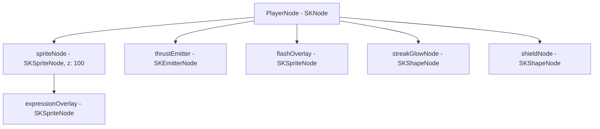

## Scene graph overview

`GameScene` is the root `SKScene` that contains all visual and physics elements during gameplay. Nodes are organized into logical layers using `zPosition` values to control rendering order, with higher values drawn on top.

```mermaid
graph TD
    GS[GameScene - root SKScene]

    subgraph Background["Background Layer (z: -10 to 10)"]
        BG[ParallaxBackgroundManager]
        Stars[Star field layers]
        Nebula[Nebula layers]
    end

    subgraph Obstacles["Obstacle Layer (z: 20 to 50)"]
        OM[ObstacleManager]
        OP[ObstaclePair - top + bottom]
        MO[MovingObstacleNode]
        SO[Solar / Belt / Europa obstacles]
        SZ[Score zones - invisible triggers]
        ZG[ZeroGravityZone]
    end

    subgraph Collectibles["Collectible Layer (z: 30 to 60)"]
        PU[PowerUpNode - shield, boost, warp]
        CN[CollectibleNode - star bits]
        CMN[CosmicMagnetNode]
    end

    subgraph Player["Player Layer (z: 88 to 100)"]
        PN[PlayerNode]
        Sprite[Astronaut sprite - z: 100]
        Thrust[Thrust emitter]
        Shield[Shield shape node]
        Glow[Streak glow node]
        Flash[Flash overlay]
    end

    subgraph Effects["Effects Layer (z: 40 to 200)"]
        VIG[Vignette overlays - z: 88]
        BL[Breadcrumb line - z: 95]
        Particles[Particle bursts]
        Text[Text popups - z: 200]
    end

    subgraph UI["UI Layer (z: 200 to 500)"]
        Labels[Score/context labels - z: 200]
        ScreenFlash[Screen flash - z: 500]
    end

    GS --> BG
    GS --> OM
    GS --> PN
    GS --> VIG
    GS --> Labels

    OM --> OP
    OM --> MO
    OM --> SO
    OM --> SZ
    OM --> PU
    OM --> CN

    PN --> Sprite
    PN --> Thrust
    PN --> Shield
    PN --> Glow
    PN --> Flash
```

## Z-ordering layers

SpaceFlapper uses `zPosition` values to organize the rendering order. Higher values render on top of lower values.

| z-Position | Layer | Contents |
|------------|-------|----------|
| -10 to 10 | Background | Parallax star fields, nebula clouds, deep space layers |
| 20 to 50 | Obstacles | Static obstacle pairs, moving obstacles, score zones, zero-G zones |
| 30 to 60 | Collectibles | Power-up nodes, star bit collectibles, cosmic magnets |
| 40 | Score zone indicators | Visual score zone markers |
| 88 | Vignettes | Bullet time vignette, rocket boost vignette, time warp vignette |
| 95 | Breadcrumb line | Personal best breadcrumb marker line |
| 100 | Player sprite | Astronaut sprite node (child of PlayerNode) |
| 200 | Text and labels | Score popups, near-miss text, milestone celebrations, survival context |
| 500 | Screen flash | Full-screen white flash overlay for death/impact effects |

<Callout kind="tip">
  The player sprite renders at z-position 100, which places it above all obstacles and collectibles but below text popups and screen effects. This ensures the astronaut is always visible during gameplay while UI feedback overlays render on top.
</Callout>

## Node lifecycle during gameplay

### Scene initialization

When `GameScene.didMove(to:)` fires, the `setupScene()` method creates all persistent nodes:

<Steps>
  <Step title="Setup background" icon="image">
    `ParallaxBackgroundManager` creates multiple star field and nebula layers as children of the scene. These persist for the entire session.
  </Step>

  <Step title="Setup player" icon="user">
    A `PlayerNode` is created at position (30% width, 50% height) and added to the scene. The player node contains its sprite, thrust emitter, flash overlay, and expression overlay as child nodes.
  </Step>

  <Step title="Setup boundaries" icon="square">
    Two invisible `SKNode` boundary nodes are placed 50pt beyond the top and bottom screen edges. These have static physics bodies with the `boundary` category.
  </Step>

  <Step title="Setup managers" icon="settings">
    `ObstacleManager`, `NearMissDetector`, `ComboManager`, `MilestoneManager`, `StreakTrailManager`, and all eight event managers are initialized with references to the scene.
  </Step>
</Steps>

### Nodes added during gameplay

During active gameplay, nodes are dynamically added and removed:

| Node type | Added when | Removed when |
|-----------|-----------|--------------|
| `ObstacleNode` (pair) | Spawn timer fires | Scrolls past left screen edge |
| `MovingObstacleNode` | Spawn timer fires (probability-based) | Scrolls past left screen edge |
| Score zone (`SKNode`) | Created with each obstacle pair | Player contacts it (triggers score) |
| `PowerUpNode` | Spawned with obstacle pair (probability-based) | Player contacts it (collected) |
| `CollectibleNode` | Spawned by `CollectibleManager` | Player contacts it or scrolls off-screen |
| `MeteorNode` | `MeteorStormManager` spawns during storms | Scrolls off-screen |
| `CometNode` | `CometRideManager` triggers event | Event ends |
| `ZeroGravityZone` | Timer-based spawn every 20-30s | Player exits zone and it scrolls off-screen |
| Text popup (`SKLabelNode`) | Near-miss, milestone, or chain event | Auto-removed after fade animation (0.5s) |
| Particle emitter (`SKEmitterNode`) | Various effects (thrust, shockwave, speed lines) | Auto-removed after emission completes |
| Vignette (`SKShapeNode`) | Bullet time, rocket boost, time warp active | Effect ends, removed with fade animation |

### Scene reset (`resetGame()`)

When the game resets (returning to menu or restarting), `resetGame()` performs a comprehensive cleanup:

- Stops obstacle spawning and removes all obstacle nodes
- Resets all difficulty parameters to base values
- Resets the near-miss detector, combo manager, and milestone manager
- Removes all zero-G zones, vignettes, and screen effects
- Restores physics world gravity to default (-5.0)
- Restores physics world speed to 1.0x
- Resets all eight event managers
- Deactivates player physics (returns to idle animation)

<Callout kind="alert">
  The `PlayerNode` itself is never removed and recreated. It persists across game sessions within the same scene instance. Only its physics state, animations, and child effect nodes are reset.
</Callout>

## PlayerNode internal hierarchy

`PlayerNode` is an `SKNode` container (not an `SKSpriteNode`) that manages several child nodes:

| Child node | Type | Purpose |
|-----------|------|---------|
| `spriteNode` | `SKSpriteNode` | Procedurally generated astronaut texture (44x44pt) |
| `thrustEmitter` | `SKEmitterNode` | Jetpack flame particles, birth rate varies with gameplay state |
| `flashOverlay` | `SKSpriteNode` | White overlay flashed during near-miss events (0.1s) |
| `expressionOverlay` | `SKSpriteNode` | Visor expression system (neutral, happy, worried, etc.) |
| `streakGlowNode` | `SKShapeNode` | Colored glow around player during active streaks |
| `shieldNode` | `SKShapeNode` | Visible shield bubble when Star Shield power-up is active |

The astronaut sprite is generated entirely in code using `UIGraphicsImageRenderer`. No image assets are loaded -- the suit body, helmet, visor, jetpack, and accent details are all drawn with `UIBezierPath` and `CGContext` operations. Suit colors are applied during generation, allowing cosmetic suit changes without separate texture files.
