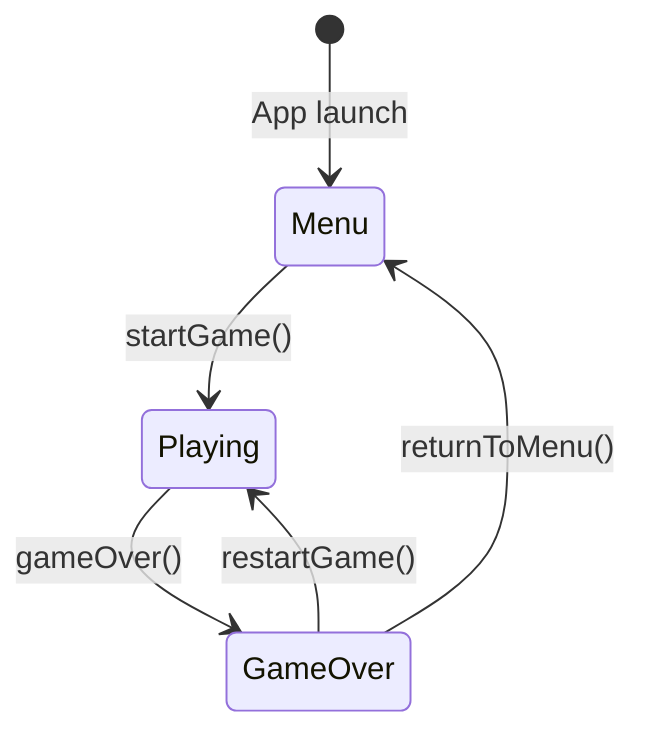

## State machine overview

SpaceFlapper manages game flow through a `GKStateMachine` from Apple's GameplayKit framework. The state machine enforces valid transitions and coordinates both the SpriteKit scene and SwiftUI overlay in response to state changes.

The `GameManager` class owns the state machine and publishes the current state as a `@Published` property, which SwiftUI views observe to display the correct overlay.



## Game states

SpaceFlapper defines three game states through a `GameState` enum and three corresponding `GKState` subclasses:

| State | Enum value | GKState class | Description |
|-------|-----------|---------------|-------------|
| Menu | `.menu` | `MenuState` | Title screen with navigation to shop, stats, achievements, settings |
| Playing | `.playing` | `PlayingState` | Active gameplay with physics, obstacles, and scoring |
| Game Over | `.gameOver` | `GameOverState` | Results screen showing score, stardust earned, and records |

## State transition rules

Each `GKState` subclass defines which states it can transition to via `isValidNextState(_:)`:

```swift GameManager.swift
class MenuState: GKState {
    override func isValidNextState(_ stateClass: AnyClass) -> Bool {
        return stateClass == PlayingState.self
    }
}

class PlayingState: GKState {
    override func isValidNextState(_ stateClass: AnyClass) -> Bool {
        return stateClass == GameOverState.self
    }
}

class GameOverState: GKState {
    override func isValidNextState(_ stateClass: AnyClass) -> Bool {
        return stateClass == MenuState.self || stateClass == PlayingState.self
    }
}
```

<Callout kind="info">
  The `PlayingState` can only transition to `GameOverState`. You cannot pause or return to the menu during gameplay -- the only exit is death.
</Callout>

## What happens during each transition

### Menu to Playing (`startGame()`)

When the player taps to start, `GameManager.startGame()` triggers the transition:

<Steps>
  <Step title="Reset difficulty" icon="refresh-cw">
    `DifficultyManager.reset()` restores all parameters to base values: gap size 190pt, scroll speed 140pt/s, spawn interval 2.8s.
  </Step>

  <Step title="Enter PlayingState" icon="play">
    The state machine enters `PlayingState`, which triggers `didEnter(from:)`:

    - Sets `currentState` to `.playing`
    - Resets score to 0
    - Resets score multiplier to 1x
    - Resets near-miss count, streak state, and celebration flags
    - Clears session stardust
    - Calls `gameScene?.startGame()`
  </Step>

  <Step title="Scene activates" icon="zap">
    `GameScene.startGame()` brings the scene to life:

    - Activates player physics (`isDynamic = true`)
    - Starts idle jetpack flame
    - Begins parallax background scrolling
    - Starts obstacle spawning
    - Starts event managers (speed surge, meteor storm, ghost rival)
    - Applies first flap impulse
  </Step>
</Steps>

### Playing to Game Over (`gameOver()`)

Death occurs when the player collides with an obstacle or boundary. The transition flows through a cinematic death animation before reaching the game over state:

<Steps>
  <Step title="Collision detected" icon="alert-triangle">
    `SKPhysicsContactDelegate.didBegin(_:)` detects a player-obstacle or player-boundary collision. The combo manager records the collision (breaking any active streak).
  </Step>

  <Step title="Death animation plays" icon="film">
    `handlePlayerDeath()` triggers a multi-phase cinematic sequence:

    - **Phase 1**: Slow-motion freeze (0.3s at 0.2x physics speed)
    - **Phase 2**: Player tumble animation (0.2s)
    - **Phase 3**: Death shockwave particle effect, survival context label, fade + shrink
  </Step>

  <Step title="Enter GameOverState" icon="square">
    After the animation completes, `gameManager?.gameOver()` enters `GameOverState`, which triggers `didEnter(from:)`:

    - Sets `currentState` to `.gameOver`
    - Computes game over results (new record detection, "SO CLOSE" calculation)
    - Updates high score if the current score exceeds it
    - Awards stardust based on performance and difficulty
  </Step>
</Steps>

### Game Over to Menu (`returnToMenu()`)

<Steps>
  <Step title="Enter MenuState" icon="home">
    `MenuState.didEnter(from:)` fires:

    - Sets `currentState` to `.menu`
    - Calls `gameScene?.resetGame()` which stops spawning, removes all obstacles, resets all event managers, and restores physics defaults
  </Step>
</Steps>

### Game Over to Playing (`restartGame()`)

The player can restart directly without returning to the menu:

<Steps>
  <Step title="Reset and replay" icon="rotate-cw">
    `GameManager.restartGame()` performs a direct restart:

    - Calls `gameScene?.resetGame()` to clear the scene
    - Resets difficulty to base values
    - Enters `PlayingState` directly from `GameOverState`
  </Step>
</Steps>

## SwiftUI state observation

`ContentView` observes the `GameManager.currentState` published property and renders the appropriate overlay:

```swift ContentView.swift
struct ContentView: View {
    @StateObject private var gameManager = GameManager()

    var body: some View {
        ZStack {
            GameContainerView(gameManager: gameManager)
                .ignoresSafeArea()

            switch gameManager.currentState {
            case .menu:
                MenuOverlayView(gameManager: gameManager)
                    .transition(.opacity)
            case .playing:
                PlayingOverlayView(gameManager: gameManager)
                    .transition(.opacity)
            case .gameOver:
                GameOverOverlayView(gameManager: gameManager)
                    .transition(.opacity)
            }
        }
        .animation(.easeInOut(duration: 0.3), value: gameManager.currentState)
    }
}
```

<Callout kind="tip">
  The SpriteKit scene runs continuously behind all overlays. The SwiftUI layer is purely presentational -- it reads state from `GameManager` but never directly manipulates the scene. All gameplay actions flow through `GameManager` methods.
</Callout>

## State machine initialization

The state machine is created during `GameManager.init()` and immediately enters `MenuState`:

```swift GameManager.swift
private func setupStateMachine() {
    let menuState = MenuState(gameManager: self)
    let playingState = PlayingState(gameManager: self)
    let gameOverState = GameOverState(gameManager: self)

    stateMachine = GKStateMachine(states: [menuState, playingState, gameOverState])
    stateMachine.enter(MenuState.self)
}
```

Each `GKState` subclass holds a `weak` reference back to `GameManager` to avoid retain cycles while still being able to update published state and trigger scene actions.
