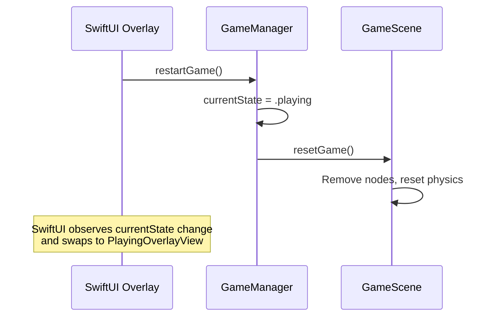
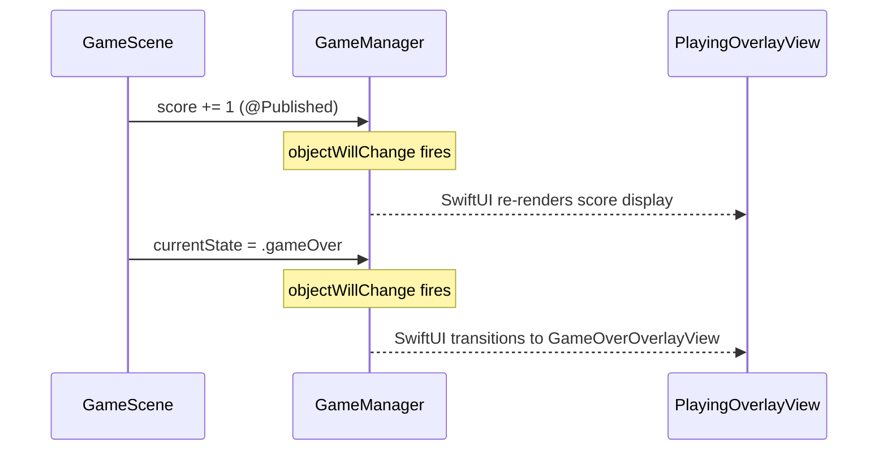

## Overview

SpaceFlapper uses a hybrid architecture where SpriteKit handles real-time gameplay rendering and SwiftUI manages all UI overlays (menus, HUD, game over screen). The bridge between these two frameworks is `GameManager`, an `ObservableObject` that both layers observe and mutate.

```mermaid
graph TD
    subgraph SwiftUI Layer
        CV[ContentView]
        MOV[MenuOverlayView]
        POV[PlayingOverlayView]
        GOV[GameOverOverlayView]
        ANV[AchievementNotificationView]
    end

    subgraph Bridge
        GM[GameManager<br>ObservableObject]
        GCV[GameContainerView]
    end

    subgraph SpriteKit Layer
        SV[SpriteView]
        GScene[GameScene]
    end

    CV --> GCV
    CV --> MOV
    CV --> POV
    CV --> GOV
    CV --> ANV
    GCV --> SV
    SV --> GScene
    GM -.->|@ObservedObject| CV
    GM -.->|@ObservedObject| MOV
    GM -.->|@ObservedObject| POV
    GM -.->|@ObservedObject| GOV
    GM <-.->|gameManager / gameScene| GScene
```

## GameContainerView

`GameContainerView` is the SwiftUI wrapper that hosts the SpriteKit `GameScene` via Apple's `SpriteView`:

```swift GameContainerView.swift
struct GameContainerView: View {
    @ObservedObject var gameManager: GameManager
    @State private var scene: GameScene?

    var body: some View {
        GeometryReader { geometry in
            if let scene = scene {
                SpriteView(scene: scene)
                    .ignoresSafeArea()
            } else {
                Color.clear
                    .onAppear {
                        createScene(size: geometry.size)
                    }
            }
        }
    }

    private func createScene(size: CGSize) {
        let newScene = GameScene(size: size)
        newScene.scaleMode = .resizeFill
        newScene.gameManager = gameManager
        gameManager.gameScene = newScene
        scene = newScene
    }
}
```

### Key design decisions

- **Deferred creation**: The `GameScene` is created in `onAppear` rather than `init` to ensure `GeometryReader` has resolved the correct screen size
- **Bidirectional reference**: `GameScene` gets a reference to `GameManager`, and `GameManager` gets a reference back to `GameScene`
- **Scale mode**: `.resizeFill` ensures the scene adapts to any screen size without letterboxing

<Callout kind="info">
  The scene is stored as `@State` so it persists across SwiftUI view updates. Creating the scene only once prevents SpriteKit from restarting the game on every re-render.
</Callout>

## State passing patterns

### SwiftUI to SpriteKit

SwiftUI drives game state changes through `GameManager` method calls. When the player taps "Play Again", the overlay view calls `gameManager.restartGame()`, which in turn calls methods on `GameScene`.



### SpriteKit to SwiftUI

`GameScene` updates `GameManager` properties during gameplay. Because `GameManager` is an `ObservableObject` with `@Published` properties, SwiftUI overlays automatically re-render when values change.



## Reactive patterns used

| Pattern | Where Used | Purpose |
|---------|-----------|---------|
| `@StateObject` | `ContentView` creates `GameManager` | Owns the lifecycle of the game manager |
| `@ObservedObject` | All overlay views observe `GameManager` | React to state changes from SpriteKit |
| `@Published` | `GameManager.currentState`, `score`, etc. | Trigger SwiftUI updates on change |
| `@State` | `GameContainerView.scene` | Persist the SpriteKit scene across renders |
| `@EnvironmentObject` | `LocalizationManager` injected at app root | Language changes propagate to all views |

## ContentView composition

`ContentView` layers SpriteKit and SwiftUI using a `ZStack`. The game scene fills the entire screen, and SwiftUI overlays render on top based on game state:

```swift ContentView.swift
struct ContentView: View {
    @StateObject private var gameManager = GameManager()

    var body: some View {
        ZStack {
            // SpriteKit game view (always rendered)
            GameContainerView(gameManager: gameManager)
                .ignoresSafeArea()

            // State-driven overlay switching
            switch gameManager.currentState {
            case .menu:
                MenuOverlayView(gameManager: gameManager)
                    .transition(.opacity)
            case .playing:
                PlayingOverlayView(gameManager: gameManager)
                    .transition(.opacity)
            case .gameOver:
                GameOverOverlayView(gameManager: gameManager)
                    .transition(.opacity)
            }

            // Achievement notification (highest z-index)
            if let achievement = gameManager.currentAchievementNotification {
                AchievementNotificationView(achievement: achievement)
                    .zIndex(100)
            }
        }
        .animation(.easeInOut(duration: 0.3), value: gameManager.currentState)
    }
}
```

<Callout kind="tip">
  The `SpriteView` remains mounted at all times -- even during menu and game over states. This allows the space background and star particles to continue animating behind the overlays.
</Callout>

## App entry point

`SpaceFlapperApp` configures the scene and injects the `LocalizationManager`:

```swift SpaceFlapperApp.swift
@main
struct SpaceFlapperApp: App {
    @ObservedObject private var localizationManager = LocalizationManager.shared

    var body: some Scene {
        WindowGroup {
            ContentView()
                .environmentObject(localizationManager)
        }
    }
}
```

## Related pages

<Columns cols="2">
  <Card title="View Hierarchy" href="/technical/view-hierarchy" icon="git-branch" horizontal="false">
    Complete SwiftUI view tree and navigation structure.
  </Card>

  <Card title="Overlay Views" href="/technical/overlay-views" icon="layers" horizontal="false">
    Detailed reference for each SwiftUI overlay view.
  </Card>
</Columns>
