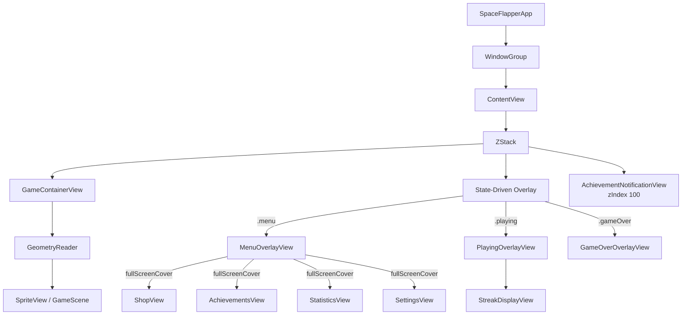
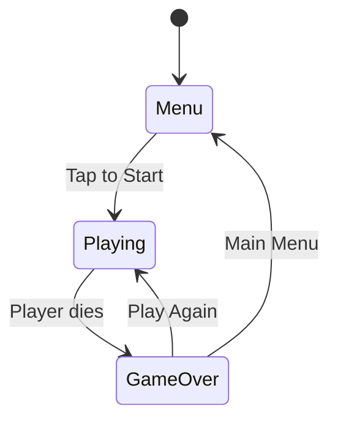

## Overview

SpaceFlapper's view hierarchy follows a layered architecture: a persistent SpriteKit game layer at the bottom, state-driven overlays in the middle, and full-screen modal sheets on top. All views share a single `GameManager` instance as their source of truth.

## Complete view tree



## Layer structure

SpaceFlapper uses three rendering layers stacked in a `ZStack`:

| Layer | Z-Index | Content | Visibility |
|-------|---------|---------|------------|
| Game | Bottom | `SpriteView` with `GameScene` | Always visible |
| Overlay | Middle | Menu, Playing HUD, or Game Over | One at a time, based on `currentState` |
| Notification | Top (100) | `AchievementNotificationView` | When achievement unlocks |

<Callout kind="info">
  The SpriteKit game scene renders continuously behind all overlays. During menu and game over states, the space background and star particles remain animated, providing visual depth.
</Callout>

## State-driven overlay switching

The active overlay is determined by `gameManager.currentState`:

```swift ContentView.swift
switch gameManager.currentState {
case .menu:
    MenuOverlayView(gameManager: gameManager)
        .transition(.opacity)
case .playing:
    PlayingOverlayView(gameManager: gameManager)
        .transition(.opacity)
case .gameOver:
    GameOverOverlayView(gameManager: gameManager)
        .transition(.opacity)
}
```

Transitions between overlays use `.easeInOut` animation with a 0.3-second duration.



## Navigation from the menu

`MenuOverlayView` presents four modal views using `.fullScreenCover`:

| Button | Icon | Destination | Presentation |
|--------|------|-------------|-------------|
| Shop | `bag.fill` | `ShopView` | `.fullScreenCover` |
| Achievements | `trophy.fill` | `AchievementsView` | `.fullScreenCover` |
| Statistics | `chart.bar.fill` | `StatisticsView` | `.fullScreenCover` |
| Settings | `gearshape.fill` | `SettingsView` | `.fullScreenCover` |

```swift MenuOverlayView.swift
.fullScreenCover(isPresented: $showShop) {
    ShopView(gameManager: gameManager, isPresented: $showShop)
}
.fullScreenCover(isPresented: $showAchievements) {
    AchievementsView(gameManager: gameManager, isPresented: $showAchievements)
}
.fullScreenCover(isPresented: $showStatistics) {
    StatisticsView(gameManager: gameManager, isPresented: $showStatistics)
}
.fullScreenCover(isPresented: $showSettings) {
    SettingsView(gameManager: gameManager, isPresented: $showSettings)
}
```

<Callout kind="tip">
  Each modal view receives both `gameManager` and an `isPresented` binding. The binding allows the modal's own close button to dismiss itself.
</Callout>

## View dependencies

Each view observes specific data sources:

| View | Observes | Key Data |
|------|----------|----------|
| `ContentView` | `@StateObject GameManager` | `currentState`, `currentAchievementNotification` |
| `GameContainerView` | `@ObservedObject GameManager` | `gameScene` reference |
| `MenuOverlayView` | `GameManager`, `LocalizationManager` | `highScore`, `totalStardust` |
| `PlayingOverlayView` | `GameManager` | `score`, `currentStreakCount`, `currentStreakLevel` |
| `GameOverOverlayView` | `GameManager`, `LocalizationManager` | Score, stardust, streak, record data |
| `ShopView` | `GameManager`, `LocalizationManager` | `progressionManager.currentProgress` |
| `AchievementsView` | `GameManager`, `LocalizationManager` | `achievementManager` completion states |
| `StatisticsView` | `GameManager`, `LocalizationManager` | `PlayerProgress` statistics |
| `SettingsView` | `GameManager`, `LocalizationManager` | `currentLanguage` |
| `StreakDisplayView` | Props only | `streakCount`, `streakLevel` |
| `AchievementNotificationView` | Props only | `achievement` |

## Overlay layering during gameplay

During the `.playing` state, the screen composition looks like this:

```
+------------------------------------------+
|  AchievementNotificationView (z: 100)    |  <- Slides in from top
|  +--------------------------------------+|
|  |      PlayingOverlayView              ||  <- Score + streak HUD
|  |  +----------------------------------+||
|  |  |                                  |||
|  |  |       SpriteView / GameScene     |||  <- Full-screen game
|  |  |                                  |||
|  |  +----------------------------------+||
|  +--------------------------------------+|
+------------------------------------------+
```

## Component reuse

Several UI patterns are shared across views:

| Pattern | Used In | Description |
|---------|---------|-------------|
| Dark background `Color(red: 0.05, green: 0.05, blue: 0.15)` | Shop, Achievements, Statistics, Settings | Consistent dark theme |
| Capsule close button | All modal views | "CLOSE" button with semi-transparent background |
| Gradient headers | All modal views | Cyan/blue or yellow/orange title gradients |
| Number formatting with locale | Menu, Statistics, Game Over | `NumberFormatter` using selected locale |

## Related pages

<Columns cols="2">
  <Card title="SwiftUI + SpriteKit Bridge" href="/technical/swiftui-spritekit" icon="link" horizontal="false">
    How the two frameworks communicate through GameManager.
  </Card>

  <Card title="Overlay Views Reference" href="/technical/overlay-views" icon="layers" horizontal="false">
    Detailed reference for each overlay view's functionality.
  </Card>
</Columns>
